

# 전자전기컴퓨터설계실험Ⅱ

## 실험 후 보고서

### LAB 1 – FPGA 조합논리회로

학과: 전자전기컴퓨터공학부

학번/이름: 2025440032 / 김윤지

작성일: 2026.09.18

대상: LAB1 조합논리회로

검증 환경: Vivado / FPGA board

프로젝트: ece2_2026 / LAB1

GitHub repository: [https://github.com/yunuos2525-cloud/ece2_2026](https://github.com/yunuos2525-cloud/ece2_2026)

Source code: [https://github.com/yunuos2525-cloud/ece2_2026/tree/246d6b621ce5b7a30d8a71a98c3e03693e69c9de/LAB1](https://github.com/yunuos2525-cloud/ece2_2026/tree/246d6b621ce5b7a30d8a71a98c3e03693e69c9de/LAB1)

Actual operation videos: [https://github.com/yunuos2525-cloud/ece2_2026/tree/c4943c324671c74ba7c7ccb56131649367458d6c/evidence/board/LAB1/raw_videos](https://github.com/yunuos2525-cloud/ece2_2026/tree/c4943c324671c74ba7c7ccb56131649367458d6c/evidence/board/LAB1/raw_videos)

Source code commit: 246d6b6

Board video commit: c4943c3

제출 tag: LAB1_POST_FINAL

## 1. 실험 목적 및 검증 방법

조합논리회로는 현재 입력 조합에 따라 출력이 결정되며, 진리표나 논리식을 바탕으로 RTL로 기술할 수 있다 [1]. LAB1에서는 AND·OR·XOR 게이트, 가산기, 감산기, 비교기, MUX/DEMUX, 인코더/디코더, 7-segment decoder 등의 조합논리회로를 설계하고 검증하였다.

각 회로의 논리식과 변환 규칙으로 예상값을 계산하고, Vivado 시뮬레이션 파형의 안정 구간에서 입력·출력 관계를 확인하였다. 확보된 PASS 및 구현 기록은 시뮬레이션과 FPGA 구현 과정을 확인하는 보조 자료로 사용하였으며, 조교가 선정한 실험 06 MUX와 실험 10 7-segment decoder는 실제 보드 동작까지 비교하였다.

실험 01~10의 실제 FPGA 작동 영상 총 10개는 표지에 표시한 GitHub의 Actual operation videos 경로에 정리하였다.

## 2. 실험별 설계 및 검증 결과

### 01. 논리 게이트

**설계 및 핵심 구조.** a와 b를 공통 입력으로 받아 AND, OR, XOR 결과를 각각 x, y, z에 출력하도록 설계하였다. RTL은 `assign x=a&b`, `assign y=a|b`, `assign z=a^b`의 독립적인 연속 할당 세 개로 구성된다. 같은 입력이 세 연산에 병렬로 전달되어 각 게이트의 출력 차이를 비교할 수 있다.

**시험 조건.** 입력 `(a,b)`를 `2'b00,2'b01,2'b10,2'b11` 순서로 인가하였다. 특히 20~40 ns에서 `a=1'b1`을 유지하고 b를 `1'b0`에서 `1'b1`로 바꾼 구간을 비교하였다.

**예상 결과.** `x=a&b`, `y=a|b`, `z=a^b`이므로 입력 순서에 따른 `{x,y,z}`는 `3'b000,3'b011,3'b011,3'b110`이다. 대표 구간에서는 `3'b011→3'b110`을 예상하였다.

**관찰 결과.** 20~30 ns에 `x=1'b0,y=1'b1,z=1'b1`, 30~40 ns에 `x=1'b1,y=1'b1,z=1'b0`이 나타났다. 앞선 입력 `2'b00`과 `2'b01`의 출력도 각각 `3'b000`과 `3'b011`이었다.

**해석.** 그림 1에서 AND는 두 입력 모두 1일 때, OR는 하나 이상의 입력이 1일 때, XOR는 두 입력이 다를 때 활성화되었다. 네 입력 조합에서 각 게이트의 진리표와 일치하였다.

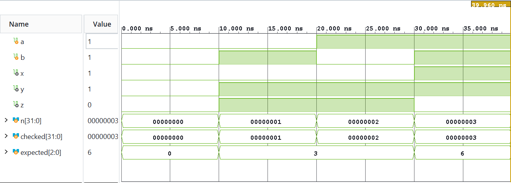

그림 1. 01. 논리 게이트의 입력·출력 및 예상값 비교 파형.

### 02. 전가산기

**설계 및 핵심 구조.** 두 개의 half_adder 인스턴스를 연결하여 전가산기를 구성하였다. 첫 번째 반가산기는 a와 b에서 partial_sum과 carry_ab를 생성하고, 두 번째는 partial_sum과 cin에서 최종 합 s와 carry_cin을 생성한다. 두 단계의 캐리를 `cout=carry_ab|carry_cin`으로 OR하여 최종 캐리를 구한다.

**시험 조건.** `(a,b,cin)`의 8개 조합을 순서대로 인가하였다. 20~40 ns에서는 `a=1'b0,b=1'b1`에서 `cin=1'b0→1'b1`을 비교하였다.

**예상 결과.** `s=a^b^cin`, `cout=(a&b)|(a&cin)|(b&cin)`이다. `0+1+0=1`에서 `{cout,s}=2'b01`, `0+1+1=2`에서 `2'b10`을 예상하였다.

**관찰 결과.** `cin=1'b0`일 때 `s=1'b1,cout=1'b0`, `cin=1'b1`일 때 `s=1'b0,cout=1'b1`이었다. 파형의 8개 조합에서 `{cout,s}`는 `2'd0,2'd1,2'd1,2'd2,2'd1,2'd2,2'd2,2'd3`으로 나타났다.

**해석.** 그림 2에서 입력 캐리가 합에 반영되었고, 합이 2 이상일 때 캐리 출력이 발생하였다. 합과 캐리의 전환이 계산 결과와 일치하였다.

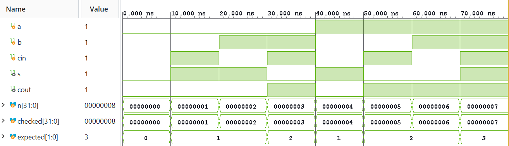

그림 2. 02. 전가산기의 입력·출력 및 예상값 비교 파형.

### 03. 4비트 가산기

**설계 및 핵심 구조.** 두 4비트 입력을 각각 5비트로 확장한 뒤 더하도록 설계하였다. 핵심 구문은 `assign {cout,s}={1'b0,a}+{1'b0,b}`이다. 합의 하위 4비트는 s로, 최상위 비트는 cout으로 출력하여 4비트 범위를 넘는 캐리를 보존한다.

**시험 조건.** 그림 3의 `a=4'h5` 구간에서 b가 순차 증가하며, `b=4'hA→4'hB`에서 합과 캐리를 비교하였다.

**예상 결과.** `{cout,s}={1'b0,a}+{1'b0,b}`이므로 `4'h5+4'hA=5'h0F`에서 `s=4'hF,cout=1'b0`, `4'h5+4'hB=5'h10`에서 `s=4'h0,cout=1'b1`을 예상하였다.

**관찰 결과.** `a=4'h5,b=4'hA`에서 `s=4'hF`였고, `b=4'hB`에서 `s=4'h0`으로 바뀌면서 cout이 `1'b1`로 상승하였다.

**해석.** 그림 3에서 합이 4비트 범위를 넘으면 하위 4비트가 0으로 바뀌고 상위 비트가 캐리로 출력되었다. 이 경계에서 합과 캐리가 예상값과 일치하였다.

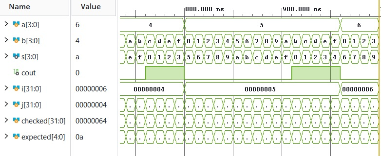

그림 3. 03. 4비트 가산기의 입력·출력 및 예상값 비교 파형.

### 04. 4비트 감산기

**설계 및 핵심 구조.** RTL에서 `assign d=a-b`로 차의 하위 4비트를 계산하고, `assign bor=a<b`로 빌림을 별도로 생성하였다. d는 차의 비트 패턴을, bor는 감수가 피감수보다 큰지를 나타낸다. 두 출력의 역할을 구분하여 음의 차와 빌림 발생을 확인한다.

**시험 조건.** 0~20 ns에서 `a=4'h0`을 고정하고 `b=4'h0→4'h1`을 인가한 구간을 비교하였다.

**예상 결과.** 차는 `d=(a-b) mod 16`, 빌림은 `bor=(a<b)`이다. `0-0`은 `d=4'h0,bor=1'b0`, `0-1`은 하위 4비트 `d=4'hF`와 `bor=1'b1`을 예상하였다.

**관찰 결과.** 0~10 ns의 `b=4'h0`에서 `d=4'h0,bor=1'b0`, 10~20 ns의 `b=4'h1`에서 `d=4'hF,bor=1'b1`이었다. 이어지는 `b=4'h2,4'h3,4'h4`에서는 차가 `4'hE,4'hD,4'hC`이고 빌림은 `1'b1`로 유지되었다.

**해석.** 그림 4에서 두 입력이 같을 때 빌림은 0이었으며, 감수가 피감수보다 커지자 빌림이 발생하였다. 음의 차를 하위 4비트와 빌림으로 표현한 결과가 계산과 일치하였다.

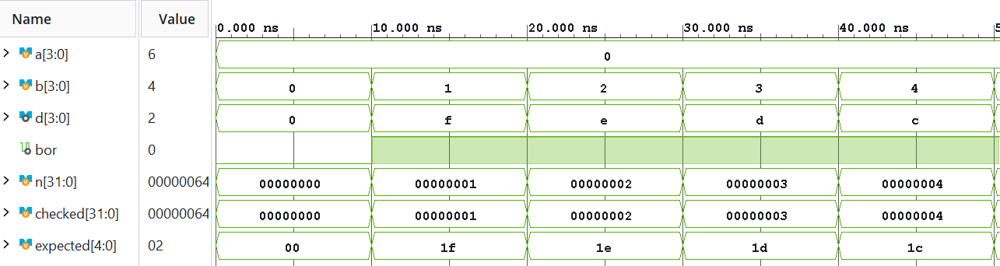

그림 4. 04. 4비트 감산기의 입력·출력 및 예상값 비교 파형.

### 05. 4비트 비교기

**설계 및 핵심 구조.** 두 4비트 입력의 대소 및 동등 관계를 동시에 비교하도록 설계하였다. `o={a>b,a==b,a<b}`에서 o[2], o[1], o[0]은 각각 크다, 같다, 작다의 조건에 대응한다. 세 비교 결과를 별도 출력 비트로 표현하여 입력 관계를 판별한다.

**시험 조건.** 그림 5의 `a=4'h5` 구간에서 `b=4'h4→4'h5→4'h6`의 세 관계를 비교하였다.

**예상 결과.** 출력 순서는 `o={a>b,a==b,a<b}`이다. 따라서 `3'b100→3'b010→3'b001`, 즉 `3'h4→3'h2→3'h1`을 예상하였다.

**관찰 결과.** `b=4'h4`에서 `o=3'h4`, `b=4'h5`에서 `o=3'h2`, `b=4'h6`에서 `o=3'h1`로 바뀌었다. 같은 구간의 expected 신호도 `3'h4,3'h2,3'h1`을 표시하였다.

**해석.** 그림 5에서 크다·같다·작다의 관계에 따라 서로 다른 출력 비트가 활성화되었다. 세 조건 모두 비교 결과에 맞는 출력이 나타났다.

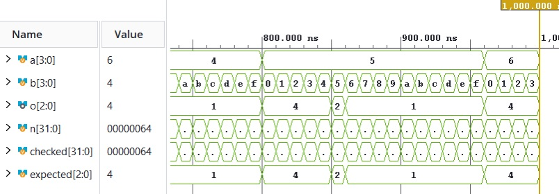

그림 5. 05. 4비트 비교기의 입력·출력 및 예상값 비교 파형.

### 06. 4:1 MUX

**설계 및 핵심 구조.** 4개의 데이터 입력 중 선택선 s[1:0]에 대응하는 하나를 출력 z로 전달하도록 설계하였다. 핵심 관계는 `z=i[3-s]`이다. `s=2'b00,2'b01,2'b10,2'b11`에 따라 `i[3],i[2],i[1],i[0]` 순서로 선택한다.

**시험 조건.** 60~80 ns에서 `i=4'b0001`을 유지하고 선택 신호 `s=2'b10→2'b11`을 비교하였다.

**예상 결과.** 선택 규칙은 `z=i[3-s]`이다. `s=2'b00,2'b01,2'b10,2'b11`은 각각 `i[3],i[2],i[1],i[0]`을 선택한다. 따라서 대표 구간에서는 `i[1]=1'b0`에서 `i[0]=1'b1`로 선택이 바뀌어 `z=1'b0→1'b1`을 예상하였다.

**관찰 결과.** 파형의 안정 구간에서 `s=2'b10`일 때 `z=1'b0`, `s=2'b11`일 때 `z=1'b1`이었다.

**해석.** 그림 6에서 데이터 입력을 고정해도 선택 신호에 따라 출력이 바뀌었다. 선택 번호가 증가할수록 낮은 입력 비트를 선택하는 규칙을 확인하였다.

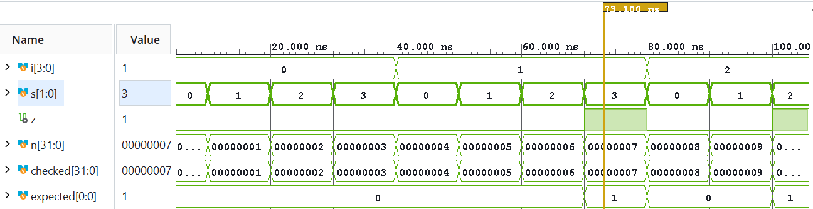

그림 6. 06. 4:1 MUX의 입력·출력 및 예상값 비교 파형.

**실제 FPGA 보드 검증.** 버튼 연결은 button1=`i[3]`, button2=`i[2]`, button3=`i[1]`, button4=`i[0]`이다. `s=2'b00`에서는 `i[3]`, `s=2'b11`에서는 `i[0]`을 선택한다. 그림 6-1과 6-2의 해당 조건에서 버튼 조작과 LED1 점등을 확인하였다.

표 1. 실험 06의 보드 입력 조건과 관찰 결과.

| 그림 | 선택 조건 및 조작 입력 | 예상되는 출력 관계 | 실제 관찰 |
|---|---|---|---|
| 6-1 | `s=2'b00`, button1=`i[3]` 조작 | `z=i[3]` | LED1 붉게 점등 |
| 6-2 | `s=2'b11`, button4=`i[0]` 조작 | `z=i[0]` | LED1 붉게 점등 |

![그림 6-1. 실험 06, s=00에서 i[3] 선택](../../evidence/board/LAB1/frames/LAB1_06_mux_board_s00_i3.png)

그림 6-1. 실험 06 MUX: `s=2'b00`, button1에 연결된 `i[3]` 선택 조건의 입력 조작 및 LED1 점등 장면.

![그림 6-2. 실험 06, s=11에서 i[0] 선택](../../evidence/board/LAB1/frames/LAB1_06_mux_board_s11_i0.png)

그림 6-2. 실험 06 MUX: `s=2'b11`, button4에 연결된 `i[0]` 선택 조건의 입력 조작 및 LED1 점등 장면.

### 07. 1:8 DEMUX

**설계 및 핵심 구조.** 하나의 데이터 입력을 선택선 s[2:0]에 따라 8개 출력 중 하나로 전달하도록 설계하였다. `i=1'b1`이면 `8'b10000000>>s`로 활성 출력 위치를 이동시키고, `i=1'b0`이면 `o=8'h00`으로 모든 출력을 비활성화한다. 선택값이 증가할수록 활성 비트가 상위 비트에서 하위 비트로 이동한다.

**시험 조건.** `i=1'b0`과 `i=1'b1` 각각에 대해 s의 8개 선택값을 순서대로 인가하였다. 대표적으로 80~100 ns의 `i=1'b1,s=3'b000→3'b001`을 비교하였다.

**예상 결과.** `i=1'b0`이면 `o=8'h00`이다. `i=1'b1`이면 `o=8'h80>>s`이므로 `s=3'b000→3'b001`에서 `o=8'h80→8'h40`을 예상하였다.

**관찰 결과.** 0~80 ns의 `i=1'b0`에서는 모든 선택 조건의 출력이 `8'h00`이었다. 80~160 ns의 `i=1'b1`에서는 s의 순차 증가에 따라 출력이 `8'h80,8'h40,8'h20,8'h10,8'h08,8'h04,8'h02,8'h01`로 나타났다.

**해석.** 그림 7에서 입력 데이터가 0이면 모든 출력이 비활성이고, 1이면 선택된 한 비트만 활성화되었다. 선택 신호에 따른 출력 이동으로 데이터 분배 기능을 확인하였다.

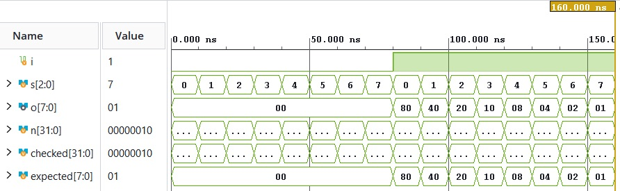

그림 7. 07. 1:8 DEMUX의 입력·출력 및 예상값 비교 파형.

### 08. 8:3 인코더

**설계 및 핵심 구조.** 조합논리 case 문으로 단일 활성 입력을 3비트 코드에 대응시켰다. 입력 `8'h80,8'h40,8'h20,8'h10,8'h08,8'h04,8'h02,8'h01`은 각각 코드 `3'd0,3'd1,3'd2,3'd3,3'd4,3'd5,3'd6,3'd7`에 대응한다. 일치하는 단일 활성 입력이 없으면 기본값 `3'b000`을 출력하므로, 다중 활성 입력에서 우선순위를 선택하는 인코더가 아니다.

**시험 조건.** 10~40 ns에서 입력 `i=8'h01→8'h02→8'h03`을 비교하였다. 앞의 두 입력은 한 비트만 1이고, `8'h03`은 두 비트가 1인 조건이다.

**예상 결과.** 변환 규칙에 따라 `8'h01→a=3'd7`, `8'h02→a=3'd6`을 예상하였다. 여러 비트가 1인 `8'h03`은 기본 출력 `3'd0`으로 처리된다.

**관찰 결과.** 입력 `8'h01,8'h02,8'h03`에서 출력 a가 각각 `3'd7,3'd6,3'd0`이었다. 파형의 입력 `8'h00,8'h04,8'h08`에서도 출력이 각각 `3'd0,3'd5,3'd4`로 나타났다.

**해석.** 그림 8에서 단일 활성 입력은 해당 위치의 코드로 변환되고, 다중 활성 입력은 기본값으로 처리되었다. 따라서 이 회로는 우선순위 인코더가 아니며, 출력 0만으로 유효 입력 `8'h80`과 무효 입력을 구별할 수 없다.

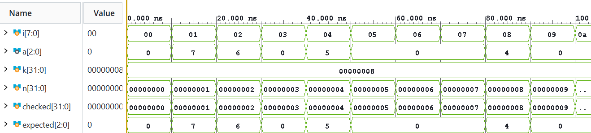

그림 8. 08. 8:3 인코더의 입력·출력 및 예상값 비교 파형.

### 09. 3:8 디코더

**설계 및 핵심 구조.** 세 입력을 `{a,b,c}` 순서의 3비트 코드로 묶어 단일 활성 출력의 위치를 정하도록 설계하였다. RTL의 핵심 관계는 `o=8'b00000001<<{a,b,c}`이다. 입력 `3'b000`은 o[0], `3'b111`은 o[7]을 활성화한다.

**시험 조건.** `{a,b,c}`를 `3'b000`부터 `3'b111`까지 순서대로 인가하였다. 30~50 ns에서는 `3'b011→3'b100` 경계를 비교하였다.

**예상 결과.** `o=8'b00000001<<{a,b,c}`이므로 대표 구간은 `8'h08→8'h10`을 예상하였다. 전체 입력 순서에서는 `8'h01,8'h02,8'h04,8'h08,8'h10,8'h20,8'h40,8'h80`이 예상된다.

**관찰 결과.** 입력 `3'b011`에서 출력은 `8'h08`, 입력 `3'b100`에서 `8'h10`이었다. 파형의 8개 입력 모두에서 출력이 예상한 순서로 이동하였다.

**해석.** 그림 9에서 3비트 입력 코드마다 대응하는 출력 한 비트가 활성화되었다. 모든 표시 입력에서 디코딩 위치가 예상과 일치하였다.

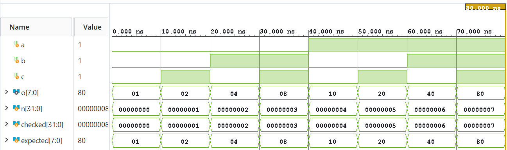

그림 9. 09. 3:8 디코더의 입력·출력 및 예상값 비교 파형.

### 10. 7-segment 디코더

**설계 및 핵심 구조.** 조합논리 case 문으로 4비트 입력에 대응하는 세그먼트 패턴을 선택하였다. 출력 순서는 `seg_data[7:0]={a,b,c,d,e,f,g,dp}`이고, 1이 세그먼트를 활성화하는 active-high 방식이다. 입력 `4'h8`은 `8'hFE`, 입력 `4'hF`는 `8'h8E`에 대응하며 소수점은 비활성 상태이다.

**시험 조건.** 입력 bcd를 `4'h0`부터 `4'hF`까지 순서대로 인가하였다. 보드 시험과 대응되는 입력 `4'h8`의 80~90 ns 구간과 입력 `4'hF`의 150~160 ns 구간을 각각 확인하였다.

**예상 결과.** 세그먼트 순서는 `seg_data[7:0]={a,b,c,d,e,f,g,dp}`이고 1이 활성인 패턴이다. 입력 `4'h8`은 `8'hFE=8'b11111110`으로 a~g를 켜고 소수점은 끈다. 입력 `4'hF`는 `8'h8E=8'b10001110`으로 a,e,f,g를 켜고 b,c,d 및 소수점은 끈다.

**관찰 결과.** 입력 `4'h8`에서 `seg_data=8'hFE`, 입력 `4'hF`에서 `seg_data=8'h8E`였다. 전체 입력의 출력은 `8'hFC,8'h60,8'hDA,8'hF2,8'h66,8'hB6,8'hBE,8'hE0,8'hFE,8'hF6,8'hEE,8'h3E,8'h9A,8'h7A,8'h9E,8'h8E`로, 파형의 expected 값과 일치하였다.

**해석.** 그림 10에서 4비트 입력에 따라 표시 문자에 필요한 세그먼트 패턴이 출력되었다. 입력 이름은 bcd이지만 `4'hA~4'hF`도 포함하여 16진수 문자 변환을 확인하였다. 입력 8과 F의 각 구간에서도 예상한 패턴이 나타났다.

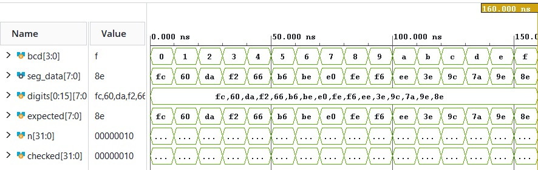

그림 10. 10. 7-segment 디코더의 입력·출력 및 예상값 비교 파형.

**실제 FPGA 보드 검증.** 입력 `4'b1000`에서 숫자 8, 입력 `4'b1111`에서 문자 F가 표시될 것으로 예상하였다. 그림 10-1과 10-2의 실제 표시가 각각 8과 F로 나타나 예상 결과 및 시뮬레이션과 일치하였다.

표 2. 실험 10의 예상 표시와 실제 표시 비교.

| 그림 | 입력 조건 | 시뮬레이션 패턴 | 예상 표시 | 실제 표시 | 비교 |
|---|---|---|---|---|---|
| 10-1 | `4'b1000` (8) | `8'hFE` | 8 | 8 | 일치 |
| 10-2 | `4'b1111` (F) | `8'h8E` | F | F | 일치 |

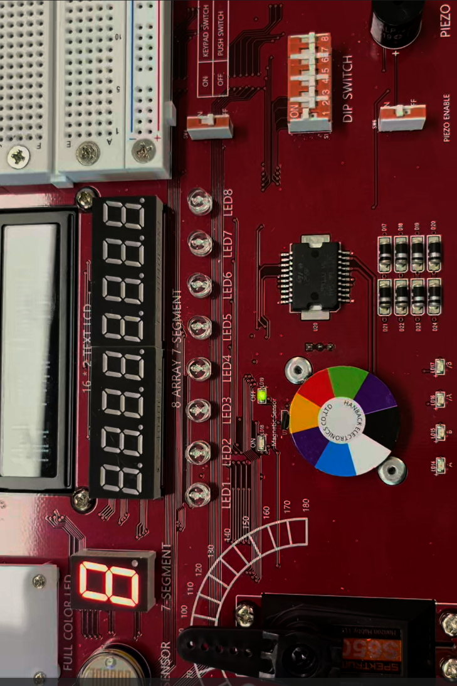

그림 10-1. 실험 10 7-segment 디코더: 입력 `4'b1000`에서 실제 표시부에 8이 나타난 장면.

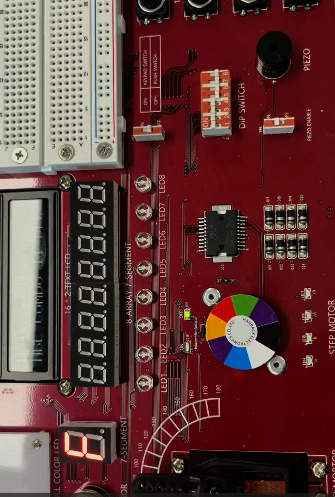

그림 10-2. 실험 10 7-segment 디코더: 입력 `4'b1111`에서 실제 표시부에 F가 나타난 장면.

## 3. Vivado 구현 및 검증 기록

### 3.1 구현 환경과 기록

기록을 확인할 수 있는 실험 01, 02, 04, 06, 08, 09, 10의 7개 프로젝트는 Vivado v2026.1과 FPGA part `xc7s75fgga484-1`을 사용하였다. 현재 소스의 설계 top과 XDC 파일은 10개 실험 모두에서 확인하였다. 이 7개 프로젝트에는 synthesis와 implementation 성공 로그, bitstream 파일, DRC report 및 timing report가 남아 있다.

실험 03, 05, 07의 구현 단계는 팀 분담에 따라 별도 환경에서 수행되었다. 원본 구현 로그와 산출물 일부가 해당 환경에 분산되어 있어, 아래의 DRC·timing 판독 결과는 기록이 확보된 7개 프로젝트에 대해 정리하였다.

### 3.2 DRC와 timing

확인 가능한 7개 프로젝트의 routed DRC report에서는 각각 error 0건과 CFGBVS/CONFIG_VOLTAGE 설정 관련 CFGBVS-1 warning 1건이 확인되었다. 이 경고는 기능 시뮬레이션과 별개의 구현 기록이다. 또한 별도의 clock 및 timing constraint가 없어 setup/hold 성능 판정에 사용할 timing 수치는 산출되지 않았다.

## 4. VS Code와 Vivado 시뮬레이션 비교

VS Code에서 수행한 Icarus 시뮬레이션과 Vivado 시뮬레이션을 비교하였다. 비교 가능한 실험 01, 02, 04, 06, 08, 09, 10에서는 입력 순서, 출력, 검사 case 수 및 로그의 종료 시간이 일치하였다. 각 case의 입력 전환 후 5 ns인 안정 시점에서도 입력·출력 불일치가 없어 기능적으로 일치하였다.

실험 03, 05, 07은 현재 확보된 Vivado 파형의 안정 구간을 예상값과 비교하였다.

## 5. 결론

LAB1에서는 AND·OR·XOR 게이트, 가산기, 감산기, 비교기, MUX/DEMUX, 인코더/디코더, 7-segment decoder 등의 조합논리회로를 설계하고, 10개 조합논리회로의 입력 조건과 예상 출력을 Vivado 시뮬레이션 파형으로 비교하였다. 분석한 구간에서 논리 연산, 캐리·빌림 발생, 대소 비교, 데이터 선택·분배 및 코드 변환이 각 회로의 규칙과 일치하였다.

실제 FPGA에서는 조교가 선정한 실험 06 MUX의 두 선택 조건에 대한 LED 점등과 실험 10 7-segment 디코더의 8·F 표시를 관찰하였다. 시뮬레이션은 신호의 논리 관계를 확인하고, 보드 사진은 시험한 조건에서의 물리적 동작을 확인하는 역할을 하였다.

이번 LAB을 통해 가산기의 캐리 경계, 감산기의 빌림, 인코더의 다중 활성 입력 처리에서 출력의 의미를 구분할 수 있었다. 회로의 핵심 관계를 먼저 정리하고, 경계 조건과 대표 입력의 파형을 해석한 뒤 실제 보드 동작과 비교하는 설계·검증 과정을 익혔다.

## 부록 A. 전체 입력 검사 보조 자료

표 A-1은 PASS 캡처의 검사 수와 종료 시간이다. 그림 A-1~A-7은 전체 입력 조합 검사 완료를 보조하는 자료이며, 각 회로의 기능은 본문의 파형으로 해석하였다. 실험 03, 05, 07은 별도 PASS 캡처가 없어 표에서 제외하였다.

| 실험 | 캡처의 검사 수 | 종료 시간 |
|---|---:|---:|
| 01 논리 게이트 | 4 | 40 ns |
| 02 전가산기 | 8 | 80 ns |
| 04 4비트 감산기 | 256 | 2560 ns |
| 06 MUX | 64 | 640 ns |
| 08 인코더 | 256 | 2560 ns |
| 09 디코더 | 8 | 80 ns |
| 10 7-segment 디코더 | 16 | 160 ns |

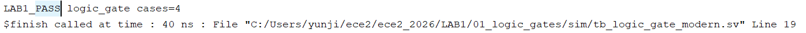

그림 A-1. 실험 01의 검사 수 및 종료 시간 기록.

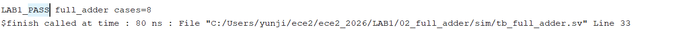

그림 A-2. 실험 02의 검사 수 및 종료 시간 기록.

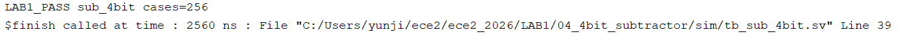

그림 A-3. 실험 04의 검사 수 및 종료 시간 기록.

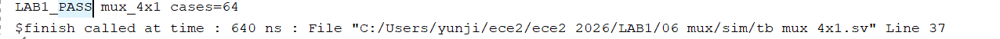

그림 A-4. 실험 06의 검사 수 및 종료 시간 기록.

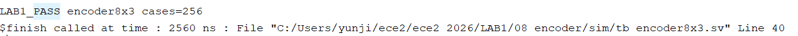

그림 A-5. 실험 08의 검사 수 및 종료 시간 기록.

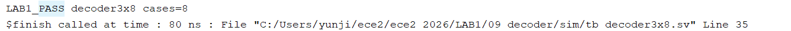

그림 A-6. 실험 09의 검사 수 및 종료 시간 기록.

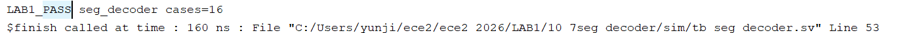

그림 A-7. 실험 10의 검사 수 및 종료 시간 기록.

## 부록 B. FPGA programming 보조 자료

그림 B-1의 Hardware Device Properties에는 장치 `xc7s75_0`, Part `xc7s75`, 상태 `Programmed`가 표시된다. 이 화면은 FPGA programming 수행의 보조 자료이다. 회로 기능은 본문의 시뮬레이션 파형과 보드 동작 사진으로 확인하였다.

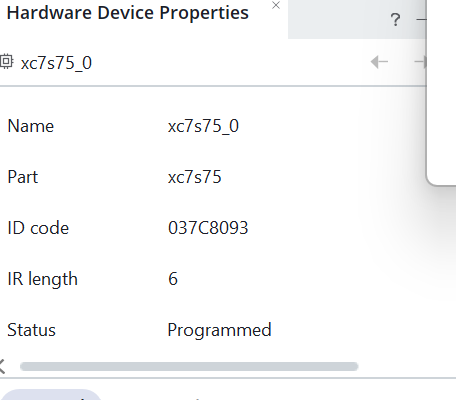

그림 B-1. FPGA 장치의 Programmed 상태 확인 화면.

## 부록 C. 제출 및 구현 추적 기록

최종 code commit: 246d6b621ce5b7a30d8a71a98c3e03693e69c9de

Board video commit: c4943c324671c74ba7c7ccb56131649367458d6c

Actual operation video path: `evidence/board/LAB1/raw_videos/`

Actual operation videos: [https://github.com/yunuos2525-cloud/ece2_2026/tree/c4943c324671c74ba7c7ccb56131649367458d6c/evidence/board/LAB1/raw_videos](https://github.com/yunuos2525-cloud/ece2_2026/tree/c4943c324671c74ba7c7ccb56131649367458d6c/evidence/board/LAB1/raw_videos)

표 C-1. 실험별 bitstream 기록

| 실험 | bitstream 기록 |
|---|---|
| 01 논리 게이트 | `LAB1/01_logic_gates/logic_gate.runs/impl_1/logic_gate.bit` |
| 02 전가산기 | `LAB1/02_full_adder/full_adder.runs/impl_1/full_adder.bit` |
| 03 4비트 가산기 | 팀원 수행 환경에서 생성, 현재 작성 환경에는 원본 미보관 |
| 04 4비트 감산기 | `LAB1/04_4bit_subtractor/4bits_subtractor.runs/impl_1/sub_4bit.bit` |
| 05 4비트 비교기 | 팀원 수행 환경에서 생성, 현재 작성 환경에는 원본 미보관 |
| 06 MUX | `LAB1/06_mux/mux.runs/impl_1/mux_4x1.bit` |
| 07 DEMUX | 팀원 수행 환경에서 생성, 현재 작성 환경에는 원본 미보관 |
| 08 인코더 | `LAB1/08_encoder/08_encoder.runs/impl_1/encoder8x3.bit` |
| 09 디코더 | `LAB1/09_decoder/decoder.runs/impl_1/decoder3x8.bit` |
| 10 7-segment 디코더 | `LAB1/10_7seg_decoder/10_7seg_decoder.runs/impl_1/seg_decoder.bit` |

## 참고문헌

[1] M. Morris Mano and Michael D. Ciletti, *Digital Design: With an Introduction to the Verilog HDL*, 5th ed., Pearson, 2013.
