# 전자전기컴퓨터설계실험Ⅱ

## 실험 후 보고서

### LAB 2 – 순차회로와 응용 회로

학과: 전자전기컴퓨터공학부

학번/이름: 2025440032 / 김윤지

작성일: 2026.09.23

대상: LAB2 순차회로와 응용 회로

검증 환경: VS Code / Icarus Verilog / Vivado / FPGA board

프로젝트: ece2_2026 / LAB2

GitHub repository: [https://github.com/yunuos2525-cloud/ece2_2026](https://github.com/yunuos2525-cloud/ece2_2026)

Source code commit: 2f7c83ed7a9ac0e78f9ecae6f56da58015f5270b

제출 tag: LAB2_POST_FINAL

<!-- PDF: A4 portrait; 표지는 독립된 1페이지·1단; 표지 다음 page break; 1절부터 참고문헌까지 고정 2단; 페이지 번호는 본문부터; 본문은 양쪽 정렬; 그림 비율 유지; 넓은 waveform은 필요할 때 두 단 전체 폭 사용 -->

## 1. 실험 목적 및 검증 방법

LAB2에서는 clock에 맞추어 값을 저장하고 갱신하는 순차회로를 다루었다. Counter와 Register부터 FSM과 8자리 Segment Scan까지 회로를 구성하고, 각 회로가 clock edge와 제어 입력에 따라 어떻게 값을 바꾸거나 유지하는지 확인하였다 [1].

실험 전 보고서에서 정리한 예상 동작을 기준으로 Vivado/XSim 파형을 다시 확인하였다. 실제 FPGA에서는 스위치와 버튼을 조작하면서 LED 및 7-segment의 변화를 관찰하였다. simulation은 짧은 시간 간격의 신호 변화와 내부 동작을 확인하는 데 사용하였고, board 실험은 같은 기능이 실제 입출력 장치에서도 나타나는지 확인하는 데 사용하였다. 01 Counter는 수업 중 조교 시연 대상으로 사용하였다.

## 2. 실험별 설계 및 검증 결과

### 01. Counter

`counter4.v`는 4비트 값을 저장하는 양방향 Counter이다. 상승 edge에서 reset을 가장 먼저 확인하므로 `rst=1`이면 다른 입력과 관계없이 0으로 초기화된다. reset이 없을 때에는 `enable=1`인 경우에만 값을 갱신하며, `down=0`이면 1씩 증가하고 `down=1`이면 1씩 감소한다. `enable=0`이면 현재 값을 그대로 유지한다. 표현 범위가 0~15인 4비트 회로이므로 증가 방향에서는 15 다음에 0이 되고, 감소 방향에서는 0 다음에 15가 된다.

Vivado에서는 `tb_counter4.sv`의 전체 0~356 ns 구간을 실행하였다. 증가 방향으로 0부터 15까지 진행한 뒤 `F→0`이 되었고, `down`을 1로 바꾼 뒤에는 감소하여 `0→F`가 나타났다. 마지막 구간에서는 `enable=0`일 때 값이 유지되었으며, `rst=1`과 `enable=1`을 함께 인가한 edge에서는 reset이 우선하여 0으로 돌아갔다.

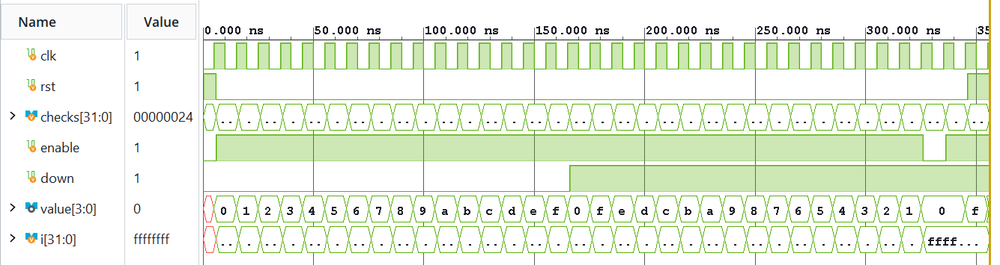

그림 1. 0~356 ns에서 증가와 감소, `enable=0`일 때의 hold, 마지막 reset 동작을 함께 확인한 파형.

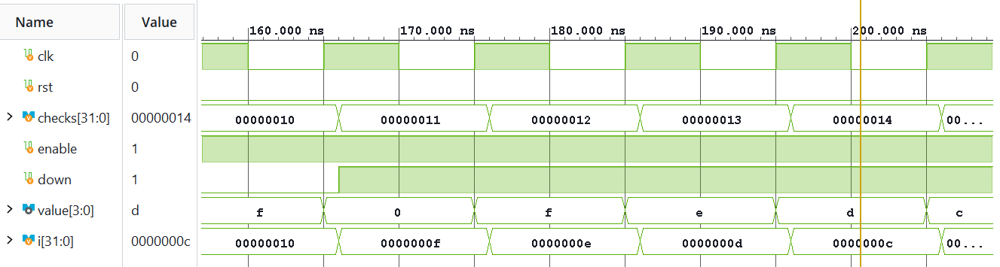

그림 2. 증가 방향의 `15→0`과 `down` 전환 뒤 감소 방향의 `0→15`를 확인한 확대 파형.

실제 board에서는 `input_frontend`를 거친 N8 버튼이 한 번의 step을 만들고, 방향 스위치가 증가와 감소를 선택하였다. 조교 시연에서 K4 reset 뒤 하위 4개 LED가 `0000`이 되었고, 증가 방향의 `1111→0000`과 감소 방향의 `0000→1111`을 확인하였다. 버튼을 길게 누른 구간에는 같은 값이 유지되어, 한 번의 press가 한 번의 count로 처리되는 것도 확인하였다.

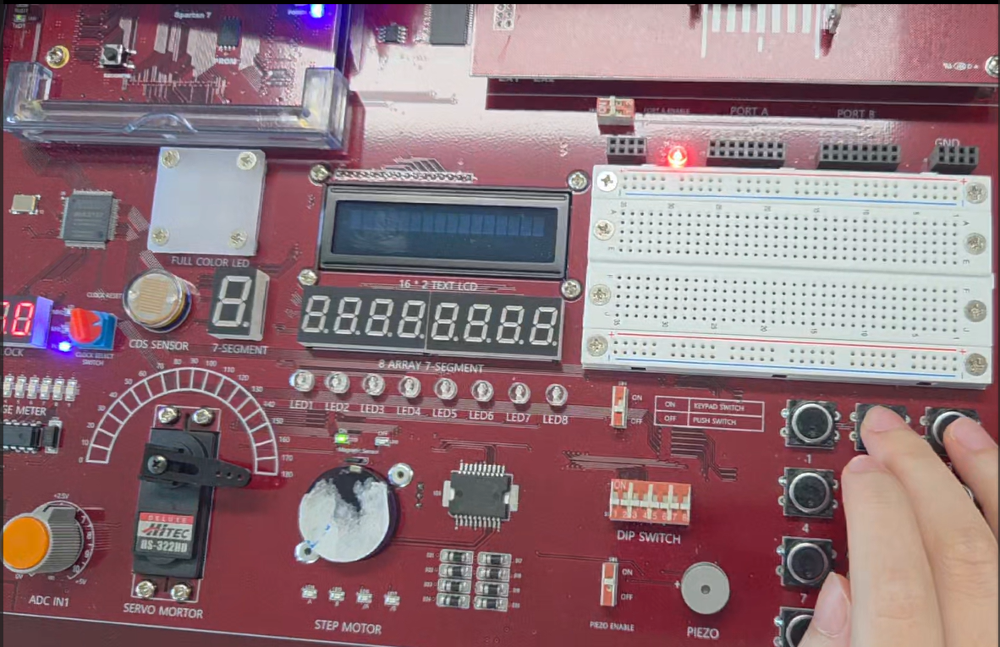

그림 3. K4 reset을 적용한 뒤 하위 4개 LED가 `0000`으로 초기화된 모습.

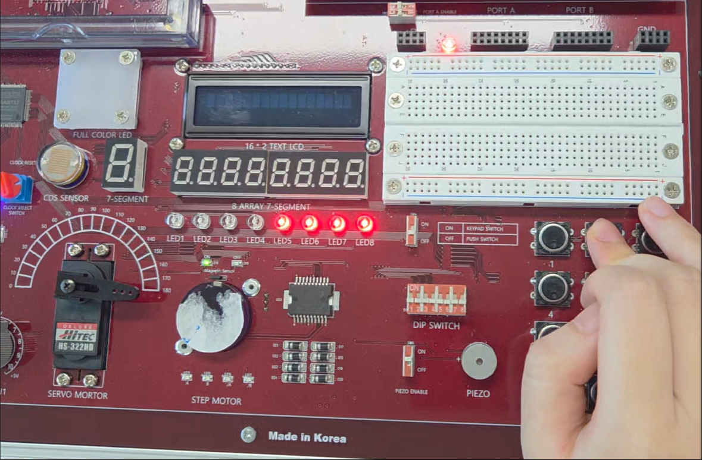

그림 4. 증가 방향에서 하위 4개 LED가 최대값 `1111`을 나타낸 모습.

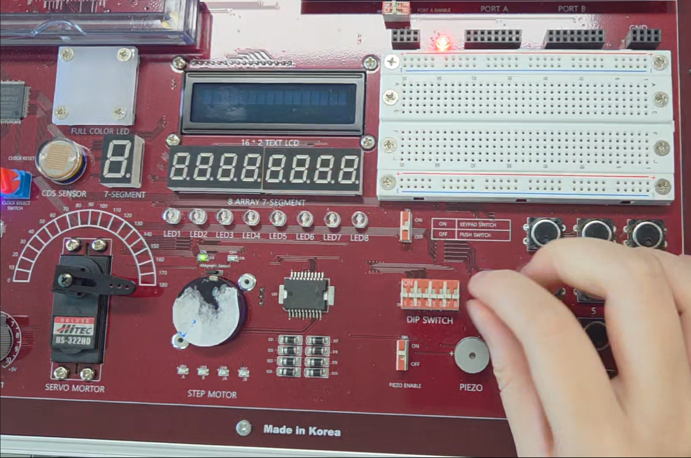

그림 5. 그림 4의 다음 step에서 LED가 `0000`으로 돌아가 4비트 증가 wrap이 발생한 모습. 감소 wrap과 long press 동작은 같은 시연 영상에서 연속으로 확인하였다.

### 02. Clock Divider

`clock_divider.v`는 입력 clock의 edge를 세어 주기가 더 긴 `divided`와 한 clock 폭의 `tick`을 만든다. counter가 `DIVISOR-1`에 도달하면 다시 0부터 세며, `divided`는 한 주기의 앞 절반과 뒤 절반이 각각 Low와 High가 되도록 갱신된다. reset을 인가하면 count와 `divided`가 모두 0이 되어 새로운 주기를 처음부터 시작한다.

simulation에서는 `DIVISOR=10`, 입력 clock 주기 10 ns를 사용하였다. clock 주기와 DIVISOR로 계산하면 `divided`의 한 주기는 100 ns이고, High와 Low는 각각 50 ns이다. Vivado 파형의 첫 상승은 55 ns, 하강은 105 ns, 다음 상승은 155 ns에 나타났으며, `tick`은 매 10번째 count에서 한 clock 동안만 1이 되었다.

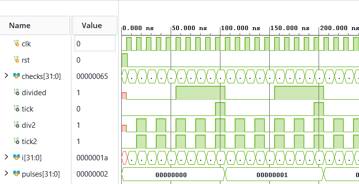

그림 6. `DIVISOR=10`에서 `divided`가 50 ns씩 High와 Low를 반복하고, 주기마다 `tick`이 한 clock 폭으로 발생한 파형.

중간에 reset을 인가했을 때에는 진행 중이던 주기가 중단되고 `divided=0`으로 초기화되었다. reset 해제 뒤에는 Low 구간을 다섯 clock 동안 다시 센 다음 High로 전환되어, 임의 지점에서 이어지는 것이 아니라 새 주기로 시작함을 확인하였다.

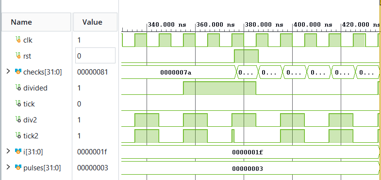

그림 7. 주기 중간의 reset으로 출력이 Low가 되고, reset 해제 뒤 Low 절반 주기부터 다시 시작하는 과정.

실제 board에서는 1 kHz 입력과 기본 `DIVISOR=1000`을 사용하였다. 이에 따라 가장 느린 `divided` 출력 LED가 켜지고 꺼지는 변화를 육안으로 확인할 수 있었다. 빠른 분주 출력의 정확한 주파수와 1 ms 폭의 `tick`은 영상으로 측정하지 않았으며, 이 관계는 Vivado 파형에서 확인하였다.

### 03. Register

`register_pair.v`는 `stored`와 `value`라는 두 개의 4비트 Register로 구성된다. `load=1`인 상승 edge에서는 `data_in`을 `stored`에 저장하고, `transfer=1`이면 현재 `stored`를 `value`로 전달한다. 두 제어가 모두 0이면 두 값은 그대로 유지되며, reset은 두 값을 모두 0으로 초기화한다.

대표 시험에서는 reset 상태의 `00`에서 입력 A를 load하여 `A0`을 만들었다. 입력을 3으로 바꾸고 transfer만 실행하면 현재 입력 3이 아니라 저장되어 있던 A가 전달되므로 `AA`가 된다. 이어 `load=1, transfer=1`을 같은 edge에 적용하면 `stored`에는 새 입력 3이 저장되지만, `value`에는 edge 이전의 `stored=A`가 전달되어 `3A`가 된다. 이는 nonblocking assignment의 오른쪽 식이 갱신 전 값을 사용하기 때문이다. 같은 제어를 다음 edge에 한 번 더 적용하면 이전에 저장된 3이 전달되어 `33`이 된다.

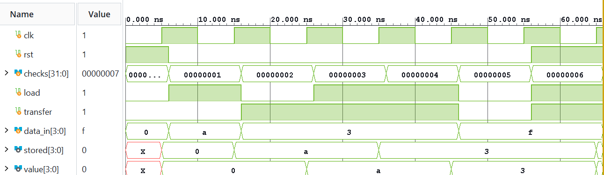

그림 8. reset 뒤 `{stored,value}`가 `00→A0→AA→3A→33`으로 변하고, 제어 입력이 없을 때 `33`을 유지한 파형.

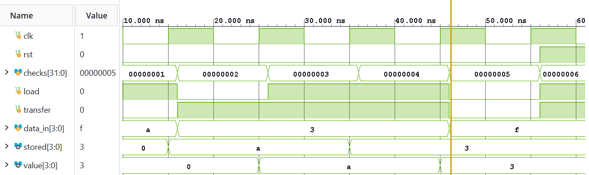

그림 9. 입력이 3인 상태에서 transfer하면 `AA`가 되고, load와 transfer를 함께 적용한 다음 `3A→33`으로 진행하는 구간.

실제 동작 영상에서도 상위 4개 LED와 하위 4개 LED가 `A0→AA→3A→33` 순서로 바뀌었다. 특히 `3A`는 새 입력과 이전 저장값이 같은 edge에서 서로 다른 Register에 반영되는 모습을 보여 주며, Vivado에서 확인한 nonblocking 동작이 board에서도 같은 LED 전환으로 나타났다.

### 04. Shift Register

`shift_register4.v`는 `enable=1`인 상승 edge마다 `serial_in`을 MSB에 넣고 기존 비트를 오른쪽으로 한 자리 이동한다. `enable=0`이면 `serial_in`이 바뀌어도 저장된 값은 변하지 않으며, reset은 shift보다 우선하여 값을 0으로 만든다.

Vivado에서는 reset 뒤 직렬 입력 `1,0`을 차례로 적용하여 `0→8→4`를 확인하였다. 이어 `enable=0`인 동안 입력을 1로 바꾸어도 값은 4를 유지하였다. enable을 다시 1로 만들면 새 1이 MSB로 들어와 A가 되고, 다음 0 입력에서는 5가 되었다. 이후 0을 계속 입력하면서 저장된 비트가 오른쪽으로 빠져나가 `A→5→2→1→0`으로 진행하였다.

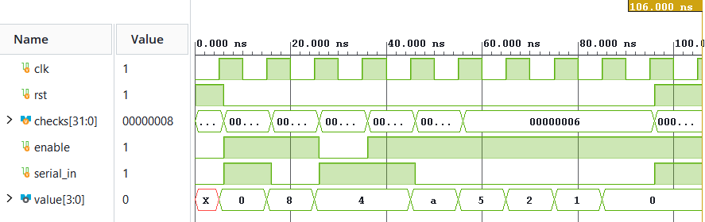

그림 10. `serial_in`이 MSB로 들어오면서 `0→8→4→4→A→5→2→1→0`으로 이동하고, `enable=0` 구간에서는 4를 유지한 파형.

실제 동작 영상에서는 버튼을 누를 때마다 LED의 점등 위치가 하위 비트 방향으로 이동하고, 버튼을 누르지 않을 때에는 같은 위치를 유지하였다. 영상에서 이동 방향과 hold는 확인할 수 있었지만 모든 중간 값을 명확한 16진수로 판독하지는 않았다.

### 05. PISO

`piso4.v`는 4비트 병렬 입력을 저장한 뒤 한 비트씩 직렬로 출력하는 PISO register이다. reset 다음으로 load가 우선하므로 `load=1`이면 `data_in` 전체를 저장한다. `serial_out`은 현재 저장값의 MSB이며, shift가 실행될 때마다 값이 왼쪽으로 이동하고 LSB에는 0이 채워진다.

대표값 A(`1010`)를 load하면 저장값은 A이고 첫 `serial_out`은 1이다. 각 shift 직전 MSB를 읽으면 직렬 출력은 `1→0→1→0`이며, 각 edge 뒤의 저장값은 `A→4→8→0→0`으로 변한다. 네 번의 shift 뒤에는 모든 원래 비트가 빠져나가 0만 남는다.

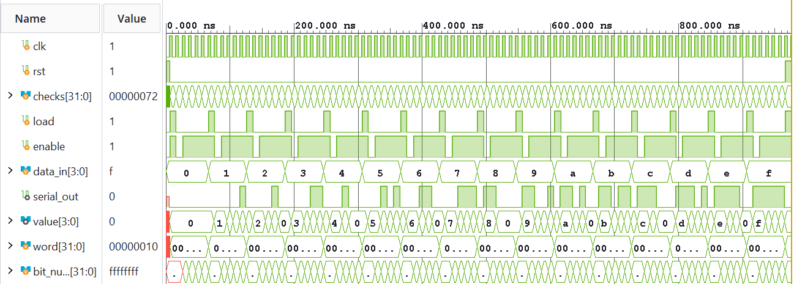

그림 11. 0~F의 병렬 입력을 차례로 load하고, 각 단어를 네 번 shift한 뒤 0이 되는 과정을 검사한 전체 파형.

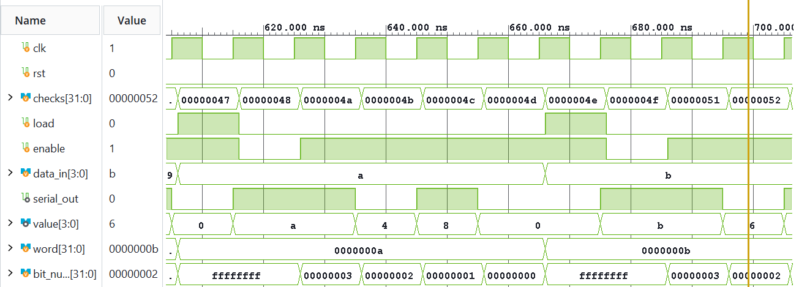

그림 12. A를 load한 뒤 저장값이 `A→4→8→0→0`, shift 직전 `serial_out`이 `1→0→1→0`으로 나타난 확대 파형.

실제 동작 영상에서는 A를 병렬 load한 뒤 버튼을 누를 때마다 저장 LED와 직렬 출력 LED가 변하는 모습을 확인하였다. 정확한 비트 순서와 edge 전후의 출력 시점은 Vivado 확대 파형으로 확인하고, board에서는 load와 shift가 실제 LED 변화로 이어지는지를 확인하였다.

### 06. Moore FSM

`moore_cycle.v`는 출력값 자체가 현재 state인 Moore FSM이다. reset state는 `00`이며, `enable=1`이고 `advance=1`인 상승 edge에서 `00→01→10→00` 순서로 전이한다. `advance` 또는 `enable` 중 하나라도 0이면 현재 state를 유지한다. 출력이 state와 같으므로 입력만 바꾸고 clock edge가 오지 않으면 출력도 변하지 않는다.

Vivado에서는 네 차례의 상태 순환과 중간 hold를 확인하였다. 첫 유효 edge에서 `00→01`이 된 뒤 `advance=0` 또는 `enable=0`인 두 edge 동안 01을 유지하였고, 다음 유효 edge에서 `01→10`, 그다음 edge에서 `10→00`으로 진행하였다.

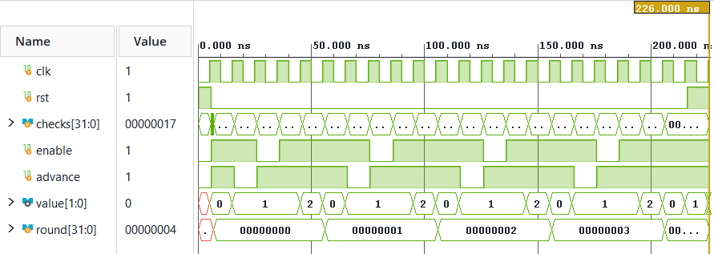

그림 13. `00→01→10→00` 순환을 반복하고 마지막에 reset으로 00으로 돌아가는 전체 파형.

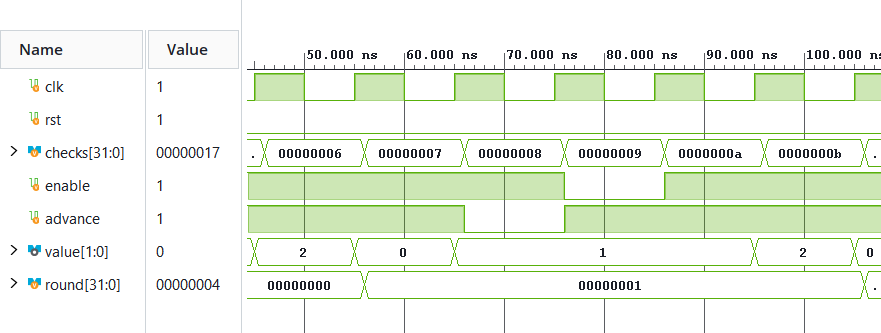

그림 14. 유효한 상승 edge에서만 state가 바뀌며, `advance=0` 또는 `enable=0`인 구간에는 01을 유지하는 모습.

실제 동작 영상에서도 하위 두 LED가 `00→01→10→00`으로 순환하였다. Advance 조건을 해제하거나 버튼을 누르지 않을 때에는 현재 LED 값이 유지되어, 입력 자체가 아니라 유효한 edge에서 state가 갱신된다는 점을 확인하였다.

### 07. Mealy FSM

`mealy_toggle.v`에서 state는 상승 edge에 맞추어 갱신되지만, 출력 `value`는 현재 state와 `bit_in`의 조합으로 바로 결정된다. `bit_in=0`이면 state와 관계없이 `value=00`이고, `bit_in=1`이면 S0에서 10, S1에서 01이 된다. 따라서 clock edge가 없어도 입력만 바뀌면 value는 변할 수 있다.

Vivado에서는 S0에서 `bit_in`만 0에서 1로 바꾸었을 때 state는 0을 유지하면서 value가 `00→10`으로 바뀌었다. 다음 유효 edge에서 state가 S1로 전이되자 value는 01이 되었고, S1에서 입력을 0으로 내렸을 때에는 state가 그대로인 상태에서 value만 00으로 바뀌었다. 입력에 따른 출력 변화와 edge에 따른 state 전이를 서로 구분할 수 있었다.

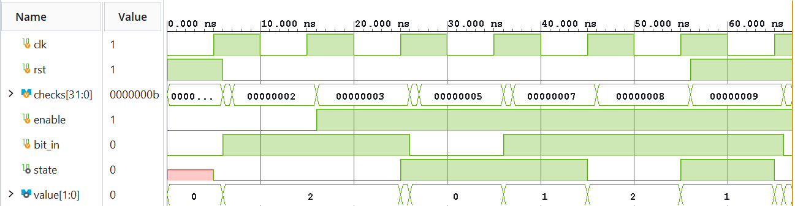

그림 15. 입력 변화와 state 전이를 포함하여 reset까지 진행한 Mealy FSM의 전체 파형.

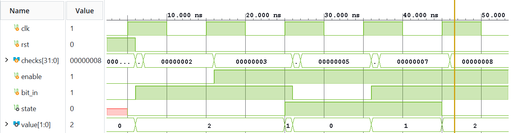

그림 16. S0와 S1에서 `bit_in` 변화 직후 value가 달라지고, 유효한 상승 edge에서 state가 전이되는 과정을 분리해 보여 주는 파형.

실제 동작 영상에서는 입력 스위치를 바꿀 때의 출력 LED 변화와 step 버튼을 눌렀을 때의 state LED 변화를 각각 확인하였다. 영상에서는 두 조작에 따른 LED 변화만 관찰하였으며, 입력에 대한 즉시 반응 시간은 Vivado 파형을 기준으로 판단하였다.

### 08. Segment Scan

`segment_scan8.v`는 `index`가 가리키는 자리의 4비트 값을 선택하고, 그 값에 맞는 `segments` pattern을 만든다. 한 자리의 active 구간 뒤에는 모든 자리 선택을 끄는 blank 구간을 두고, 다음 index로 이동하는 과정을 반복한다. Core의 `select`는 active-high이지만, `lab2_segment_scan.v`에서는 이를 반전하고 bit 순서를 맞추어 board의 active-low `seg_com`으로 출력한다.

Vivado에서 reset 직후에는 `index=0, select=00`인 blank 상태가 나타났다. 이어 첫 자리가 활성화되면 숫자 0의 pattern인 `select=01, segments=FC`가 되었고, 다음 blank를 거쳐 index 1의 숫자 1이 `select=02, segments=60`으로 나타났다. 따라서 자리 선택과 segment pattern이 함께 바뀌며, 두 자리 사이마다 `select=00`인 blank가 들어가는 것을 확인하였다.

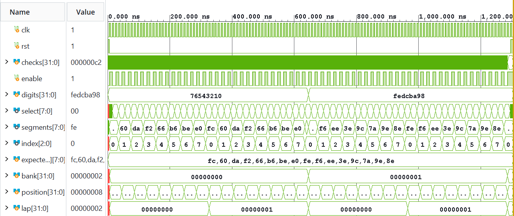

그림 17. 0~7과 8~F 두 입력 묶음을 순회하면서 active와 blank를 반복하고 마지막 reset으로 돌아가는 전체 파형.

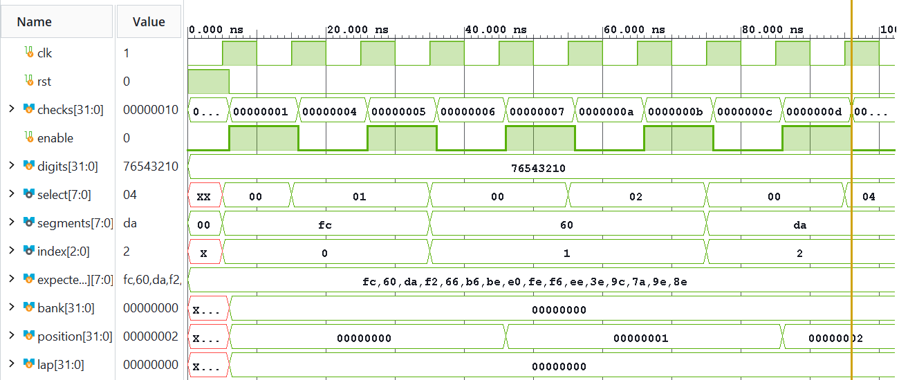

그림 18. 숫자 0의 `01/FC`와 숫자 1의 `02/60` 사이에 `select=00`인 blank가 들어가는 첫 두 자리 전환.

board의 1 kHz clock에서는 RTL 동작에 따라 한 자리 active 1 ms와 blank 1 ms가 반복된다. 여덟 자리의 한 순회는 16 ms이므로 refresh rate는 62.5 Hz이고, 각 자리의 active duty는 6.25%이다. 이 값은 1 kHz clock과 RTL 동작으로 계산한 값이며 board 영상에서 측정한 값은 아니다. 실제 동작 영상에서는 여덟 자리가 연속된 표시처럼 보였고, 입력 스위치를 바꾸었을 때 첫 자리 숫자가 함께 바뀌는 것을 확인하였다.

## 3. Vivado 구현 및 FPGA 적용 기록

Vivado project 기록에서 확인한 도구 version은 Vivado v2026.1(64-bit)이며, 대상 소자는 Combo II-DLD S75 board의 `xc7s75fgga484-1`이다. 각 실험의 XDC에는 해당 회로에서 사용하는 clock, reset, button, DIP switch, LED 등의 FPGA pin을 정의하였다. B6 clock에는 1 kHz에 해당하는 1,000,000 ns 주기 constraint를 적용하였고, Segment Scan에는 7-segment data와 COM pin도 추가하였다.

01·03·05·07·08에서는 synthesis와 implementation 결과, routed DRC/timing report 및 생성된 bitstream을 확인하였다. 확인 가능한 timing report에서는 설정한 clock constraint를 충족하였고 TNS와 THS는 0이었다. Routed DRC에는 error가 없었으며, `CFGBVS`와 `CONFIG_VOLTAGE` property가 지정되지 않았다는 `CFGBVS-1` warning이 1건씩 남아 있었다. 이 warning은 FPGA 구성 전압 설정에 관한 항목으로, Behavioral simulation에서 확인한 회로의 논리 동작과는 구분하였다.

확인 가능한 synthesis log에는 1 kHz clock의 period와 half-period가 합성기의 내부 표현 범위를 넘어 일부 값이 잘렸다는 `Synth 8-681` warning도 기록되어 있었다. 또한 01·05·07·08에서는 사용하지 않는 LED 비트를 0으로 고정하여 `Synth 8-3917`이 발생했으며, 두 항목은 기능 simulation의 실패가 아니라 constraint와 고정 출력에 관한 구현 경고로 구분하였다.

현재 저장소에서 확인한 bitstream 파일과 SHA-256은 다음과 같다.

| 실험 | bitstream 파일 | SHA-256 |
|---|---|---|
| 01 Counter | `lab2_counter.bit` | `1EF0A72DD98789ED24C55D9F7AD2CFA06045ACD2CF275286B081FC1B78638FA4` |
| 03 Register | `lab2_register.bit` | `3FDE5301E6306E0899C557196569DA9928ED04F1C17D5FBC05DCD06DEF8C607C` |
| 05 PISO | `lab2_piso.bit` | `D659D1822EDCE4D8833BF5CAF559371A64A0AB4C395A10A9AAFF1237DD589ED2` |
| 07 Mealy FSM | `lab2_mealy.bit` | `FD41FEF64B1832EFCAF23304667D04542F44A0B62E055E1F2AF818F8E7BCCAC3` |
| 08 Segment Scan | `lab2_segment_scan.bit` | `6614AA913F52FB964D13EC1412BD358A40352FF759209C5970F3E21051271D5A` |

02 Clock Divider, 04 Shift Register, 06 Moore FSM의 synthesis, implementation 및 FPGA 적용은 팀 분담에 따라 별도 Vivado 환경에서 수행되었다. 해당 환경의 원본 bitstream과 timing report는 현재 저장소에 남아 있지 않아 bit hash와 세부 timing 수치를 임의로 제시하지 않았다. 세 실험의 기능은 확보된 Vivado simulation 결과와 실제 board 동작 영상을 기준으로 확인하였다.

Program Device 화면은 01 Counter, 02 Clock Divider, 04 Shift Register에서 확인하였다. 이 화면은 FPGA programming이 수행되었음을 보여 주는 자료이고, 실제 회로 기능은 각 실험의 board 동작 영상에서 확인하였다.

## 4. 결론

이번 실험에서는 순차회로가 상승 edge를 기준으로 값을 갱신하고, 유효한 enable이 없을 때에는 현재 값을 유지한다는 공통 원리를 확인하였다. reset이 다른 제어보다 우선하는 동작과 제한된 비트 수에서 발생하는 wrap도 simulation과 실제 FPGA 출력으로 비교할 수 있었다.

Register 실험에서는 nonblocking assignment로 인해 같은 edge에서도 새로 저장되는 값과 다른 Register로 전달되는 이전 값이 구분된다는 점을 확인하였다. Moore FSM은 state가 바뀌는 edge에서 출력이 달라지는 반면, Mealy FSM은 state가 그대로여도 입력에 따라 출력이 바뀔 수 있어 두 구조의 출력 시점 차이를 파형으로 구분할 수 있었다. Segment Scan에서는 active와 blank를 반복하여 여러 자리를 시간분할로 표시하는 원리를 확인하였다.

Vivado 파형은 edge 전후의 신호와 짧은 timing을 분석하는 데 적합했고, FPGA board는 버튼과 스위치 조작이 실제 LED 및 7-segment 변화로 이어지는지를 확인하는 데 적합했다. 두 결과를 함께 비교함으로써 RTL의 동작과 물리적인 출력 사이의 대응을 확인하였다.

## 5. 제출 자료

- **Source:** [LAB2 실험 source](https://github.com/yunuos2525-cloud/ece2_2026/tree/main/LAB2)
- **PRE Report:** [LAB2 실험 전 보고서](https://github.com/yunuos2525-cloud/ece2_2026/blob/main/reports/pre/LAB2_pre_report.pdf)
- **POST Report:** [LAB2 실험 후 보고서](https://github.com/yunuos2525-cloud/ece2_2026/blob/main/reports/post/LAB2_post_report.pdf)
- **01 Counter Board Photo:** [시연 사진](https://github.com/yunuos2525-cloud/ece2_2026/tree/main/evidence/board/LAB2/frames)
- **01~08 Board Videos:** [실제 동작 영상](https://github.com/yunuos2525-cloud/ece2_2026/blob/main/README.md)

## 참고문헌

[1] M. Morris Mano and Michael D. Ciletti, *Digital Design: With an Introduction to the Verilog HDL*, 5th ed., Pearson, 2013.
