# 전자전기컴퓨터설계실험Ⅱ

## 실험 후 보고서

### LAB 3 - PWM 및 주변장치 제어

학과: 전자전기컴퓨터공학부

학번/이름: 2025440032 / 김윤지

작성일: 2026.10.04

대상: 19 LED PWM ~ 25 UART Echo

검증 환경: VS Code / Icarus Verilog / VaporView / Vivado 2026.1 / FPGA board

프로젝트: ece2_2026 / LAB3

GitHub repository:

[https://github.com/yunuos2525-cloud/ece2_2026](https://github.com/yunuos2525-cloud/ece2_2026)

Source code commit:

fd539b320326f65146adb0926222179019a2653c

제출 tag: LAB3_POST_FINAL

## 1. 실험 목적 및 검증 방법

LAB3에서는 50 MHz clock을 기준으로 PWM, piezo, stepper motor, MM:SS 시계, character LCD, UART를 제어하는 회로를 설계하였다. 실험 19~25의 RTL, testbench, XDC를 Vivado project에 등록하고, 실험 전 보고서에서 사용한 대표 조건을 XSim에서도 다시 시험하였다. 대상 FPGA는 `xc7s75fgga484-1`이며, 각 XDC에는 `LVCMOS33`과 20 ns clock constraint가 지정되어 있다 [1].

검증은 네 단계로 나누었다. 먼저 VS Code의 Icarus/VaporView에서 예상값과 대표 파형을 확인하였다. 다음으로 같은 RTL과 testbench를 Vivado/XSim에서 실행하여 PASS 결과와 대표 파형이 예상과 일치하는지 확인하였다. 그 뒤 19, 21, 23, 25는 저장소에서 synthesis, implementation, DRC, timing, bitstream 및 Program Device 자료를 확인하였다. 20, 22, 24는 팀원 PC에서 implementation과 board 적용을 수행했으며 관련 구현 자료는 저장소에 보존되어 있지 않다. 마지막으로 실제 board의 LED, RGB LED, piezo, motor, 7-segment, LCD 및 UART 출력을 관찰하였다.

XSim 파형에서는 정확한 duty, 주기, 상태 전이, 자리올림 및 command/data 전송 순서를 확인하였다. Board 사진과 영상에서는 설계가 실제 물리 출력으로 이어지는지를 확인하였다. 즉, programming 성공과 board 기능 검증을 구분하고, 영상에서 직접 확인하기 어려운 duty, 주파수 및 내부 timing은 simulation 또는 계산 결과를 통해 확인하였다.

## 2. 실험별 설계 및 검증 결과

### 2.1 19 LED PWM

`lab3_led_pwm`은 버튼 입력을 one-pulse로 변환하고, 입력될 때마다 PWM level을 한 단계씩 증가시켜 동일한 PWM 신호를 8개 LED에 출력한다. TB에서는 `LEVELS=10`을 사용하므로 level 3의 예상 duty는 `3/10=30%`이며, level 10 다음 버튼 입력에서는 level이 0으로 순환해야 한다.

XSim에서는 전체 검사가 `LAB3_LED_PWM_PASS checks=4`로 종료되었다. 대표 파형에서 level 3일 때 한 PWM period의 10 clocks 중 3 clocks가 HIGH이고 7 clocks가 LOW여서 예상한 30% duty와 일치하였다. 또한 level 10의 연속 HIGH 상태에서 다음 press가 들어오자 level이 0으로 바뀌고 LED 출력도 `8'hFF`에서 `8'h00`으로 전환되어 100%→0% wrap을 확인하였다.

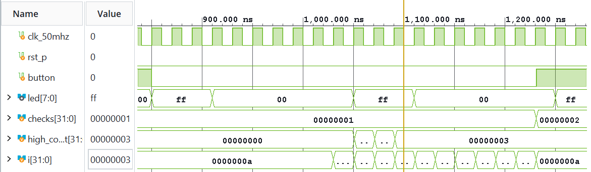

그림 1. Level 3에서 HIGH 3 clocks, LOW 7 clocks가 반복되어 30% duty가 형성된 구간.

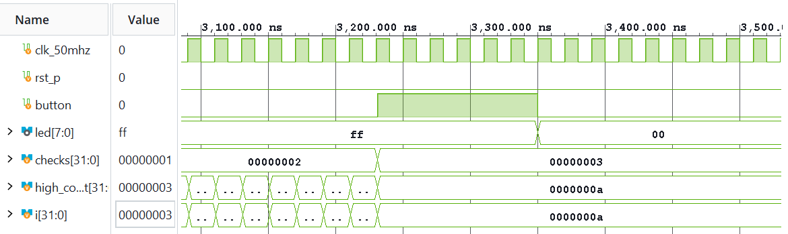

그림 2. 최대 level 다음 press에서 level과 8개 LED 출력이 0으로 순환한 구간.

실제 board 영상에서는 버튼 조작에 따라 LED의 상대 밝기가 단계적으로 변하는 것을 확인하였다. [LED PWM board 동작 영상](https://github.com/yunuos2525-cloud/ece2_2026/blob/89d23161479ae0d2f1cbcf0ebb550bb4eeb856f5/evidence/board/LAB3/raw_videos/LAB3_19_led_pwm_program_video.mp4)

### 2.2 20 RGB PWM

`lab3_rgb_pwm`은 R/G/B 채널에 독립적인 level과 PWM channel을 두어 세 색의 duty를 따로 조절한다. 대표 시험에서는 R/G/B 버튼을 각각 2회, 5회, 8회 입력하여 20%, 50%, 80% duty를 만들고, 이어 R 버튼만 한 번 더 눌러 R의 HIGH 폭만 2 clocks에서 3 clocks로 증가하는지 검사하였다.

XSim은 `LAB3_RGB_PWM_PASS checks=2`로 종료되었다. 그림 3에서는 세 채널의 HIGH 폭이 각각 2/5/8 clocks로 나타났고, 그림 4에서는 G와 B가 유지된 상태에서 R만 2→3 clocks로 증가하였다. 따라서 duty 조합과 채널 독립성이 실험 전 예상과 일치하였다.

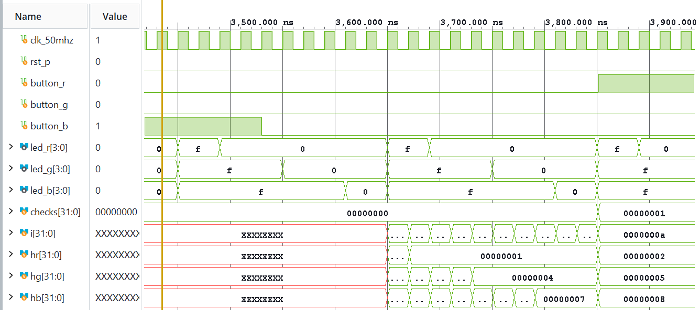

그림 3. 동일 PWM period에서 R/G/B의 HIGH 폭이 각각 2/5/8 clocks로 나타난 구간.

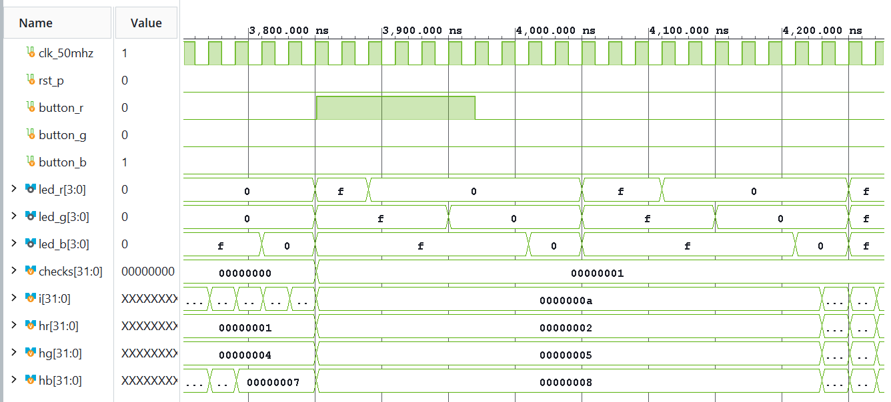

그림 4. R 채널만 2→3 clocks로 증가하고 G/B 채널은 유지된 독립성 검사.

Board 영상에서는 버튼 조작에 따라 RGB LED의 색과 상대 밝기가 변화하는 것을 확인하였다. [RGB PWM board 동작 영상](https://github.com/yunuos2525-cloud/ece2_2026/blob/89d23161479ae0d2f1cbcf0ebb550bb4eeb856f5/evidence/board/LAB3/raw_videos/LAB3_20_rgb_pwm_video.mp4)

### 2.3 21 Piezo

`lab3_piezo`는 다음 식으로 square wave의 half-period를 계산하고, counter가 해당 값에 도달할 때마다 piezo 출력을 반전한다.

`HALF_PERIOD = CLK_HZ / (2 × TONE_HZ)`

Board 설정의 `CLK_HZ=50,000,000`, `TONE_HZ=294`에서는 half-period가 85,034 clocks로 계산된다. TB에서는 짧은 시간에 같은 구조를 검증하기 위해 `CLK_HZ=1000`, `TONE_HZ=100`을 사용하여 예상 반전 간격을 5 clocks로 줄였다.

XSim 파형에서 counter가 `0→1→2→3→4→0`으로 순환할 때마다 piezo가 반전되었고, 연속 반전 사이의 간격은 5 clocks였다. 실행은 `LAB3_PIEZO_PASS edges=5`로 종료되어 계산과 파형이 일치하였다.

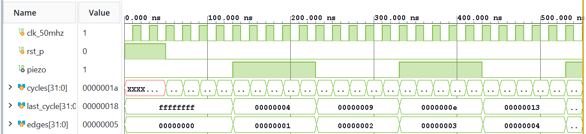

그림 5. TB 축소 조건에서 counter가 다섯 clock마다 0으로 돌아가고 piezo 출력이 반전되는 파형.

실제 board 영상의 음성에서 piezo의 출력음을 확인하였다. [Piezo board 동작 영상](https://github.com/yunuos2525-cloud/ece2_2026/blob/89d23161479ae0d2f1cbcf0ebb550bb4eeb856f5/evidence/board/LAB3/raw_videos/LAB3_21_piezo_program_video.mp4)

### 2.4 22 Stepper

`lab3_stepper`는 step enable이 발생할 때 2-bit state를 갱신하고, state를 4-bit motor 구동 pattern으로 변환한다. 정방향에서는 reset 상태의 `3`에서 `6→C→9→3` 순서로 진행하고, 방향 입력을 바꾸면 `3→9→C`와 같이 반대 순서로 진행한다. `enable=0`에서는 마지막 pattern을 유지해야 한다.

XSim에서 정방향, 역방향, hold를 포함한 8개 검사가 모두 통과하여 `LAB3_STEPPER_PASS checks=8`이 출력되었다. 그림 6에는 정방향 pattern, 방향 변경 뒤의 역방향 pattern, `enable=0`에서 `C`가 유지되는 구간이 연속으로 나타난다.

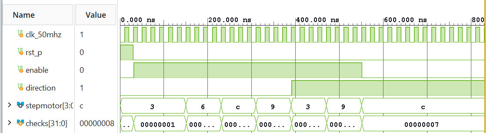

그림 6. Direction과 enable 조건에 따라 4상 pattern의 진행 방향이 바뀌고, `enable=0`에서 마지막 pattern이 유지되는 파형.

Board 영상에서는 motor가 회전하고 direction 조작에 따라 회전 방향이 바뀌며, `enable=0`에서 정지하는 것을 확인하였다. [Stepper board 동작 영상](https://github.com/yunuos2525-cloud/ece2_2026/blob/89d23161479ae0d2f1cbcf0ebb550bb4eeb856f5/evidence/board/LAB3/raw_videos/LAB3_22_stepper_video.mp4)

### 2.5 23 MM:SS Clock

`mmss_counter`는 1초 enable마다 `second_ones`, `second_tens`, `minute_ones`, `minute_tens`를 BCD 범위에서 갱신한다. 초 일의 자리, 초 십의 자리, 분 일의 자리, 분 십의 자리의 최대값은 각각 9, 5, 9, 5이며, 59:59 다음에는 00:00으로 순환한다.

대표 경계는 00:09→00:10, 00:59→01:00, 59:59→00:00이다. XSim에서 첫 경계에는 초 일의 자리의 9→0과 초 십의 자리의 0→1이 나타났고, 두 번째 경계에는 두 초 자리가 0이 되면서 분 일의 자리가 증가하였다. 마지막 경계에서는 네 자리가 모두 00:00으로 돌아갔다. 전체 실행은 `LAB3_MMSS_PASS checks=7`로 종료되었다.

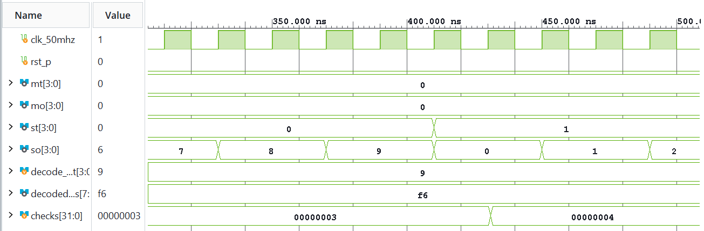

그림 7. 초 일의 자리에서 초 십의 자리로 전달되는 첫 10진 자리올림.

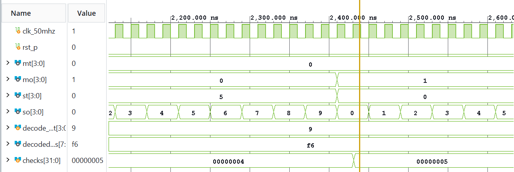

그림 8. 두 초 자리가 0으로 돌아가고 분 일의 자리가 증가한 경계.

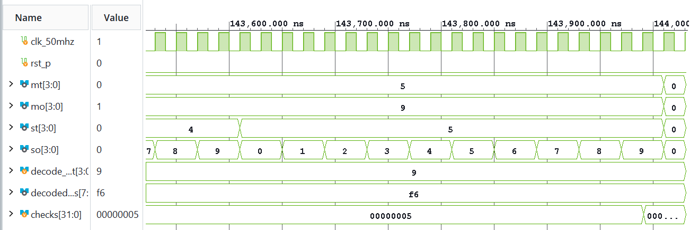

그림 9. 분·초 네 자리가 모두 순환하여 00:00으로 복귀한 3600초 경계.

실제 board에서는 약 1분 동안 7-segment의 MM:SS 표시가 계속 증가하는 것을 확인하였다. [MM:SS Clock board 동작 영상](https://github.com/yunuos2525-cloud/ece2_2026/blob/89d23161479ae0d2f1cbcf0ebb550bb4eeb856f5/evidence/board/LAB3/raw_videos/LAB3_23_mmss_clock_program_video.mp4)

### 2.6 24 Character LCD

`lab3_character_lcd`는 HD44780 호환 LCD를 8-bit write-only 방식으로 제어한다. 초기화 명령 `38, 38, 38, 0C, 06, 01, 80`을 전송한 뒤 첫 행에 `FPGA LAB3`를 출력한다. 이어 `0xC0` 명령으로 둘째 행을 선택하고 `LCD CONTROLLER`를 전송한다. TB는 `lcd_e`의 하강 시점마다 `lcd_rs`, `lcd_rw`, `lcd_data`를 예상 배열과 비교하였다.

XSim은 40 bytes를 모두 검사한 뒤 `LAB3_LCD_PASS bytes=40`으로 종료되었다. 초기화 구간에서는 `RS=0`, `RW=0`에서 7개 command가 순서대로 나타났다. 첫 행 구간에서는 `RS=1`에서 `FPGA LAB3`의 ASCII 값과 공백이 전송되었고, 이후 `RS=0`, `data=0xC0`으로 둘째 행을 선택한 다음 `LCD CONTROLLER`의 ASCII data가 이어졌다.

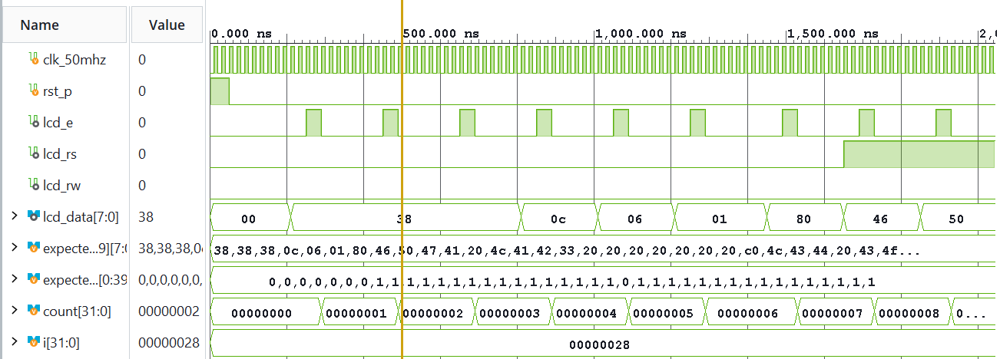

그림 10. `RS=0`, `RW=0`에서 LCD 초기화와 첫 행 주소 지정 command가 전송된 순서.

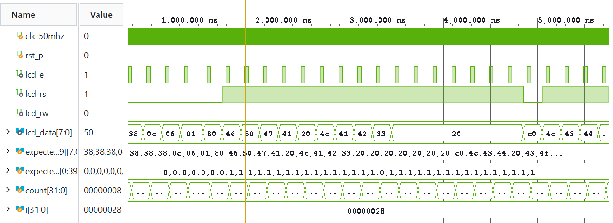

그림 11. `RS=1`에서 `FPGA LAB3`와 남은 공백의 ASCII data가 전송된 구간.

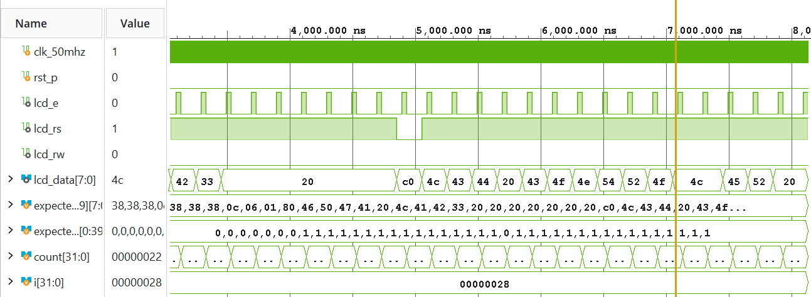

그림 12. `0xC0` command로 둘째 행을 선택한 뒤 `LCD CONTROLLER` data가 이어진 구간.

실제 board 영상에서는 LCD 첫 행에 `FPGA LAB3`, 둘째 행에 `LCD CONTROLLER`가 표시되는 것을 확인하였다. [Character LCD board 동작 영상](https://github.com/yunuos2525-cloud/ece2_2026/blob/89d23161479ae0d2f1cbcf0ebb550bb4eeb856f5/evidence/board/LAB3/raw_videos/LAB3_24_character_lcd_video.mp4)

### 2.7 25 UART Echo

`uart_rx`는 9600 baud, 8 data bits, no parity, 1 stop bit 조건의 frame을 수신하고, `lab3_uart_echo`는 수신 완료 시 byte를 LED에 저장한 뒤 `uart_tx`로 다시 전송한다. 대표 시험은 ASCII `A`인 `0x41`이며, 전체 TB에서는 `0x41`, `0x5A`, `0x0A`를 차례로 검사하였다.

XSim에서 `0x41` RX frame 수신 뒤 `rx_valid`가 발생하고 LED 값이 `0x41`로 바뀐 다음 같은 값의 TX frame이 시작되는 순서를 확인하였다. 전체 세 byte의 echo와 LED 저장 검사는 `LAB3_UART_ECHO_PASS checks=3`으로 종료되었고 framing error는 발생하지 않았다.

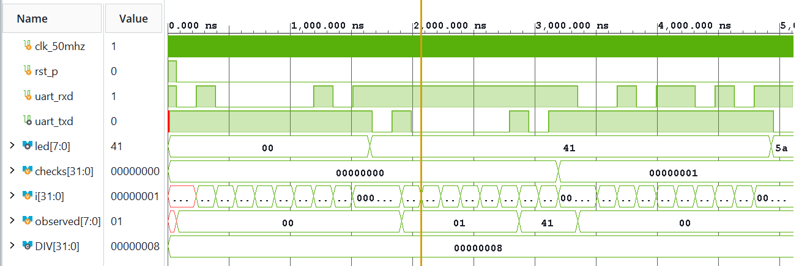

그림 13. `0x41` RX frame 뒤 수신 완료, LED 저장, 동일 byte TX가 이어진 내부 동작.

UART Echo는 실제 조교 시연 대상으로 사용하였다. 그림 14는 serial port가 COM9로 열린 상태를 보여 준다. 실제 시연에서는 terminal의 local echo를 OFF로 설정하고 문자 `A`를 송신했으며, 그림 15와 같이 FPGA에서 반환된 `A`를 확인하였다.

그림 14. Terminal에서 serial port COM9를 연 상태를 보여 주는 화면.

그림 15. Local echo를 끈 시연 조건에서 `A`를 송신한 뒤 FPGA로부터 반환된 `A`가 표시된 화면.

Board overview에서는 실제 FPGA board 적용 상태와 `8'b0100_0001 = 8'h41`, 즉 ASCII `A`에 해당하는 LED pattern을 확인하였다.

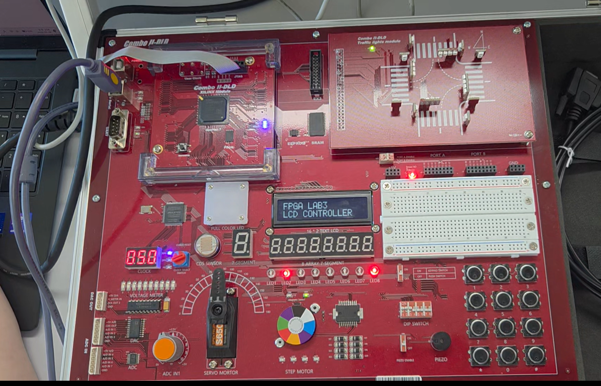

그림 16. UART Echo가 적용된 FPGA board에서 `0x41`에 해당하는 LED pattern.

[UART Echo 전체 board 시연 영상](https://github.com/yunuos2525-cloud/ece2_2026/blob/89d23161479ae0d2f1cbcf0ebb550bb4eeb856f5/evidence/board/LAB3/raw_videos/LAB3_25_uart_echo_program_video.mp4)

## 3. Vivado 구현 및 FPGA 적용 기록

7개 project의 대상 소자는 `xc7s75fgga484-1`이며, 각 XDC는 50 MHz clock에 대해 20 ns period와 `LVCMOS33`을 지정한다. Behavioral Simulation, implementation, programming 및 실제 board 동작은 각각 구분하여 확인하였다.

19, 21, 23, 25는 저장소에서 implementation report, bitstream 및 Program Device 화면을 확인하였다. 네 실험 모두 synthesis, implementation 및 bitstream 생성을 완료했고, WNS가 0 이상이며 TNS가 0으로 timing constraint를 만족하였다. 세부 결과와 warning은 표에 정리하였다.

| 실험 | 구현 및 timing 결과 | 확인된 warning | Program Device 기록 |
|---|---|---|---|
| 19 LED PWM | synthesis/implementation/bitstream 완료, timing 만족 (WNS 8.971 ns, TNS 0) | `CFGBVS-1` 1건, `TIMING-18` 8건 | 부록 B 참조 |
| 20 RGB PWM | 팀원 PC에서 implementation 및 board 적용 수행, 관련 구현 자료 미보관 | 세부 DRC/timing 결과 미기재 | 화면 미보관 |
| 21 Piezo | synthesis/implementation/bitstream 완료, timing 만족 (WNS 16.761 ns, TNS 0) | `CFGBVS-1` 1건, `TIMING-18` 1건 | 부록 B 참조 |
| 22 Stepper | 팀원 PC에서 implementation 및 board 적용 수행, 관련 구현 자료 미보관 | 세부 DRC/timing 결과 미기재 | 화면 미보관 |
| 23 MM:SS Clock | synthesis/implementation/bitstream 완료, timing 만족 (WNS 15.118 ns, TNS 0) | `CFGBVS-1` 1건, `TIMING-18` 16건 | 부록 B 참조 |
| 24 Character LCD | 팀원 PC에서 implementation 및 board 적용 수행, 관련 구현 자료 미보관 | 세부 DRC/timing 결과 미기재 | 화면 미보관 |
| 25 UART Echo | synthesis/implementation/bitstream 완료, timing 만족 (WNS 14.617 ns, TNS 0) | `CFGBVS-1` 1건, `TIMING-18` 9건 | 부록 B 참조 |

20, 22, 24의 implementation과 board 적용은 팀원 PC에서 수행하였다. 해당 구현 자료는 저장소에 보존되어 있지 않아 세부 DRC 및 timing 결과는 제시하지 않았다.

## 4. 결론

LAB3에서는 50 MHz clock을 기준으로 PWM, 주파수 분주, 순차 상태 제어, BCD counting, LCD command/data 전송 및 UART 통신을 구현하여 여러 주변장치를 제어하였다. LED와 RGB PWM에서는 duty 변화에 따른 출력 제어를 확인했고, piezo에서는 counter를 이용하여 주파수를 생성하였다. Stepper motor에서는 입력에 따라 구동 pattern의 진행 방향이 바뀌고 `enable=0`에서 마지막 pattern이 유지되는 동작을 확인하였다. 또한 MM:SS Clock의 자리올림, Character LCD의 초기화와 문자 전송, UART의 수신·저장·재전송 과정을 파형으로 확인하였다.

Vivado/XSim에서 계산한 예상값과 주요 신호 변화를 확인한 뒤 실제 FPGA board에서 LED 밝기와 색, piezo 출력음, motor 회전, MM:SS 표시, LCD 문자열, UART echo와 LED 출력을 확인하였다. 이를 통해 RTL에서 설계한 시간 및 상태 제어가 실제 주변장치의 동작으로 연결되는 과정을 확인하였다.

## 부록 A. XSim PASS 결과

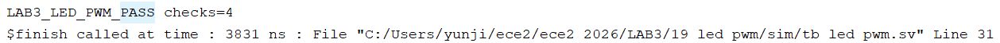

그림 A-1. LED PWM XSim PASS 결과.

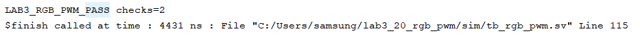

그림 A-2. RGB PWM XSim PASS 결과.

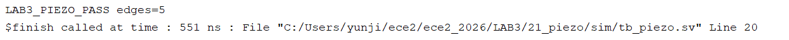

그림 A-3. Piezo XSim PASS 결과.

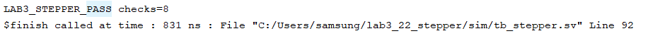

그림 A-4. Stepper XSim PASS 결과.

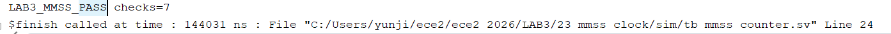

그림 A-5. MM:SS Clock XSim PASS 결과.

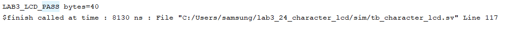

그림 A-6. Character LCD XSim PASS 결과.

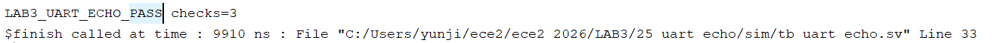

그림 A-7. UART Echo XSim PASS 결과.

## 부록 B. Program Device 결과

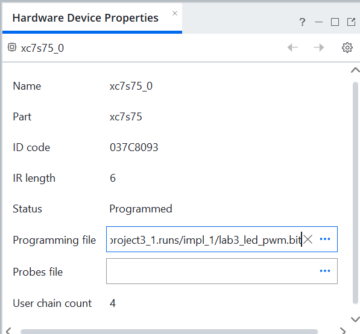

그림 B-1. LED PWM Program Device 결과.

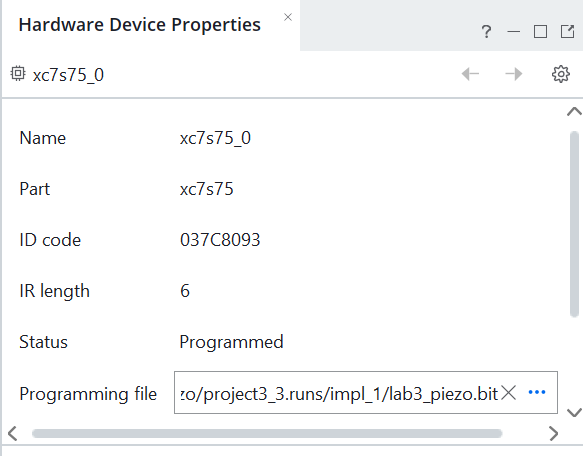

그림 B-2. Piezo Program Device 결과.

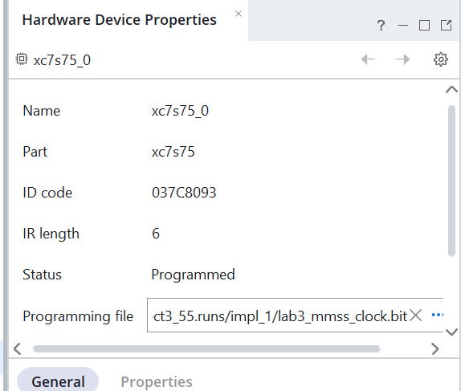

그림 B-3. MM:SS Clock Program Device 결과.

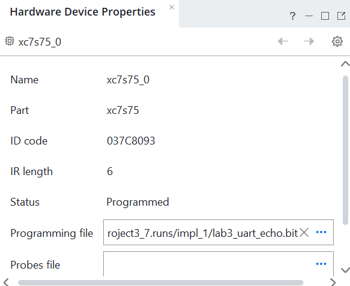

그림 B-4. UART Echo Program Device 결과.

## 5. 참고문헌

[1] 전자전기컴퓨터설계실험Ⅱ, LAB3 교안: `06.LAB3_00_START.pdf`, `06.LAB3_01_LED_PWM_VIVADO.pdf` ~ `06.LAB3_07_UART_ECHO_VIVADO.pdf`, 2026.

[2] M. Morris Mano and Michael D. Ciletti, *Digital Design: With an Introduction to the Verilog HDL, VHDL, and SystemVerilog*, 6th ed., Pearson, 2017.
