# 전자전기컴퓨터설계실험Ⅱ 실험 전 보고서

# LAB 2 – 순차회로와 응용 회로

| 항목 | 내용 |
|---|---|
| 학과 | 전자전기컴퓨터공학부 |
| 학번/이름 | 2025440032 / 김윤지 |
| 작성일 | 2026.09.19 |
| 대상 | 01 Counter ~ 08 Segment Scan, 08A Integrated |
| 검증 환경 | VS Code · Icarus Verilog · VaporView |
| 프로젝트 | ece2_2026 / LAB2 |
| 기준 커밋 | 미지정 (LAB2 미커밋) |
| GitHub 주소 | https://github.com/yunuos2525-cloud/ece2_2026 |
| 제출 태그 | 미지정 |

<!-- PDF: 표지는 1단, 아래 A~K 및 참고문헌은 2단 -->

## A. 목적 및 공통 검증 조건

LAB2에서는 여러 순차회로와 그 응용 회로를 설계하고, 입력과 이전 상태로부터 예상한 동작을 simulation 및 파형과 비교하여 검증한다.

### 공통 설계 원리

상태는 상승 edge에서 갱신된다. 코어의 synchronous reset이 우선하고, `enable=0`이면 이전 상태를 유지한다. Nonblocking 할당의 오른쪽 항은 같은 edge 직전 값을 사용하므로 레지스터 전달·시프트·상태 전이도 이전 상태에서 계산한다.

### Simulation 검증 방법

각 TB는 주기 **10 ns** clock의 상승 edge 뒤 `#1`에 값을 검사한다. 컴파일 성공, TB PASS, VaporView에서 예상값과 실제 파형을 비교한 기능 검증은 서로 다른 단계다. 01~08의 TB는 코어를 직접 시험하고, 08A의 TB는 통합 top을 시험한다. XDC는 Icarus 기능 simulation에 사용되지 않았다.

| 실험 | 코어 RTL | 설계 최상위 | 코어 TB / 시뮬레이션 최상위 |
|---|---|---|---|
| 01 Counter | `counter4.v` | `lab2_counter` | `tb_counter4.sv` / `tb_counter4` |
| 02 Clock Divider | `clock_divider.v` | `lab2_clock_divider` | `tb_clock_divider.sv` / `tb_clock_divider` |
| 03 Register | `register_pair.v` | `lab2_register` | `tb_register_pair.sv` / `tb_register_pair` |
| 04 Shift Register | `shift_register4.v` | `lab2_shift_register` | `tb_shift_register4.sv` / `tb_shift_register4` |
| 05 PISO | `piso4.v` | `lab2_piso` | `tb_piso4.sv` / `tb_piso4` |
| 06 Moore FSM | `moore_cycle.v` | `lab2_moore` | `tb_moore_cycle.sv` / `tb_moore_cycle` |
| 07 Mealy FSM | `mealy_toggle.v` | `lab2_mealy` | `tb_mealy_toggle.sv` / `tb_mealy_toggle` |
| 08 Segment Scan | `segment_scan8.v` | `lab2_segment_scan` | `tb_segment_scan8.sv` / `tb_segment_scan8` |
| 08A Integrated | 8개 코어를 포함한 12개 RTL | `lab2_integrated` | `tb_lab2_integrated.sv` / `tb_lab2_integrated` |

### Simulation과 실제 보드의 차이

보드 B6 clock은 **1 kHz**(주기 1 ms)로 설정할 계획이다. 물리 스위치와 N8 버튼은 `input_frontend`를, 08A의 N4 버튼은 `button_onepulse`를 거치므로 TB의 직접 입력과 보드의 입력 timing은 다르다. Vivado와 보드 검증은 아직 수행하지 않았으며 K절에는 계획만 적는다.

## B. 실험 1. Counter

### 설계 목적과 핵심 RTL

`counter4`는 4비트 `value`를 증가 또는 감소시키는 순차회로다. `rst`가 가장 우선하고, `enable=0`이면 값을 유지한다. `lab2_counter`는 처리된 입력을 코어에 연결하고 `value`를 하위 LED 네 개에 표시한다.

```verilog
always @(posedge clk) begin
    if (rst) value <= 4'd0;
    else if (enable) begin
        if (down) value <= value - 4'd1;
        else value <= value + 4'd1;
    end
end
```

증가와 감소는 모두 4비트 범위에서 계산된다. 따라서 15에서 한 번 더 증가하면 0이고, 0에서 한 번 감소하면 15다.

### 예상 동작

| 시험 조건 | 검사 시점 | 예상 `value` | 계산 근거 |
|---|---:|---:|---|
| `rst=1` | 6 ns | 0 | 5 ns 상승 에지에서 초기화 |
| `enable=1,down=0` | 16~156 ns | 1→15 | 매 에지 1 증가 |
| 15에서 한 번 더 증가 | 166 ns | 0 | `(15+1) mod 16` |
| 0에서 `down=1` 감소 | 176 ns | 15 | `(0-1) mod 16` |
| `enable=0` | 336 ns | 0 | 할당이 없어 유지 |
| 0에서 다시 감소 | 346 ns | 15 | 감소 순환 |
| `rst=1,enable=1` | 356 ns | 0 | 리셋 우선 |

### Simulation 결과와 파형 분석

`tb_counter4`는 reset, 양방향 경계값, hold 및 reset 우선순위를 **36회** 검사했다. 정상 실행은 [PASS 로그](../../evidence/vscode/LAB2/01_counter/normal/LAB2_01_counter_normal_pass_log.png)의 `LAB2_PASS counter4 checks=36`과 356 ns 종료로 확인된다. 표의 입력 순서대로 진행한 전체 파형에서 `down`·`enable`·`rst`의 변화와 `value`의 증가·감소·유지가 대응한다. 경계값은 다음 확대 파형에서 읽는다.

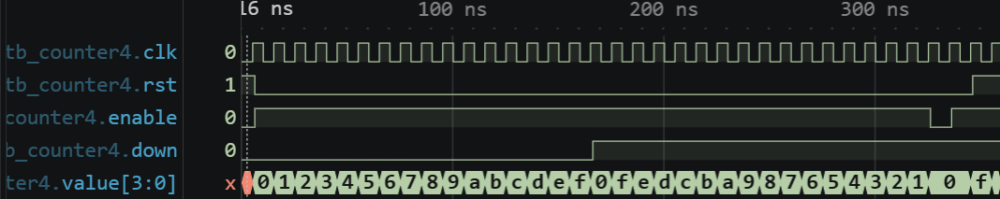

그림 1. 0~356 ns의 클록·리셋·제어·4비트 값. 증가에서 감소로 바뀌는 위치와 마지막 제어 구간을 보여준다.

155 ns edge 뒤 `value=15`에서 165 ns edge에 한 번 더 증가시키면 4비트 범위를 넘어 0이 된다. `down`은 그 뒤인 166 ns에 1로 바뀌므로 175 ns edge에서는 0에서 15로 감소해야 한다. 확대 파형의 `f→0→f`는 두 연산의 경계값을 보여준다.

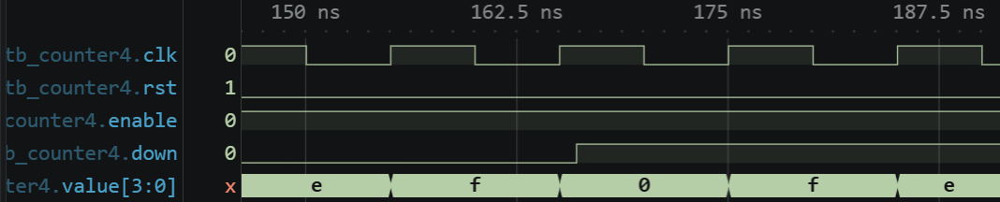

그림 2. 150~178 ns 부근의 증가 15→0, 감소 0→15 및 `down` 전환.

335 ns edge에서 `enable=0`이므로 0을 유지하고, 345 ns edge의 감소로 15가 된다. 355 ns에는 `rst=1,enable=1`을 함께 주었으므로 reset이 우선해 0으로 돌아간다. 파형에서도 `0→f→0`이 확인되며, reset 입력 직후가 아니라 다음 clock edge에서 0이 되는 동기 동작이다.

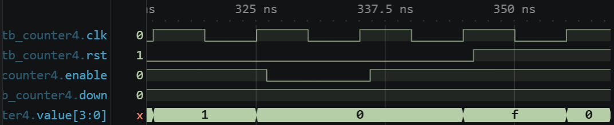

그림 3. 320~356 ns 부근의 유지, 재순환, 동기 리셋.

## C. 실험 2. Clock Divider

### 설계 목적과 핵심 RTL

`clock_divider`는 `count=0…DIVISOR-1`을 반복하고, 짝수 분주비의 앞 절반에서 `divided=0`, 뒤 절반에서 1을 낸다. `tick`은 `count=DIVISOR-1`인 한 clock 동안 HIGH가 되는 제어 신호다. 다른 순차회로의 clock을 대신하지 않고, 같은 clock edge에서 동작할지를 알려주는 enable로 사용할 수 있다.

```verilog
assign tick = !rst && (count == DIVISOR - 1);
always @(posedge clk) begin
    if (rst) begin
        count <= 0;
        divided <= 1'b0;
    end else begin
        if (count == DIVISOR - 1) count <= 0;
        else count <= count + 1'b1;
        if (count == DIVISOR/2 - 1 ) divided <= 1'b1;
        else if (count == DIVISOR - 1) divided <= 1'b0;
    end
end
```

`lab2_clock_divider`는 분주비 2·10·50 및 기본 1000 회로의 출력을 모은다. TB는 분주비 10과 최소값 2, tick 세 번, 중간 reset과 재시작을 검사한다.

### 예상 주기와 출력 관계

| 에지 뒤 `count`, DIVISOR=10 | `divided` | `tick` | 뜻 |
|---|---:|---:|---|
| 0~4 | 0 | 0 | Low 절반 |
| 5~8 | 1 | 0 | High 절반 |
| 9 | 1 | 1 | 한 clock 폭의 tick |
| 다음 0 | 0 | 0 | 순환, `divided` 하강 |

TB의 `T_clk=10 ns`이므로 `T_divided=10×10=100 ns`이고 High/Low는 각각 50 ns로 duty는 50%다. `DIVISOR=2`의 `div2`는 매 10 ns마다 반전하며 16 ns 첫 검사에서 1이어야 한다. 정상 로그는 **PASS 129회, 436 ns 종료**를 기록한다.

### Simulation 결과와 파형 분석

30 clock 동안 분주기를 진행한 뒤 reset하고 다시 시작했다. 분주비 10에서는 세 번의 tick이 발생하고 reset 뒤 Low 구간부터 재시작해야 한다. 전체 파형에서 `divided`가 일정한 주기로 HIGH/LOW를 반복하고, 각 분주 주기의 끝에서 `tick`이 한 clock 동안 HIGH가 되는 것을 확인했다. `div2/tick2`와 끝부분 reset도 TB의 129개 검사 범위에 포함된다.

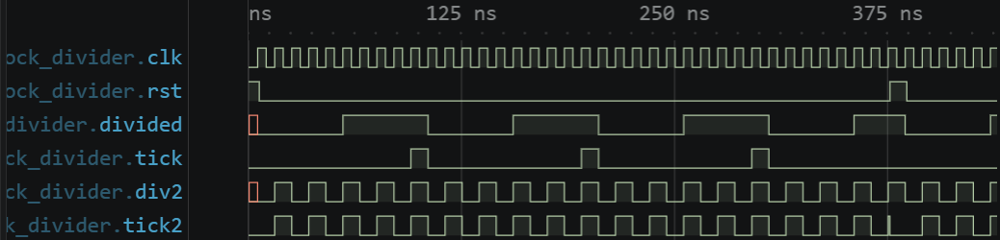

그림 4. 0~436 ns 분주비 10·2 출력, tick 및 리셋 흐름.

첫 상승 55 ns, 하강 105 ns, 재상승 155 ns를 비교하면 High/Low가 각각 50 ns여야 한다. 95~105 ns 동안 `tick`이 HIGH로 유지되고, 105 ns 상승 edge에서 `divided`가 LOW로 전환된다. 확대 파형의 출력 전환과 tick 폭이 이 계산에 맞는다.

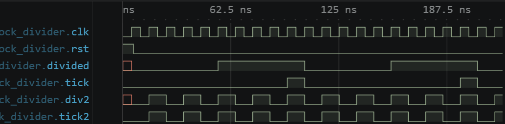

그림 5. duty 50%와 한 클록 폭 tick을 함께 검토한 확대 파형.

376 ns에 `rst=1`을 인가하면 조합식으로 계산되는 `tick`은 바로 LOW가 되고, `divided`는 다음 상승 edge인 385 ns에서 LOW로 초기화된다. reset 해제 뒤 `divided`는 435 ns에 다시 HIGH가 된다. 확대 파형에서 두 출력의 반응 시점이 다르게 나타나는 이유가 이 구조다.

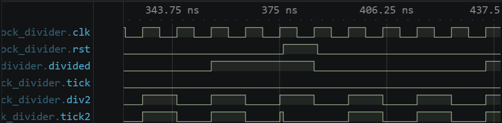

그림 6. 중간 reset에서 tick이 바로 LOW가 되고 `divided`는 다음 상승 edge에 초기화되는 구간.

### 오류 검출 및 복구

| 실행 | RTL 조건과 예상 | 실제 확인 및 의미 |
|---|---|---|
| 정상 | `count==DIVISOR/2 - 1`, `div2=1` | PASS 129회, 436 ns 종료 |
| 수정 | 한 줄을 `count==DIVISOR/2`로 변경; 16 ns 예상 1, 수정 RTL 계산값 0 | 16 ns `minimum divisor duty` FAIL. 최소 분주비의 첫 High 시점을 놓침 |
| 원복 | 원래 비교식 복원 | 별도 실행 PASS 129회, 436 ns 종료 |

`clock_divider.v`의 비교식을 한 칸 늦추자 최소 분주비 2에서 첫 High가 나오지 않았다. RTL만 수정하고 TB는 변경하지 않았다. TB의 16 ns `minimum divisor duty` 검사에서 예상값 `div2=1`, 실제값 `div2=0`으로 FAIL했고, 원래 식을 복구한 별도 실행은 129개 검사를 모두 통과했다.

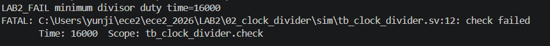

그림 7. 분주비 2의 첫 High가 누락된 16 ns FAIL 로그.

## D. 실험 3. Register

### 설계 목적과 핵심 RTL

`register_pair`는 `load`에서 `data_in`을 `stored`에 저장하고, `transfer`에서 **edge 직전의 `stored`**를 `value`에 전달한다. 두 제어가 동시에 1이어도 저장과 전달은 각각 실행된다.

```verilog
always @(posedge clk) begin
    if (rst) begin
        stored <= 4'd0;
        value <= 4'd0;
    end else begin
        if (load) stored <= data_in;
        if (transfer) value <= stored;
    end
end
```

같은 edge에서 `stored`에 새 입력을 쓰더라도 `value`는 이전 `stored`를 읽는다. `lab2_register`는 두 값을 LED에 연결하고, TB는 아래 7개 상태를 검사한다.

### 제어 조건과 예상값

| 에지 조건 | 다음 `stored` | 다음 `value` | 우선순위·근거 |
|---|---|---|---|
| `rst=1` | 0 | 0 | 두 제어보다 우선 |
| `load=1,transfer=0` | `data_in` | 이전 `value` | 저장만 |
| `load=0,transfer=1` | 이전 `stored` | 이전 `stored` | 외부 `data_in`은 전달하지 않음 |
| `load=1,transfer=1` | `data_in` | 이전 `stored` | nonblocking의 old value |
| 두 제어 0 | 이전 `stored` | 이전 `value` | hold |

| 검사 시점 | 시험 조건 | 예상 `{stored,value}` |
|---:|---|---:|
| 6 ns | reset | `00` |
| 16 ns | `data_in=A,load=1` | `A0` |
| 26 ns | `data_in=3,transfer=1` | `AA` |
| 36 ns | `data_in=3,load=transfer=1` | `3A` |
| 46 ns | 같은 제어 한 에지 더 | `33` |
| 56 ns | 제어 0, 입력 F | `33` |
| 66 ns | `rst=1`, 두 제어 1 | `00` |

### Simulation 결과와 파형 분석

정상 로그는 **PASS 7회, 66 ns 종료**를 기록한다. 저장·전달·동시 제어·hold·reset을 적용한 전체 파형에서 `{stored,value}`가 표의 `00→A0→AA→3A→33→33→00` 순서로 나타났다. 입력 F를 준 hold에서도 값이 33으로 남고, 마지막에는 두 제어가 1이어도 reset으로 00이 된다.

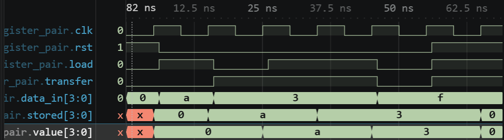

그림 8. 0~66 ns의 데이터 저장·전달·유지·초기화 순서.

25 ns edge에서는 `data_in=3`이어도 이전 `stored=A`가 전달되어 `AA`가 된다. 35 ns에 load와 transfer를 함께 적용하면 `stored=3`을 새로 저장하면서 `value=A`를 유지하므로 `3A`가 예상된다. 확대 파형에서도 `AA→3A→33`을 확인했으며, 45 ns의 다음 transfer에서 비로소 `value=3`이 된다.

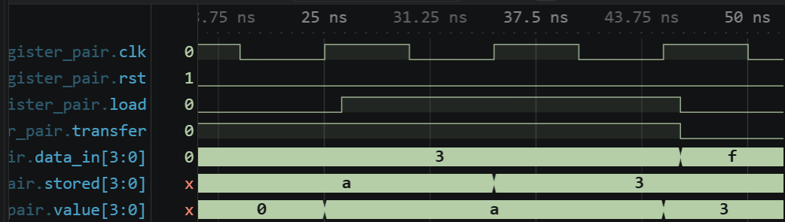

그림 9. 25/35/45 ns edge 전후 `data_in`, `stored`, `value`의 차이.

### 오류 검출 및 복구

| 실행 | RTL 조건과 예상 | 실제 확인 및 의미 |
|---|---|---|
| 정상 | `value <= stored` | PASS 7회, 66 ns 종료; 26 ns 값 `AA` |
| 수정 | `value <= data_in`; 26 ns 예상값 `AA`, 수정 RTL 계산값 `A3` | 26 ns `transfer stored not live input` FAIL. 저장값 대신 현재 입력 3을 전달 |
| 원복 | `value <= stored` 복원 | 별도 실행 PASS 7회, 66 ns 종료 |

`register_pair.v`의 전달 대상을 `stored`에서 현재 `data_in`으로 바꾸었다. RTL만 수정하고 TB는 변경하지 않았다. 이때 이전 저장값 대신 입력 3이 전달되어 26 ns에 예상값 `{stored,value}=AA`, 실제값 `A3`가 된다. 실제 TB의 `transfer stored not live input` 검사에서 FAIL했고, 원래 식으로 복구한 별도 실행은 7개 검사를 통과했다.

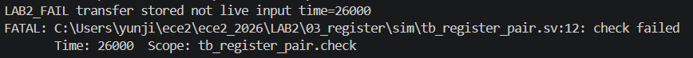

그림 10. 26 ns 저장값 대신 현재 입력이 전달된 FAIL 로그.

## E. 실험 4. Shift Register

### 설계 목적과 핵심 RTL

`shift_register4`는 `enable=1`인 상승 edge마다 `serial_in`을 최상위 비트에 넣고, 기존 비트를 한 자리씩 오른쪽으로 옮긴다. 오른쪽 항의 비트들은 모두 edge 직전의 `value`다.

```verilog
always @(posedge clk) begin
    if (rst) value <= 4'd0;
    else if (enable) value <= {serial_in, value[3:1]};
end
```

`enable=0`에서는 입력이 바뀌어도 저장값을 유지한다. `lab2_shift_register`는 상태를 하위 LED 네 개에 연결한다.

### 비트 이동과 예상값

| 에지 조건 | 이전 `value` | `serial_in` | 다음 `value` | 의미 |
|---|---:|---:|---:|---|
| `rst=1` | 임의 | 임의 | `0000` | reset 우선 |
| `enable=1` | `0000` | 1 | `1000` (8) | MSB로 진입 |
| `enable=1` | `1000` | 0 | `0100` (4) | 오른쪽으로 이동 |
| `enable=0` | `0100` | 1 | `0100` (4) | 입력 변화에도 유지 |
| `enable=1` | `0100` | 1 | `1010` (A) | 이전 비트 동시 이동 |
| `enable=1` | `1010` | 0 | `0101` (5) | 4비트 이력 |

### Simulation 결과와 파형 분석

`tb_shift_register4`는 방향, hold, 0 입력에 따른 비트 배출과 reset 우선순위를 8회 검사했다. 정상 로그는 **PASS 8회, 106 ns 종료**다. 입력 `1,0`, hold 중 입력 1, 재개 후 `1,0`, 네 번의 0과 마지막 reset을 적용한 전체 파형에서 `0→8→4→4→A→5→2→1→0→0`이 나타났다. 0을 계속 입력하면 저장된 비트가 한 자리씩 오른쪽으로 이동하면서 결국 `value=0000`이 된다.

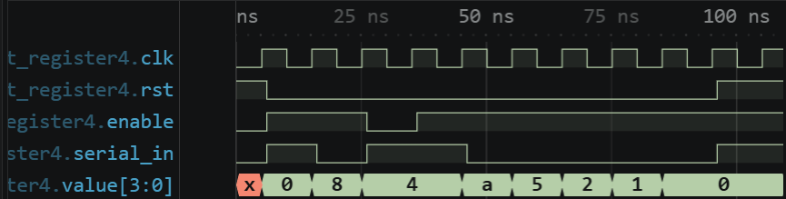

그림 11. 0~106 ns의 오른쪽 이동, enable 유지 및 끝 리셋.

25 ns edge 뒤 `value=4`에서 `enable=0,serial_in=1`로 35 ns edge를 지나면 4를 유지해야 한다. 45 ns에 enable을 1로 되돌리면 새 입력 1이 MSB로 들어가 A가 된다. 확대 파형의 `4→4→A`는 입력 변화만으로는 상태가 변하지 않음을 보여준다.

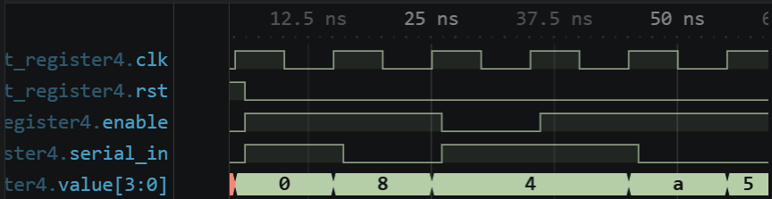

그림 12. `serial_in=1`이어도 `enable=0`이면 4를 유지하고, 재개 시 A가 되는 구간.

네 번의 0 입력 뒤 105 ns edge에서 `rst=1,enable=1,serial_in=1`을 함께 인가했다. reset이 시프트보다 우선하므로 새 1은 들어오지 않고 106 ns에도 0이어야 한다. 확대 파형에서 이 값이 확인되었다.

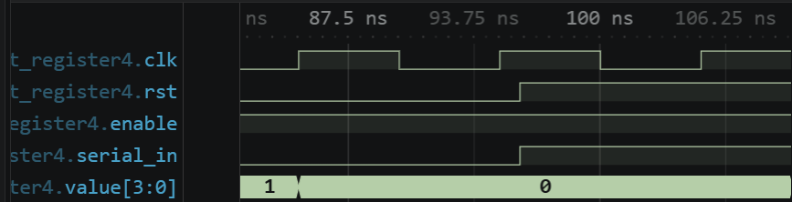

그림 13. 105 ns edge의 reset·enable 동시 입력과 106 ns 값 0.

### 오류 검출 및 복구

| 실행 | RTL 조건과 예상 | 실제 확인 및 의미 |
|---|---|---|
| 정상 | `{serial_in,value[3:1]}`, 첫 1 입력 뒤 `1000` | PASS 8회, 106 ns 종료 |
| 수정 | `{value[2:0],serial_in}`; 16 ns 예상값 `1000`, 수정 RTL 계산값 `0001` | 16 ns `input enters MSB` FAIL. 직렬 입력이 반대쪽 비트에 들어감 |
| 원복 | 원래 결합식 복원 | 별도 실행 PASS 8회, 106 ns 종료 |

`shift_register4.v`의 결합 순서를 반대로 바꾸고 TB는 변경하지 않았다. 첫 직렬 입력 1이 MSB 대신 LSB에 들어가므로 16 ns의 예상값 `1000`과 달리 수정 회로는 `0001`을 낸다. 실제 TB의 `input enters MSB` 검사에서 FAIL했고, 원래 결합식으로 복구한 별도 실행은 8개 검사를 통과했다.

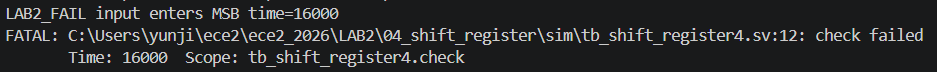

그림 14. 첫 직렬 입력이 MSB 대신 LSB로 들어간 16 ns FAIL 로그.

## F. 실험 5. PISO

### 설계 목적과 핵심 RTL

`piso4`는 4비트 병렬 입력을 저장한 뒤 최상위 비트부터 직렬로 내보낸다. 상승 edge의 우선순위는 **reset > load > enable > hold**다.

```verilog
assign serial_out = value[3];
always @(posedge clk) begin
    if (rst) value <= 4'd0;
    else if (load) value <= data_in;
    else if (enable) value <= {value[2:0], 1'b0};
end
```

`serial_out`은 현재 `value[3]`을 그대로 보여준다. `lab2_piso`는 병렬 저장값과 직렬 출력을 LED에 연결한다.

### 제어 우선순위와 예상 비트열

| 제어 조건 | 다음 `value` | 현재 `serial_out` | 근거 |
|---|---|---|---|
| `rst=1` | 0 | 갱신 뒤 0 | 최우선 초기화 |
| `load=1` | `data_in` | 저장값의 bit 3 | enable이 함께 1이어도 load |
| `enable=1` | `{이전 value[2:0],1'b0}` | 시프트 전에는 이전 bit 3 | MSB-first, zero fill |
| 두 제어 0 | 이전 값 | 이전 bit 3 | hold |

단어 A(`1010`)를 load한 직후 `value=A,serial_out=1`이다. 625 ns hold 뒤에도 같고, 각 shift **직전**의 출력은 `1→0→1→0`이다. 635/645/655/665 ns edge **직후** `value`는 `4→8→0→0`으로 변한다. TB가 shift 전 출력을 읽는 이유는 첫 비트 1을 놓치지 않기 위해서다.

### Simulation 결과와 파형 분석

`tb_piso4`는 0~F의 각 단어에 load·hold·4개 직렬 비트·zero fill을 검사하고 양끝 reset을 더해 **16×7+2=114회**를 확인했다. 정상 로그는 **PASS 114회, 976 ns 종료**다. 모든 단어가 네 번의 shift 뒤 0이 되어야 하며, 전체 파형에서 16개 입력의 반복 load·shift와 마지막 reset을 확인했다. A의 비트 순서는 다음 확대에서 읽는다.

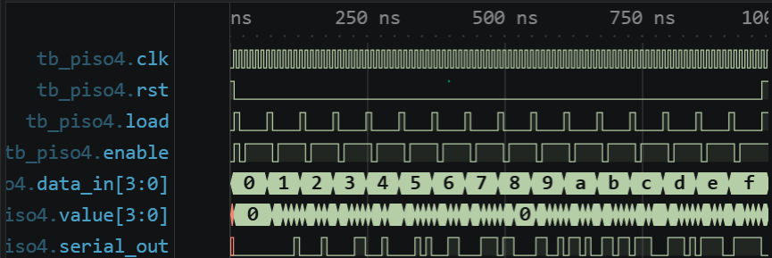

그림 15. 입력 0~F 전체 시험, 병렬 저장과 직렬 출력의 흐름.

A를 load하고 hold한 뒤 네 번 shift하면 `value=A→4→8→0→0`이다. 확대 파형에서 각 shift 전 `serial_out=1→0→1→0`을 확인했다. 출력은 현재 저장값의 MSB이므로 edge 뒤의 새 `value[3]`을 직전 출력과 구분해서 읽어야 한다.

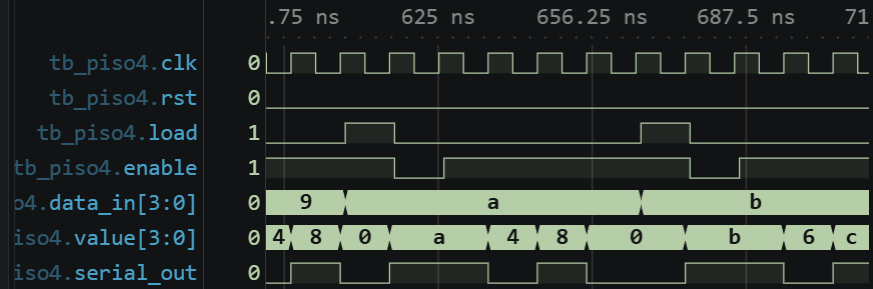

그림 16. A 저장 뒤 hold 및 MSB-first `1,0,1,0` 출력과 zero fill.

### 오류 검출 및 복구

| 실행 | RTL 조건과 예상 | 실제 확인 및 의미 |
|---|---|---|
| 정상 | `serial_out=value[3]` | PASS 114회, 976 ns 종료 |
| 수정 | `serial_out=value[0]`; `word=1`의 86 ns 예상값 0, 수정 RTL 계산값 1 | 86 ns `MSB first before edge` FAIL. LSB를 먼저 출력 |
| 원복 | `serial_out=value[3]` 복원 | 별도 실행 PASS 114회, 976 ns 종료 |

`piso4.v`의 `serial_out` 선택 비트를 `[3]`에서 `[0]`으로 바꾸고 TB는 변경하지 않았다. `word=1`의 shift 전 출력은 MSB가 0이므로 예상값 0이지만 수정 회로는 LSB인 1을 낸다. 실제 TB의 86 ns `MSB first before edge` 검사에서 실제값 1로 FAIL했고, 원래 비트를 복구한 별도 실행은 114개 검사를 통과했다.

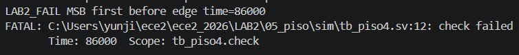

그림 17. 86 ns 직렬 출력 비트 선택 오류를 검출한 FAIL 로그.

## G. 실험 6. Moore FSM

### 설계 목적과 상태 관계

`moore_cycle`은 `value` 자체가 현재 state이자 출력인 세 상태 회로다. `rst=1`이면 S0(`00`)로 돌아가고, `enable && advance`일 때만 S0→S1→S2→S0로 전이한다. `value`는 clock edge에서만 바뀌므로 `advance`를 edge 사이에 변경해도 바로 변하지 않는다. `lab2_moore`는 이 출력을 하위 LED 두 개에 연결한다.

`case`문에서는 S0(`00`)과 S1(`01`)의 다음 상태를 각각 지정하고, 나머지 경우는 `default`에서 S0(`00`)로 전이하도록 하였다. 따라서 S2(`10`)에서는 다음 유효한 상승 edge에 S0로 돌아간다.

| 현재 상태 | `enable && advance=1`의 다음 상태 | 그 외 | 출력 `value` |
|---|---|---|---|
| S0 = `00` | S1 = `01` | S0 유지 | `00` |
| S1 = `01` | S2 = `10` | S1 유지 | `01` |
| S2 = `10` | S0 = `00` | S2 유지 | `10` |
| `rst=1` | S0 = `00` | S0 = `00` | 에지 뒤 `00` |

### 핵심 RTL 코드

```verilog
always @(posedge clk) begin
    if (rst) value <= 2'b00;
    else if (enable && advance) begin
        case (value)
            2'b00: value <= 2'b01;
            2'b01: value <= 2'b10;
            default: value <= 2'b00;
        endcase
    end
end
```

현재 `value`에 따라 다음 state가 정해지지만 할당은 상승 edge에서 실행된다. 두 제어 중 하나가 0이면 현재 state를 유지한다.

### Simulation 결과와 파형 분석

`tb_moore_cycle`은 네 차례 상태 순환과 hold, 마지막 S1 상태에서의 reset을 **23회** 검사했다. 정상 로그는 **PASS 23회, 226 ns 종료**다. 각 순환의 예상값 `00→01→10→00`이 전체 파형에서 0/1/2/0으로 보이고, 이 표시는 각각 `00/01/10/00`에 대응한다. `enable=0` 또는 `advance=0`인 edge에서는 값이 유지되었다.

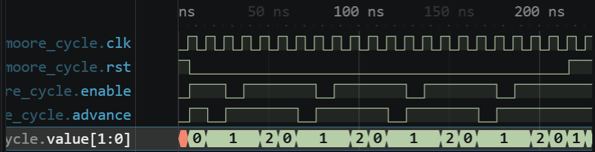

그림 18. 네 차례 상태 순환과 제어에 따른 hold·reset.

6 ns에 `advance`만 1로 바꾸어도 clock edge가 오기 전인 7 ns에는 `value=00`이다. 15 ns 이후 유효 edge에서 16 ns `01`이 되고, 25/35 ns에는 `enable` 또는 `advance`를 0으로 두어 26/36 ns에도 `01`을 유지한다. 이어 46 ns `10`, 56 ns `00`으로 변하는 시점이 확대 파형에 나타난다.

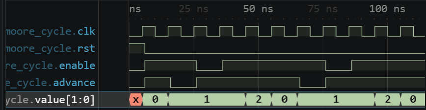

그림 19. 첫 상태 순환의 입력 변경, hold, S1→S2 전이 및 S0 복귀.

### 오류 검출 및 복구

| 실행 | RTL 조건과 예상 | 실제 확인 및 의미 |
|---|---|---|
| 정상 | S1(`01`)→S2(`10`) | PASS 23회, 226 ns 종료 |
| 수정 | S1→S0(`00`); 46 ns 예상값 `10`, 수정 RTL 계산값 `00` | 46 ns `S1 to S2` FAIL. S2를 건너뜀 |
| 원복 | S1→S2 복원 | 별도 실행 PASS 23회, 226 ns 종료 |

`moore_cycle.v`의 S1 전이를 S2에서 S0으로 바꾸고 TB는 변경하지 않았다. S2를 건너뛰므로 46 ns의 예상값 `10` 대신 `00`이 예상된다. 실제 TB의 `S1 to S2` 검사에서 실제값 `00`으로 FAIL했고, 원래 전이를 복구한 별도 실행은 23개 검사를 통과했다.

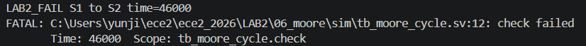

그림 20. S1→S2가 S1→S0으로 바뀐 46 ns FAIL 로그.

## H. 실험 7. Mealy FSM

### 설계 목적과 상태·출력 관계

`mealy_toggle`의 1비트 `state`는 상승 edge에서만 바뀐다. `rst=1`이면 S0이고, `enable && bit_in`이면 S0↔S1로 토글한다. 출력 `value`는 현재 `state`와 `bit_in`의 조합 결과이므로 clock edge가 없는 시점에도 입력 변화에 따라 달라질 수 있다. `lab2_mealy`는 `state`와 `value`를 LED에 연결한다.

### 핵심 RTL 코드

```verilog
always @(posedge clk) begin
    if (rst) state <= 1'b0;
    else if (enable && bit_in) state <= ~state;
end
// Reset changes state at the rising edge; value is combinational.
assign value = !bit_in ? 2'b00 : (state ? 2'b01 : 2'b10);
```

`state`에는 nonblocking 할당을 사용하고 `value`는 연속 할당으로 계산한다. 이 차이 때문에 state 전이와 입력에 따른 출력 변화 시점이 구별된다. 여기서 `assign`의 continuous assignment는 절차 블록 안의 blocking assignment(`=`)와 다른 개념이다.

### 예상 동작

| 현재 `state` | `bit_in` | 조합 `value` | 다음 유효 에지의 `state` |
|---:|---:|---:|---:|
| S0 = 0 | 0 | `00` | 유지 |
| S0 = 0 | 1 | `10` | `enable=1`이면 S1 |
| S1 = 1 | 0 | `00` | 유지 |
| S1 = 1 | 1 | `01` | `enable=1`이면 S0 |

`rst`는 `state`를 S0로 바꾸지만 `value`를 직접 00으로 초기화하지 않는다. 따라서 `bit_in=1`인 채 리셋 에지를 지나면 `{state,value}=010`이고, 이후 입력만 0으로 내리면 `000`이 된다.

### Simulation 결과와 파형 분석

`tb_mealy_toggle`은 clock edge가 없는 시점의 입력 반응, edge에서의 state 전이와 reset 뒤 조합 출력을 **11회** 검사했다. 정상 로그는 **PASS 11회, 67 ns 종료**다. 입력 비트와 enable을 각각 바꾼 전체 파형에서 state는 edge에서만, value는 입력을 바꾼 직후에도 변한다. `enable=0`이면 state는 유지되지만 value는 현재 state와 `bit_in`으로 결정되므로 입력만 바꾸어도 달라질 수 있다.

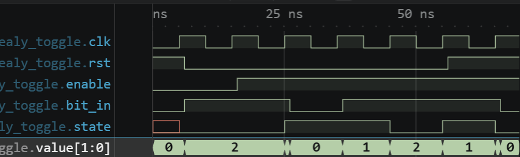

그림 21. 0~67 ns의 `bit_in`·`state`·`value` 변화와 끝 리셋.

| 검사 시점 | 시험 조건 | 예상 `{state,value}` |
|---:|---|---:|
| 7 ns | S0에서 입력만 0→1 | `010` |
| 16 ns | `enable=0`인 에지 | `010` |
| 26 ns | `enable=1,bit_in=1` 에지 뒤 S1 | `101` |
| 27 ns | S1에서 입력만 1→0 | `100` |
| 37 ns | S1에서 입력만 0→1 | `101` |
| 66 ns / 67 ns | 입력1인 reset 에지 / 입력만 0으로 변경 | `010 / 000` |

6~37 ns 확대 구간에서는 입력만 바꾸는 시점과 유효 edge를 함께 비교했다. 7 ns에는 S0에서 `value=10`, 27 ns에는 S1에서 `00`, 37 ns에는 S1에서 `01`이 예상된다. 실제 파형에서도 입력을 바꾼 직후 value만 변하고 state는 다음 유효 edge까지 유지되었다. 따라서 이 출력은 현재 state와 현재 입력을 함께 사용한다.

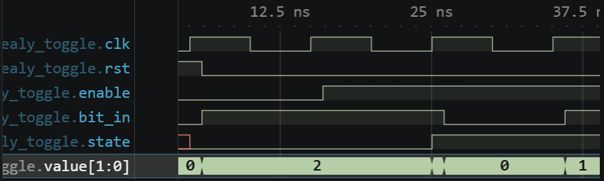

그림 22. 6~37 ns의 입력 변화와 clock edge 사이 조합 출력 반응.

### 오류 검출 및 복구

| 실행 | RTL 조건과 예상 | 실제 확인 및 의미 |
|---|---|---|
| 정상 | S0/입력1→`10`, S1/입력1→`01` | PASS 11회, 67 ns 종료 |
| 수정 | 두 출력식을 교환; 7 ns 예상값 `010`, 수정 RTL 계산값 `001` | 7 ns `S0 input changes between clocks` FAIL. 에지 전 조합 출력에서 검출 |
| 원복 | 원래 출력식 복원 | 별도 실행 PASS 11회, 67 ns 종료 |

`mealy_toggle.v`의 두 상태별 출력식을 교환하고 TB는 변경하지 않았다. 입력을 1로 바꾼 7 ns에는 예상값 `{state,value}=010`이어야 하지만 수정 회로는 `001`을 낸다. 실제 TB의 `S0 input changes between clocks` 검사에서 FAIL했고, 원래 출력식으로 복구한 별도 실행은 11개 검사를 통과했다.

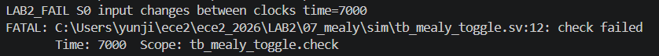

그림 23. 입력 변화 직후 조합 출력의 예상값/실제값이 다른 7 ns FAIL 로그.

## I. 실험 8. Segment Scan

### 설계 구조와 scan 원리

`segment_scan8`은 32비트 `digits`에서 `index=0…7`이 가리키는 자리의 4비트 값을 `nibble`로 선택한다. 그 값에 대응하는 `segments={a,b,c,d,e,f,g,dp}` 패턴을 만들고, `select`로 한 자리를 선택한다. 내부 출력은 active-high다. 순차회로는 **한 자리 활성 → 모든 자리 blank → 다음 자리 활성**을 반복한다. `enable=0`이면 `index/blank`가 유지되고, reset에서는 `index=0,blank=1`로 시작한다. blank에서 `select=00`이어도 조합 `segments` 값은 남아 있을 수 있다.

`lab2_segment_scan`은 논리 `select`의 비트 순서를 뒤집어 보드의 active-low `seg_com`으로 연결한다. `tb_segment_scan8`의 `bank`는 0~7과 8~F를 두 번씩 시험하는 TB 변수다. 초기·마지막 reset 2회와 2 bank×2바퀴×8자리×6검사=192회를 합해 **194회**를 확인한다.

`index`는 3비트이므로 7 다음에는 0으로 돌아간다. 별도 tick 없이 `enable=1`인 각 clock edge에서 활성과 blank가 번갈아 변한다.

### Segment pattern과 핵심 RTL

```verilog
always @(posedge clk) begin
    if (rst) begin
        index <= 0;
        blank <= 1'b1;
    end else if (enable) begin
        blank <= ~blank;
        if (!blank) index <= index + 1'b1;
    end
end
```

```verilog
nibble = digits >> (index * 4);
select = blank ? 8'h00 : (8'h01 << index);
```

두 번째 발췌는 조합 블록의 두 줄이다. `index`로 선택한 nibble에 따라 같은 블록의 `case`가 아래 segment pattern을 정한다. `blank=1`에서는 자리 선택만 꺼지므로 `select`와 `segments`를 구별해 읽어야 한다.

| 숫자 | `segments` hex | 숫자 | `segments` hex |
|---:|---:|---:|---:|
| 0 | FC | 8 | FE |
| 1 | 60 | 9 | F6 |
| 2 | DA | A | EE |
| 3 | F2 | B | 3E |
| 4 | 66 | C | 9C |
| 5 | B6 | D | 7A |
| 6 | BE | E | 9E |
| 7 | E0 | F | 8E |

### 예상 자리 전환

| 검사 시점 | 시험 조건 | 예상 `index/select/segments` | 표시 의미 |
|---:|---|---|---|
| 6 ns | reset | `0/00/FC` 가능 | 첫 자리 blank; segments=00 요구 아님 |
| 16 ns | enable 1 | `0/01/FC` | 숫자 0 활성 |
| 26 ns | enable 0 | `0/01/FC` | 활성 상태 유지 |
| 36 ns | enable 1 | `1/00/60` | 다음 자리 준비 blank |
| 46 ns | enable 0 | `1/00/60` | blank 유지 |
| 56 ns | enable 1 | `1/02/60` | 숫자 1 활성 |
| 1306 ns | 마지막 reset | `0/00/입력에 따른 값` | `index/blank` 초기화 |

`digits=76543210`에서 index 0~7은 0~7을, `FEDCBA98`에서는 8~F를 가리킨다. 36 ns에는 index가 1로 바뀌지만 `select=00`인 blank 상태다. 56 ns에야 `select=02`가 되어 다음 자리가 켜진다.

### Simulation 결과와 파형 분석

정상 로그는 **PASS 194회, 1306 ns 종료**를 기록한다. 두 bank를 두 바퀴씩 진행하고 중간 hold와 마지막 reset을 가했다. 전체 파형에서 `index/select/segments`의 자리 순서, 활성·blank 반복과 마지막 초기화를 확인했다. 0~F의 pattern은 TB 검사와 위 표로 대조한다.

첫 bank가 끝난 뒤 646 ns에 `digits`가 바뀌고 656 ns부터 둘째 bank를 검사한다. 확대 파형은 첫 bank의 두 자리 전환을 보여준다.

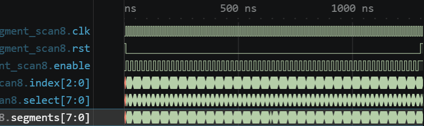

그림 24. 0~1306 ns의 자리 순회, 활성/blank 반복, hold 및 마지막 reset.

reset 해제 뒤 enable을 1/0으로 바꾸며 6~56 ns를 읽었다. `index/select`는 `0/00→0/01→0/01→1/00→1/00→1/02`, 숫자 0과 1의 `segments`는 `FC/60`이어야 한다. 확대 파형에서 활성 `01/02` 사이의 `00` blank와 index 전환을 확인했다. blank는 자리 선택을 끄는 구간이며 `segments` 전체가 0이 되는 구간은 아니다.

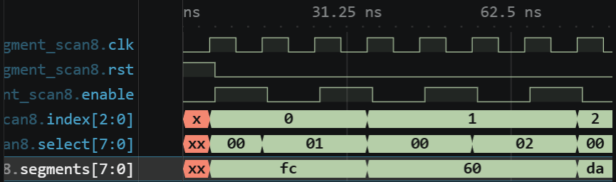

그림 25. 첫 두 자리의 활성·유지·blank·다음 자리 활성 관계.

### 오류 검출 및 복구

| 실행 | RTL 조건과 예상 | 실제 확인 및 의미 |
|---|---|---|
| 정상 | `select=blank ? 8'h00 : (8'h01 << index)` | PASS 194회, 1306 ns 종료; 최초 reset에서 `select=00` |
| 수정 | `blank ? 8'h00 :` 제거; 6 ns 예상값 `index=0,select=00`, 수정 RTL 계산값 `0,01` | 6 ns `reset blanks digit zero` FAIL. reset blank가 사라짐 |
| 원복 | blank 조건 복원 | 별도 실행 PASS 194회, 1306 ns 종료 |

`segment_scan8.v`의 `select` 식에서 blank 분기를 제거하고 TB는 변경하지 않았다. 초기 blank 슬롯에서도 첫 자리가 켜져 6 ns에 예상값 `index=0,select=00` 대신 수정 회로의 `index=0,select=01`이 나타난다. 실제 TB의 `reset blanks digit zero` 검사에서 FAIL했고, 원래 식을 복구한 별도 실행은 194개 검사를 통과했다.

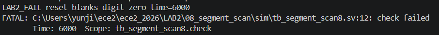

그림 26. reset 직후 blank 슬롯에서 자리 0이 켜진 6 ns FAIL 로그.

## J. 08A Integrated

### 1. 통합 시스템 구조

`lab2_integrated`는 8개 코어, 입력 처리, LCD 표시 및 출력 선택 회로를 묶는다. `mode[2:0]`은 reset에서 0이고 `mode_press`마다 `0→1→…→7→0`으로 순환한다. `mode_press`는 mode 변경과 동시에 `circuit_reset=reset || mode_press`를 발생시켜 코어를 초기화한다. `step_press`는 현재 선택된 코어의 한 단계 동작을 지시하며, 두 제어가 동시에 들어오면 코어에서는 reset이 우선한다.

모든 코어는 공통 `clk`를 사용하고, step 기반 코어는 `mode` 조건이 맞을 때만 enable을 받는다. 분주기들은 계속 같은 clock으로 진행하다 mode 변경 때 초기화된다. `tick`은 다른 코어의 clock이 아니라 Divider 동작을 확인하기 위한 출력이다. LED MUX는 현재 mode의 결과를 선택하고 7-segment는 mode 7에서만 활성화된다. LCD는 `MODE 01`~`MODE 08`과 각 mode 이름을 표시한다. 코어에는 `mode_press`를 포함한 `circuit_reset`이, LCD에는 global `reset`만 전달된다. LCD는 한 번의 화면 갱신 중 번호와 이름이 섞이지 않도록 표시할 mode를 고정한다.

하위 RTL의 역할은 다음과 같다.

| RTL | 역할 |
|---|---|
| `counter4.v`, `clock_divider.v` | 4비트 상·하향 계수, 분주 출력과 tick 생성 |
| `register_pair.v`, `shift_register4.v`, `piso4.v` | 저장·전달, 직렬 입력 시프트, 병렬 입력의 직렬 출력 |
| `moore_cycle.v`, `mealy_toggle.v`, `segment_scan8.v` | 상태 기반 출력, 상태·입력 기반 출력, 8자리 선택·blank·segment 생성 |
| `input_frontend.v`, `button_onepulse.v` | reset·mode 버튼·스위치 처리, step 버튼의 한 클록 펄스 생성 |
| `lcd_lab2_modes.v`, `lab2_integrated.v` | LCD 모드 문자 전송, 8개 기능의 연결·mode 제어·출력 MUX |

`tb_lab2_integrated`는 LED·scan·내부 mode/count를 검사한다. LCD ROM을 정답으로 읽지 않고 실제 버스의 `lcd_data/lcd_rs/lcd_e`로 32칸 화면을 재구성해 `MODE nn`·16자 이름·주소 `80/C0`·`lcd_rw=0`·버스 setup/유지 시간을 확인한다. `simulation.json`은 12개 RTL과 `sim/tb_lab2_integrated.sv`, simulation top `tb_lab2_integrated`를 지정한다.

### 2. Mode별 기능

| mode / LCD | 기능 | step·입력 조건 | 주요 예상 출력 |
|---|---|---|---|
| 0 / MODE 01 · UP DOWN COUNTER | Counter | `step_press`; `switches[0]` 방향 | LED `00→01→00→0F` |
| 1 / MODE 02 · CLOCK DIVIDER | Divider | 공통 clk, step 불필요 | TB 분주비 10에서 30클록 동안 tick 3회; LED에 `tick/divided/div50/div10/div2` |
| 2 / MODE 03 · REGISTER PAIR | Register | `step_press`; `switches[0]` load, `[1]` transfer, `[7:4]` 데이터 | `led={stored,registered}`: `A0→3A→33` |
| 3 / MODE 04 · SHIFT REGISTER | Shift | `step_press`, `switches[7]` 직렬 입력 | LED 하위 4비트 `08→04` |
| 4 / MODE 05 · PISO | PISO | `step_press`; `switches[0]=1` load, 0 shift; `[7:4]` 데이터 | `A1→40→81` |
| 5 / MODE 06 · MOORE FSM | Moore | `step_press`, `switches[7]` advance | LED `0→1→2→0`; 입력만 바꾸면 상태 유지 |
| 6 / MODE 07 · MEALY FSM | Mealy | `step_press`로 상태 전이, `switches[7]` 입력 | `00→02`(입력만 변경)→`05`(step)→`04`(입력 0) |
| 7 / MODE 08 · 8 DIGIT SCAN | Segment scan | `switches[7:4]` 첫 자리, 자동 scan | 첫 자리 9에서 `seg_data=F6`; COM active-low·blank, LED=index |

mode 7 다음 `mode_press`는 0으로 돌아가고 counter를 0으로 초기화한다. Mode 2의 `A0→3A`는 현재 입력이 아닌 이전 `stored=A`가 전달되는 경계조건이다. Mode 6의 LED는 `{5'b00000,state,value}`다. 처음 `state=0,bit_in=0`에서는 `value=00`이어서 LED가 `00`이다. `step_press` 없이 `bit_in`만 0→1로 바꾸면 state는 0을 유지하고 조합 출력 `value`만 `00→10`으로 변하므로 LED 전체 값은 `00→02`가 된다.

### 3. 핵심 제어 RTL

```verilog
always @(posedge clk) begin
    if (reset) mode <= 0;
    else if (mode_press) mode <= mode + 1'b1;
end
// Each new mode starts from its initial state, even if step is pressed too.
wire circuit_reset = reset || mode_press;
```

```verilog
counter4 counter(clk, circuit_reset, step_press && mode==0, switches[0], count);
```

mode가 바뀌면 코어는 새 mode의 초기 상태로 돌아간다. 예시의 Counter처럼 step 기반 코어의 enable에는 `step_press`와 mode 조건을 함께 사용하고, 현재 mode의 결과만 LED MUX에서 선택한다.

### 4. 정상 통합 simulation

정상 실행은 **`LAB2_INTEGRATED_PASS modes=8 checks=2848`**, **34326 ns 종료**였다. TB는 8개 mode, LCD 실제 버스 전송, mode 7 scan의 활성 32회·blank 32회, mode/step 동시 입력과 최종 reset까지 검사했다. TB에서는 `STABLE_CYCLES=3`, `DIVISOR=10`으로 실행 시간을 줄였다. XDC는 Icarus 기능 simulation에 사용되지 않았다.

### 5. 대표 동작 검증

초기 reset 뒤 `mode_press`로 mode 0→7→0을 순회하고 각 mode에서 입력과 `step_press`를 가했다. LED는 현재 mode의 코어 결과를 선택하고, segment는 mode 7에서만 활성화되며, 순환 뒤 counter는 0이어야 한다. 전체 파형에서 mode·입력·LED·segment가 이 순서로 변하는 것을 확인했다. 세부 값은 다음 확대와 TB 검사로 대조한다.

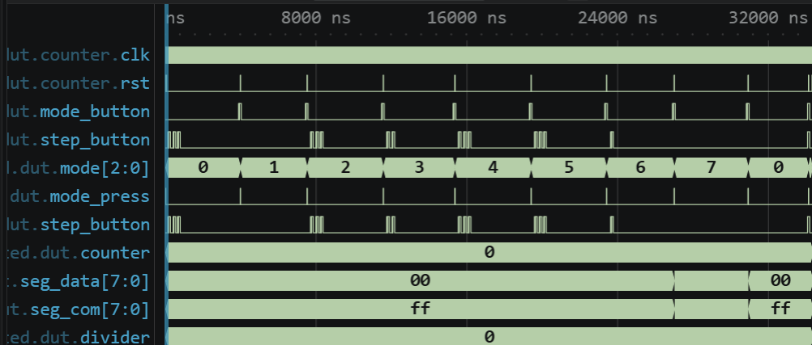

그림 27. 0~34326 ns의 mode 0→7→0 순환과 출력 선택.

mode 2에서 `sw=A1`로 load하고 `33`으로 바꾸어 transfer를 두 번 실행했다. LED는 `A0→3A→33`으로 변해야 하며 확대 파형에서 이 순서를 확인했다. 첫 transfer에서 새 입력 3 대신 이전 저장값 A가 전달된다.

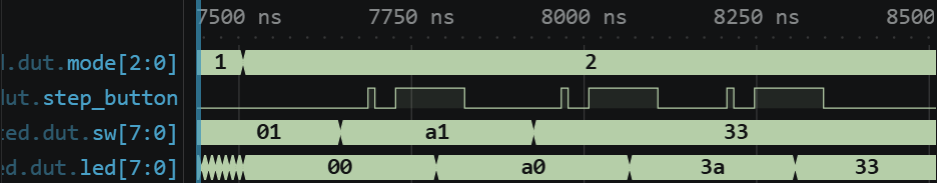

그림 28. 7500~8500 ns의 mode 2 Register load·이전 값 전달.

mode 4의 LCD 전송에서는 첫 줄 `MODE 05`, 둘째 줄 `PISO`가 예상된다. `E` 펄스 전에 데이터와 `RS`가 설정되고 전송 중 유지되어야 한다. 확대 파형에서 주소 `80`과 `M/O/D/E` 전송을 확인했으며, TB가 LCD 버스에서 재구성한 32칸 화면과 timing 검사로 전체 문자열을 검증했다.

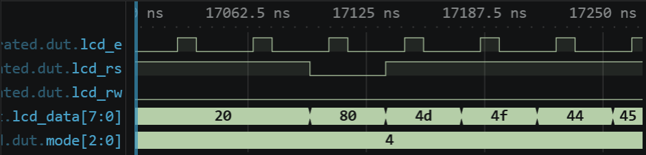

그림 29. 17050~17250 ns의 LCD 첫 줄 주소와 MODE 05 전송 시작.

mode 7에서 첫 자리 입력을 9로 두면 index 0의 `seg_data=F6`, 활성 COM의 active-low 패턴과 blank의 `seg_com=FF`가 예상된다. 확대 파형에서 활성 COM과 FF blank의 교대 및 index·segment 변화를 확인했다. TB의 32 active/32 blank 검사는 전체 scan 비율을 확인한다.

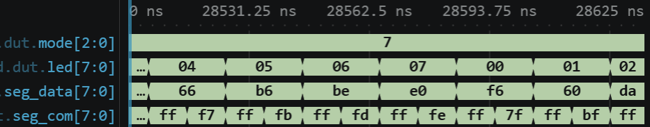

그림 30. 28500~28625 ns의 mode 7 segment 선택과 blank.

mode와 step을 동시에 입력하면 새 mode로 진행하되 코어 reset이 step보다 우선해야 한다. 마지막 global reset 뒤에는 mode=0, LED=0, `seg_com=FF`, `lcd_e=0`이 예상된다. 확대 파형에서 입력과 외부 출력의 전환 및 초기화를 확인했다. 내부 `mode/count`와 LCD 조건은 같은 정상 실행의 TB 검사로 확인했다.

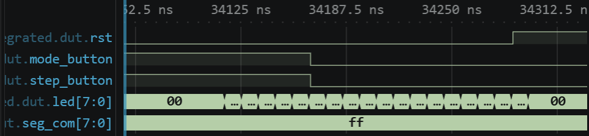

그림 31. 34000~34330 ns의 mode/step 동시 입력과 최종 reset.

### 6. 오류 검출 및 복구

`LAB2/08A_integrated/src/counter4.v`의 한 줄 `value <= value + 4'd1;`을 `value <= value + 4'd2;`로 바꾸고 TB는 변경하지 않았다. 첫 mode 0 증가에서 예상 LED 값은 `01`이지만 수정 회로는 `02`를 만든다. 실제 TB의 **346 ns `counter increments once`** 검사에서 FAIL했고, 원래 RTL로 복구한 별도 실행은 **`modes=8 checks=2848`**, 34326 ns 종료로 PASS했다.

| 실행 | RTL 조건과 예상 | 실제 확인 및 의미 |
|---|---|---|
| 정상 | `value <= value + 4'd1;`; 첫 증가 LED `01` | PASS `modes=8 checks=2848`, 34326 ns 종료 |
| 수정 | `value <= value + 4'd2;`; 예상값 `01`, 실제값 `02` | 346 ns `counter increments once` FAIL |
| 원복 | 증가식을 `4'd1`로 복원, TB 유지 | 별도 실행 PASS `modes=8 checks=2848`, 34326 ns 종료 |

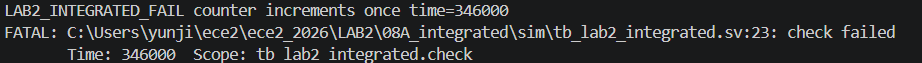

그림 32. counter 증가량 +2 수정 뒤 346 ns의 LED 예상값 `01`/실제값 `02` 검출 로그.

## K. Vivado 및 FPGA 보드 실험 계획

### 공통 실험 절차

Vivado에서는 각 실험의 RTL을 **Design Sources**, testbench를 **Simulation Sources**, `lab2_*.xdc`를 **Constraints**로 등록할 계획이다. `lab2_*`는 synthesis/implementation을 위한 design top, `tb_*`는 Behavioral Simulation을 위한 simulation top으로 구분한다. 08A는 RTL 12개, 다른 실험은 각 RTL 3개를 사용한다. 대상 부품은 교안의 `xc7s75fgga484-1`, 보드 메인 클록 B6은 **1 kHz**로 설정한다. Behavioral Simulation에서 사전 검증한 기능을 다시 확인한 뒤 synthesis, implementation, DRC 및 timing 확인, bitstream 생성, FPGA programming 순으로 실제 보드 검증을 진행한다. 이 단계들은 아직 수행하지 않았다.

물리 스위치와 N8 버튼은 `input_frontend`를, 08A의 N4 step 버튼은 `button_onepulse`를 거친다. 따라서 보드에서는 입력을 먼저 설정하고 안정된 뒤 버튼을 눌러야 한다. TB의 직접 입력 시점과 보드의 반응 시점은 같지 않다.

| 실험 / design top | 입력 설정·조작 | 예상 출력 | 실제 확인할 항목 |
|---|---|---|---|
| 01 `lab2_counter` | K4 reset; DIPSW8=`sw[0]` 방향을 먼저 설정하고 N8 누름 | LED[3:0] 0→15→0 또는 0→15 감소 순환; 상위 4비트 0 | 한 번 누름에 한 단계, 길게 누름 중 추가 증가 없음, 양방향 wrap |
| 02 `lab2_clock_divider` | B6 1 kHz, K4 reset; N8·DIP는 분주비를 바꾸지 않음 | LED[0]=500 Hz, [1]=100 Hz, [2]=20 Hz, [3]=1 Hz, [4]=1 ms tick, [7:5]=0 | LED3의 0.5 s High/Low; 빠른 LED/tick은 측정 장비나 시간 분해가 가능한 기록으로 확인 |
| 03 `lab2_register` | DIP 상위 4비트 데이터, `sw[0]` load, `sw[1]` transfer를 설정한 뒤 N8 | `led={stored,value}`: A1 입력→A0, 32→AA, 33→3A, 같은 33 재실행→33, F0 hold→33, K4→00 | 동시 제어에서 이전 stored 전달, hold·reset |
| 04 `lab2_shift_register` | SW1=`sw[7]` 직렬 입력, N8 한 단계, K4 reset | LED[3:0] `0→8→4→A→5→2→1→0→0`; 상위 4비트 0 | 입력만 변경하면 hold, 각 누름에서 한 자리 이동 |
| 05 `lab2_piso` | SW1~4에 A, SW8=`sw[0]` 1에서 N8 load; 0에서 N8 shift | `led={value,000,serial_out}`: `A1→40→81→00→00` | load 직후 첫 serial bit=1을 시프트 전에 읽고 이후 0,1,0 순서 |
| 06 `lab2_moore` | SW1 advance, N8 enable, K4 reset | LED[1:0] `00→01→10→00`, 상위 6비트 0 | 스위치만 변경하거나 advance=0에서 press해도 상태 유지 |
| 07 `lab2_mealy` | SW1 bit_in, N8 상태 전이, K4 reset | `led={00000,state,value}`: 대표 `000→010→101→100→100→010` | 동기화된 스위치 입력 뒤 출력 변화와 press 뒤 상태 토글을 구분 |
| 08 `lab2_segment_scan` | SW1~4=1001, K4 reset; N8은 스캔 진행에 불필요 | 첫 자리 9, 뒤 1~7; LED[2:0]=index; COM active-low·blank FF | 자리 순서·blank·첫 자리 스위치 반영과 실제 표시 |
| 08A `lab2_integrated` | B6 1 kHz; K4 reset, N8 mode, N4 step; 모드별 `sw[7:0]` 입력 | LCD `MODE 01`~`MODE 08`과 이름, LED mode별 MUX, mode 7에서만 segment 활성 | mode 0→7→0, 코어별 예상 출력, mode 변경 시 코어 reset, mode+step 동시 입력의 reset 우선, 최종 K4 초기화 |

### 실험별 확인 사항

- **01 Counter.** `down=0/1`로 증가·감소 방향을 정하고 N8을 한 번씩 눌러 LED 하위 4비트가 한 단계씩 변하는지 본다. `15→0`, `0→15` 경계값과 버튼을 길게 눌러도 한 번의 press pulse만 생기는지를 확인한다.
- **02 Clock Divider.** B6의 1 kHz에서는 한 clock이 1 ms이므로 기본 `DIVISOR=1000`의 `divided` 주기는 1 s, High/Low는 각각 0.5 s다. `tick`은 매 1 s마다 1 ms 동안 HIGH이므로 LED 눈관찰보다 시간 분해가 가능한 측정·기록으로 확인한다. 분주비 10 출력은 `10×1 ms=10 ms` 주기이며, TB의 10 ns clock과 보드의 1 ms clock을 구분한다.
- **03 Register.** 데이터와 load/transfer 스위치를 먼저 설정하고 N8로 한 단계 실행한다. LED의 `{stored,value}`가 A load에서 `A0`, 입력 3의 transfer에서 `AA`, 동시 load·transfer에서 `3A`, 다음 transfer에서 `33`인지 확인해 같은 edge의 새 값이 아닌 이전 `stored`가 전달됨을 살핀다.
- **04 Shift Register.** `serial_in`을 설정한 뒤 N8을 한 번 누를 때마다 LED 하위 4비트가 `0000→1000→0100`처럼 한 자리씩 오른쪽으로 이동하는지 확인한다. 한 press pulse에 두 자리 이상 움직이지 않아야 한다.
- **05 PISO.** A(`1010`)를 load하면 `value=A`, `serial_out=1`이다. 이후 shift 전의 직렬 출력이 `1→0→1→0`인지 읽고, 각 shift 뒤 저장값이 `A→4→8→0→0`으로 변하는지 LED에서 구분해 확인한다.
- **06 Moore FSM.** advance 스위치를 1로 두고 N8을 누를 때 `00→01→10→00`인지 본다. `advance=0`이거나 버튼을 누르지 않은 동안에는 입력만 바꿔도 상태가 유지되는지 확인한다.
- **07 Mealy FSM.** 먼저 `state=0`에서 `bit_in`만 0→1로 바꾸면 `value=00→10`인지 본다. 그다음 N8로 `state=1`로 전이시키면 `value=01`이 되는지 확인해 입력 변화와 state 변화의 효과를 구분한다.
- **08 Segment Scan.** 1 kHz에서 한 자리의 active 1 ms와 blank 1 ms가 2 ms를 차지하므로, 각 자리는 **16 ms마다 1 ms** 켜진다. 반복률은 **62.5 Hz**, on duty는 **1/16=6.25%**다. 논리 `select=01/02/00`은 active-low `seg_com=7F/BF/FF`에 대응하며, blank에서 모든 COM이 꺼지고 첫 자리의 스위치 값이 표시되는지 확인한다.
- **08A Integrated.** K4로 reset한 뒤 N8로 mode를 바꾸고, mode별 스위치를 설정해 N4로 현재 코어를 한 단계 실행한다. LCD의 mode 이름, 현재 코어만 선택한 LED, mode 7에서만 켜지는 7-segment를 확인한다. mode 변경 시 코어 초기화와 mode/step 동시 입력의 reset 우선순위, 01~08 단독 실험과 같은 기능도 비교한다.

보드 결과는 실제 관찰 또는 측정 뒤에만 기록한다. XDC의 핀·clock 제약은 Vivado와 보드 단계에서 확인한다.

## 참고문헌

[1] 전자전기컴퓨터설계실험Ⅱ, LAB2 실험 교안: Counter ~ Segment Scan 및 08A Integrated.

[2] Charles H. Roth, 『논리설계기초』 제7판, 강진구 역, Cengage Learning, 2017.
