# 전자전기컴퓨터설계실험Ⅱ 실험 전 보고서

# LAB 3 – PWM 및 주변장치 제어

| 항목 | 내용 |
|---|---|
| 학과 | 전자전기컴퓨터공학부 |
| 학번/이름 | 2025440032 / 김윤지 |
| 작성일 | 2026.09.25 |
| 대상 | 19 LED PWM ~ 25 UART Echo |
| 검증 환경 | VS Code · Icarus Verilog · VaporView |
| 프로젝트 | ece2_2026 / LAB3 |
| 기준 커밋 | 15bbfc0 |
| GitHub 주소 | https://github.com/yunuos2525-cloud/ece2_2026.git |
| 제출 태그 | LAB3_PRE_FINAL |

## A. 목적 및 공통 검증 조건

LAB3에서는 PWM, piezo, stepper motor, MM:SS 시계, character LCD, UART와 같은 여러 주변장치를 FPGA로 제어하는 방법을 다룬다. 각 실험에서는 50 MHz 기준 clock과 parameter를 이용하여 장치에 필요한 동작 주기와 제어 신호를 만든다. Counter는 이 주기를 구현하는 수단이며, 실험의 목적은 만들어진 제어 신호가 각 장치의 출력 동작으로 어떻게 이어지는지 설계하고 simulation으로 확인하는 것이다.

먼저 설계식으로 예상값을 계산하고, TB가 시험 입력을 DUT에 적용하도록 구성하였다. TB는 미리 정한 예상값과 실제 출력을 비교하여 PASS/FAIL을 판단하고 VCD 파일을 생성한다. 이어 VaporView 파형에서 핵심 경계조건의 내부 상태와 출력 변화를 읽어 계산값과 비교하였다. 따라서 PASS 로그는 TB 검사가 끝까지 통과했음을 보여 주고, 파형은 특정 입력에서 신호가 예상한 값과 순서로 변했음을 보여 준다. 보드 절에는 실제 실험에서 적용할 입력과 예상 결과만 정리한다.

### 공통 파일과 검증 역할

| 실험 | 설계 top | 주요 RTL과 역할 | TB / simulation top | XDC의 주요 외부 신호 |
|---|---|---|---|---|
| 19 LED PWM | `lab3_led_pwm` | `button_onepulse.v`: 동기화·debounce·1-clock press 생성<br>`pwm_channel.v`: counter와 threshold로 PWM 생성<br>`lab3_led_pwm.v`: level 관리와 LED 연결 | `tb_led_pwm.sv` / `tb_led_pwm` | `button`, `led[7:0]` |
| 20 RGB PWM | `lab3_rgb_pwm` | `button_onepulse.v`: 색별 press 생성<br>`pwm_channel.v`: 색별 PWM 생성<br>`lab3_rgb_pwm.v`: R/G/B level 독립 관리 | `tb_rgb_pwm.sv` / `tb_rgb_pwm` | `button_r/g/b`, `led_r/g/b[3:0]` |
| 21 Piezo | `lab3_piezo` | `lab3_piezo.v`: half-period counter와 piezo 반전 | `tb_piezo.sv` / `tb_piezo` | `piezo` |
| 22 Stepper | `lab3_stepper` | `lab3_stepper.v`: 입력 동기화, step 간격·방향·4-bit 구동값 생성 | `tb_stepper.sv` / `tb_stepper` | `enable`, `direction`, `stepmotor[3:0]` |
| 23 MM:SS Clock | `lab3_mmss_clock` | `mmss_counter.v`: BCD 시간 계수<br>`sevenseg_decode.v`: 숫자를 segment 출력값으로 변환<br>`lab3_mmss_clock.v`: 네 자리 scan과 출력 연결 | `tb_mmss_counter.sv` / `tb_mmss_counter` | `seg_data[7:0]`, `seg_com[7:0]` |
| 24 Character LCD | `lab3_character_lcd` | `lab3_character_lcd.v`: 초기화 명령, 문자열 byte, RS/RW/E 제어 순서 생성 | `tb_character_lcd.sv` / `tb_character_lcd` | `lcd_e`, `lcd_rs`, `lcd_rw`, `lcd_data[7:0]` |
| 25 UART Echo | `lab3_uart_echo` | `uart.v`: UART RX/TX bit 간격과 frame 처리<br>`lab3_uart_echo.v`: 수신 byte의 LED 저장과 TX 재전송 | `tb_uart_echo.sv` / `tb_uart_echo` | `uart_rxd`, `uart_txd`, `led[7:0]` |

RTL은 FPGA에 구현될 회로의 상태 갱신과 출력 동작을 기술한다. TB는 DUT에 시험 입력을 가하고, 미리 정한 예상값과 실제 출력을 비교하여 PASS/FAIL을 판단한다. 또한 `$dumpfile`과 `$dumpvars`로 VCD 파일을 생성하여 내부 신호와 출력이 시간에 따라 변하는 모습을 파형으로 볼 수 있게 한다. `simulation.json`은 Icarus가 compile할 RTL과 TB 파일 및 simulation top module을 지정한다.

XDC는 논리 동작을 기술하는 파일이 아니라 Vivado 구현과 실제 보드 연결을 위한 constraint 파일이다. 각 RTL port를 FPGA package pin에 연결하고 `LVCMOS33` I/O standard를 지정하며, `clk_50mhz` port를 B6 pin에 배치한 뒤 외부에서 공급되는 50 MHz clock에 대해 20 ns period constraint를 설정한다. XDC는 synthesis와 implementation 및 실제 보드 사용에 필요하지만 Icarus의 순수 RTL 기능 simulation에는 사용되지 않는다.

모든 TB는 `always #10`으로 20 ns 주기의 simulation clock을 만든다. 실제 보드의 50 MHz와 긴 대기 parameter를 그대로 사용하면 매우 많은 clock cycle이 필요하므로, 각 TB는 회로의 상태 변화 순서와 비율 관계는 유지하면서 `CLK_HZ`, 주파수, debounce 및 wait 값을 해당 실험에 맞게 줄인다. 구체적인 축소값은 각 실험의 계산과 TB 표에 반영하였다.

수정 실험에서는 정상 PASS와 파형을 먼저 보존한 뒤 parameter 또는 RTL 한 항목만 변경하였다. TB의 정상 예상값은 그대로 유지하고, 변경 영향이 FAIL 또는 파형 변화로 나타나는지 살핀 다음 원래 값으로 복구하여 다시 실행하였다.

## B. 실험 19. LED PWM

### 목적, 설계 구조와 예상 동작

`button_onepulse`는 비동기 버튼 입력을 동기화하고 debounce한 뒤 유효한 입력마다 한 clock 폭의 `press`를 만든다. `press`가 한 번 발생할 때마다 `level`이 한 단계 증가하고, `pwm_channel`은 level에 따라 한 PWM 주기에서 HIGH가 유지되는 시간을 정한다. 따라서 level이 높을수록 LED가 밝아지며, 최대 단계 `LEVELS`에서 다음 press가 들어오면 level은 다시 0으로 돌아가 LED가 꺼진다.

```verilog
threshold = (level >= LEVELS)
          ? PERIOD_CYCLES
          : (PERIOD_CYCLES * level) / LEVELS;
pwm <= (count < threshold);
```

보드 기본값은 `CLK_HZ=50_000_000`, `PWM_HZ=1_000`, `LEVELS=10`이므로 PWM 한 주기는 50,000 clocks이고 주파수는 1 kHz이다. TB에서는 `CLK_HZ=1000`, `PWM_HZ=100`, `DEBOUNCE_CYCLES=2`로 줄여 한 주기를 10 clocks로 만든다. 따라서 level 3의 예상 HIGH 폭은 `10×3/10=3 clocks`, LOW 폭은 7 clocks, duty는 30%이다. 버튼은 HIGH 6 clocks와 LOW 6 clocks로 구동하므로 2-clock debounce 조건을 충분히 만족한다.

### 파일 역할과 정상 TB 자극

설계 top은 `lab3_led_pwm`, simulation top은 `tb_led_pwm`이다. XDC는 `button`과 `led[7:0]`을 보드의 실제 pin에 연결하며, RTL의 `clk_50mhz` port를 50 MHz 기준 clock이 입력되는 FPGA B6 pin에 연결하고 clock period를 20 ns로 지정한다.

| 순서/시험 조건 | TB 자극 | 사전 예상 결과 | TB가 검사하는 값 |
|---|---|---|---|
| reset 해제 직후 | 3번째 상승 edge 뒤 `rst_p=0` | level 0, PWM HIGH 0 clocks | 한 period의 `led[0]` HIGH 횟수 0 |
| level 3 | `press_button()` 3회 | threshold 3, HIGH 3/10, duty 30% | HIGH 횟수 3 |
| 최대 단계 | `press_button()` 추가 7회 | level 10, HIGH 10/10, duty 100% | HIGH 횟수 10 |
| wrap-around | `press_button()` 추가 1회 | level 0으로 복귀, LED OFF | HIGH 횟수 0 |

정상 실행은 [PASS 로그](../../evidence/vscode/LAB3/19_led_pwm/normal/LAB3_19_led_pwm_normal_pass_log.png)의 `LAB3_LED_PWM_PASS checks=4`로 끝났다.

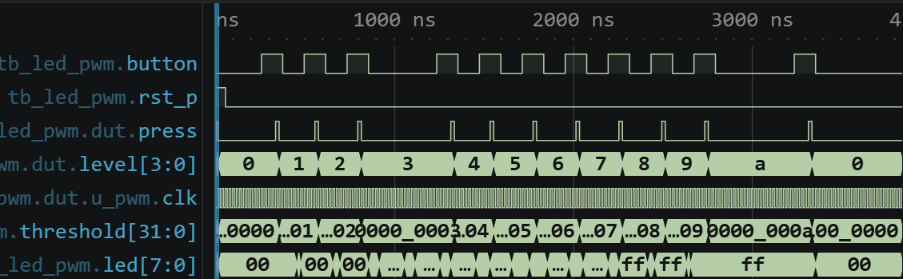

그림 1. reset 이후 level 0→3→10→0과 PWM 출력의 전체 흐름.

level이 3이고 `LEVELS=10`이므로 10-clock PWM period 중 3 clocks가 HIGH일 것으로 예상하였다. 실제 확대 파형에서 `level=3`, `threshold=3`이며 `led`가 3 clocks HIGH, 7 clocks LOW로 반복된다. 계산한 HIGH/LOW 길이와 파형에서 센 clock 수가 같으므로 duty는 30%이다.

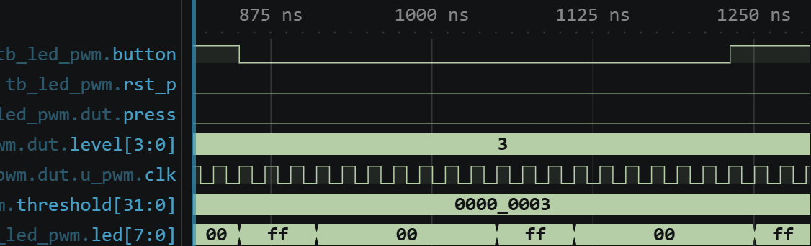

그림 2. level 3에서 HIGH 3 clocks, LOW 7 clocks인 30% PWM.

level 10에서는 threshold가 period 전체인 10이므로 100% HIGH가 예상된다. 그 상태에서 버튼을 한 번 더 누르면 level과 threshold가 10→0으로 순환해야 한다. 이에 따라 8개 LED 출력은 `8'hFF`에서 `8'h00`으로 바뀌어 모두 켜진 상태에서 모두 꺼진 상태로 전환되어야 한다. 실제 파형에도 이 값의 변화가 나타나 최대 단계 다음 입력의 wrap-around를 확인할 수 있었다.

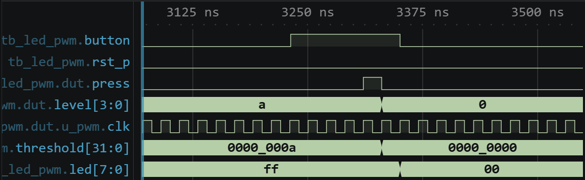

그림 3. level 10의 100% 출력에서 다음 press로 level 0, LED OFF가 되는 경계.

### 수정 실험과 복구

TB의 DUT parameter만 `.LEVELS(10)`에서 `.LEVELS(5)`로 바꾸고 TB의 예상 high count는 3으로 유지하였다. level 3이면 수정 회로의 duty는 `3/5=60%`이고 10-clock period 중 HIGH는 6 clocks가 된다. 실제 FAIL 로그의 `level=3 high=6`은 이 계산과 일치하며, TB가 기대한 3 clocks와 달라 오류를 검출하였다.


그림 4. `LEVELS=5`에서 측정된 HIGH 6 clocks 때문에 발생한 FAIL.

| 상태 | 조건 | 예상 | 실제 결과 |
|---|---|---|---|
| 정상 | `LEVELS=10`, level 3 | HIGH 3/10, 30% | PASS `checks=4` |
| 수정 | `LEVELS=5`, TB 예상값 유지 | 수정 회로 HIGH 6/10, TB 예상값 3 | FAIL, `high=6` |
| 복구 | `LEVELS=10` 원복 | HIGH 3/10 | PASS `checks=4` |

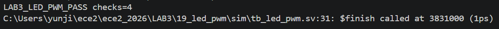

그림 5. 원래 parameter로 복구한 별도 실행의 PASS.

## C. 실험 20. RGB PWM

### 세 채널 구조와 예상값

R/G/B마다 `button_onepulse`, `level`, `pwm_channel`을 독립적으로 둔다. 세 level은 reset에서 0이고 해당 채널의 `press`만 그 level을 한 단계 올린다. 각 색의 PWM 출력 하나를 해당 색의 LED 4개에 동일하게 연결하므로, 같은 색의 LED 4개는 동일한 duty로 함께 켜지고 꺼진다.

```verilog
if (press_r) level_r <= (level_r == LEVELS) ? 0 : level_r + 1'b1;
if (press_g) level_g <= (level_g == LEVELS) ? 0 : level_g + 1'b1;
if (press_b) level_b <= (level_b == LEVELS) ? 0 : level_b + 1'b1;
```

TB는 `CLK_HZ=1000`, `PWM_HZ=100`, `LEVELS=10`, `DEBOUNCE_CYCLES=2`를 사용하므로 PWM period는 10 clocks이다. R/G/B 버튼을 각각 2, 5, 8회 누르면 예상 HIGH 폭은 2, 5, 8 clocks이고 duty는 20%, 50%, 80%이다.

### 파일 역할과 정상 TB 자극

설계 top은 `lab3_rgb_pwm`, simulation top은 `tb_rgb_pwm`이다. 세 `button_onepulse` instance는 R/G/B 버튼을 따로 처리하고, 세 `pwm_channel` instance는 각 level을 별도의 PWM으로 변환한다. XDC는 세 버튼과 R/G/B LED port를 실제 pin에 연결한다.

| 순서/시험 조건 | TB 자극 | 사전 예상 결과 | TB가 검사하는 값 |
|---|---|---|---|
| reset 해제 | 3번째 상승 edge 뒤 `rst_p=0` | R/G/B level 모두 0 | 다음 버튼 자극의 초기 상태 |
| 서로 다른 duty | R/G/B 버튼을 각각 2/5/8회 입력 | HIGH 2/5/8 clocks, duty 20/50/80% | R/G/B의 HIGH clock 수가 각각 2/5/8인지 `measure(2,5,8)`로 검사 |
| R 채널 독립 증가 | R 버튼만 1회 추가 입력 | R은 HIGH 3 clocks, G/B는 5/8 유지 | R/G/B의 HIGH clock 수가 각각 3/5/8인지 `measure(3,5,8)`로 검사 |

정상 실행은 [PASS 로그](../../evidence/vscode/LAB3/20_rgb_pwm/normal/LAB3_20_rgb_pwm_normal_pass_log.png)의 `LAB3_RGB_PWM_PASS checks=2`로 끝났다.

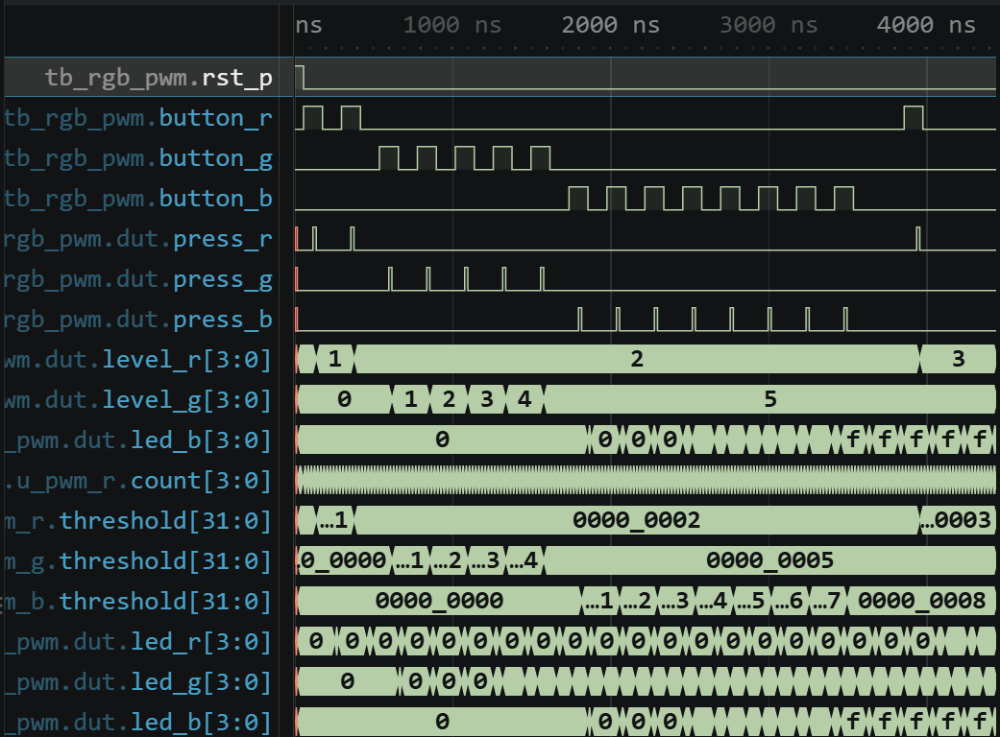

그림 6. 세 색의 버튼 입력, level 변화와 두 차례 PWM 폭 검사의 전체 흐름.

R/G/B level이 2/5/8이면 threshold도 2/5/8이고 한 period에서 각 출력의 HIGH 폭이 그 값과 같아야 한다. 실제 파형에서 R은 2 clocks, G는 5 clocks, B는 8 clocks HIGH로 나타났다. 이를 10-clock period와 비교하면 세 duty는 각각 20%, 50%, 80%이다.

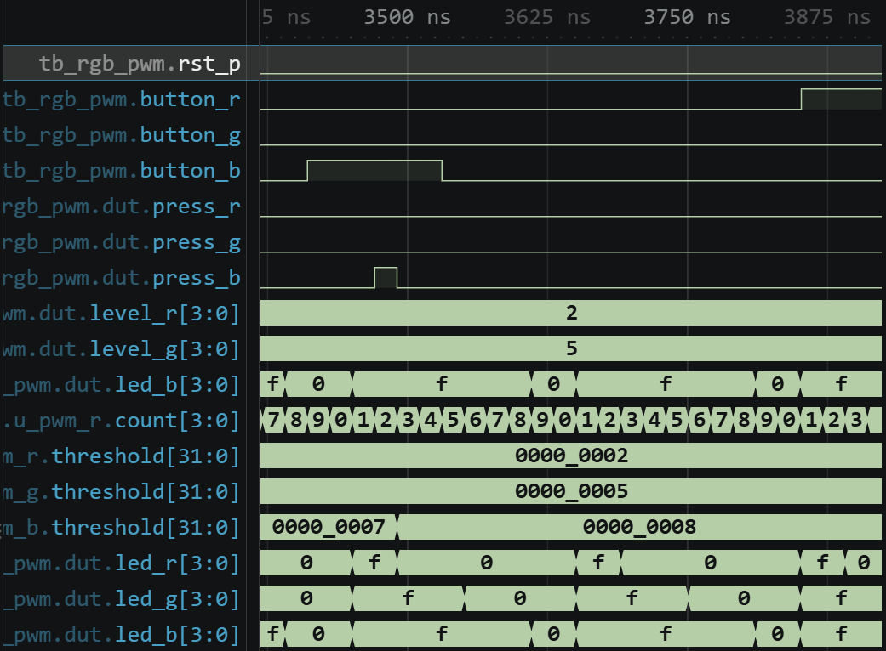

그림 7. 같은 PWM period에서 서로 다른 R/G/B HIGH 폭.

R 버튼만 추가 입력하면 `press_r`에 의해 `level_r`와 `threshold_r`가 2→3으로 바뀌고 G/B는 5와 8을 유지해야 한다. 확대 파형에서도 R만 2→3으로 변하고 G/B는 그대로이므로 한 색의 버튼 입력이 다른 색의 level에 영향을 주지 않는다.

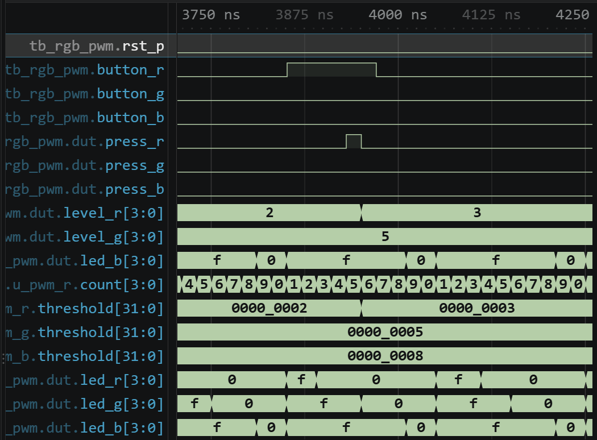

그림 8. R만 2→3으로 증가하고 G/B는 유지되는 독립성 검사.

### 수정 실험과 복구

RTL reset 초기값 중 `level_r<=0`만 `level_r<=1`로 바꾸고 G/B 및 TB 예상값은 유지하였다. 이후 버튼을 2/5/8회 누르면 실제 level은 3/5/8이므로 HIGH 폭도 3/5/8 clocks가 된다. 실제 로그의 `rgb high=3,5,8`은 정상 기대 2/5/8과 달라 FAIL했다.

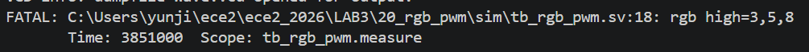

그림 9. R 초기 level을 1로 바꾼 뒤 R HIGH 폭만 3 clocks가 된 FAIL.

| 상태 | R/G/B 초기 및 시험 조건 | 예상 | 실제 결과 |
|---|---|---|---|
| 정상 | 초기 0/0/0, press 2/5/8회 | HIGH 2/5/8 | PASS `checks=2` |
| 수정 | R만 초기 1, press와 TB 동일 | 수정 회로 3/5/8, TB 예상값 2/5/8 | FAIL, `rgb high=3,5,8` |
| 복구 | R 초기값 0으로 원복 | HIGH 2/5/8 및 R만 3/5/8 | PASS `checks=2` |

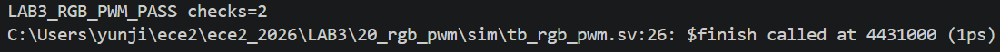

그림 10. R 초기값 복구 후 두 검사를 다시 통과한 결과.

## D. 실험 21. Piezo

### 주파수 분주 원리와 파형

원하는 square wave의 한 주기에는 두 번의 출력 반전이 필요하므로 half-period counter 값은 다음과 같다.

`HALF_PERIOD = CLK_HZ / (2 × TONE_HZ)`

보드 기본값 `CLK_HZ=50,000,000`, `TONE_HZ=294`를 적용하면 `HALF_PERIOD`는 85,034 clocks로 계산되며, `piezo` 출력은 이 간격마다 HIGH와 LOW가 번갈아 바뀐다. TB는 `CLK_HZ=1000`, `TONE_HZ=100`을 사용하므로 half-period는 `1000/(2×100)=5 clocks`이다.

```verilog
if (count == HALF_PERIOD - 1) begin
    count <= 0;
    piezo <= ~piezo;
end
```

### 파일 역할과 정상 TB 자극

`lab3_piezo.v` 하나가 설계 top 전체를 구성하며 half-period counter와 `piezo` 반전을 담당한다. `tb_piezo`는 `piezo` 출력과 DUT port의 연결을 비교하고, counter가 0으로 돌아오는 clock 간격을 측정한다. XDC는 `piezo` port를 Y21 pin에 연결한다.

| 순서/시험 조건 | TB 자극 | 사전 예상 결과 | TB가 검사하는 값 |
|---|---|---|---|
| reset | `rst_p=1`로 3개 상승 edge 유지 후 해제 | `count=0`, `piezo=0`에서 시작 | 연결된 `piezo`와 `dut.piezo` 비교 |
| 25-clock 관찰 | reset 해제 후 25개 상승 edge 진행 | `count`가 0→1→2→3→4→0, 5 clocks마다 `piezo` 반전 | 연속 `count==0` 간격 5 clocks |
| edge 수 검사 | 25-clock 관찰 종료 | 최소 4회 이상의 반전 경계 | `edges>=4`; 실제 `edges=5` |

정상 실행은 [PASS 로그](../../evidence/vscode/LAB3/21_piezo/normal/LAB3_21_piezo_normal_pass_log.png)의 `LAB3_PIEZO_PASS edges=5`로 끝났다. 5-clock half-period를 적용하면 counter가 0→1→2→3→4→0을 반복하고 0으로 돌아갈 때마다 출력이 반전되어야 한다. 실제 파형에서 측정한 출력 반전 간격도 5 clocks이므로 계산한 반주기와 관찰값이 일치하였다.

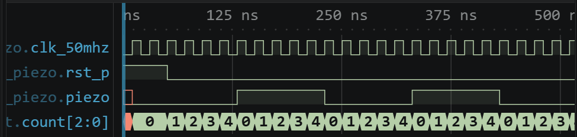

그림 11. counter 순환과 piezo 반전이 5 clocks마다 반복되는 파형.

### 수정 실험과 복구

TB DUT의 `TONE_HZ`만 100에서 125로 바꾸면 half-period는 `1000/(2×125)=4 clocks`이다. TB의 정상 기대 5 clocks는 그대로 두었으므로 실제 4-clock 간격에서 `half period=4` FAIL이 발생하였다.

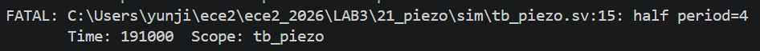

그림 12. tone 증가로 half-period가 5에서 4 clocks로 짧아진 것을 검출한 로그.

| 상태 | `TONE_HZ` | 계산한 half-period | 실제 결과 |
|---|---:|---:|---|
| 정상 | 100 | 5 clocks | PASS `edges=5` |
| 수정 | 125 | 4 clocks | FAIL, `half period=4` |
| 복구 | 100 | 5 clocks | PASS `edges=5` |

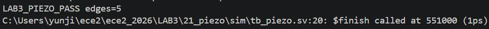

그림 13. `TONE_HZ=100`으로 복구한 뒤의 PASS.

## E. 실험 22. Stepper Motor

### 상태 순서, 방향과 정지

`STEP_CYCLES=CLK_HZ/STEP_HZ`마다 2-bit `state`를 갱신한다. `state`는 2비트이므로 0~3만 표현할 수 있다. `direction_sync=0`인 정방향에서는 `0→1→2→3→0`, `direction_sync=1`인 역방향에서는 `0→3→2→1→0` 순서로 순환한다. 각 state에는 `0011`, `0110`, `1100`, `1001`의 4-bit `stepmotor` 구동값이 대응한다. `enable_sync=0`에서는 count를 0으로 만들지만 state는 바꾸지 않으므로 motor 출력도 마지막 위치를 유지한다.

```verilog
if (!enable_sync) count <= 0;
else if (count == STEP_CYCLES - 1) begin
    count <= 0;
    state <= direction_sync ? state - 1'b1 : state + 1'b1;
end
```

TB는 `CLK_HZ=8`, `STEP_HZ=2`로 설정하므로 `STEP_CYCLES=4 clocks`이다.

### 파일 역할과 정상 TB 자극

`lab3_stepper.v`는 `enable`과 `direction`을 두 단계로 동기화하고, step counter와 2-bit state로 `stepmotor[3:0]` 구동값을 만든다. 설계 top은 `lab3_stepper`, simulation top은 `tb_stepper`이다. XDC는 두 제어 입력과 네 motor 출력 port를 package pin에 연결한다.

| 순서/시험 조건 | TB 자극 | 사전 예상 결과 | TB가 검사하는 값 |
|---|---|---|---|
| reset 해제 | 2개 상승 edge 뒤 `rst_p=0` | state 0의 출력값 `0011` | `stepmotor=0011` |
| 정방향 | `enable=1`, `direction=0`; 각 state 도달까지 대기 | 4 clocks마다 `0110→1100→1001→0011` | `6→C→9→3` 순서 |
| 역방향 | `direction=1`; 동기화와 state 도달까지 대기 | `0011→1001→1100` | `9→C` 순서 |
| disable 유지 | `enable=0`, 동기화 후 12 clocks 대기 | state와 출력이 마지막 `1100` 유지 | `stepmotor=1100` |

정상 실행은 reset 상태를 포함한 8개 출력값을 모두 비교했고, [PASS 로그](../../evidence/vscode/LAB3/22_stepper/normal/LAB3_22_stepper_normal_pass_log.png)에 `LAB3_STEPPER_PASS checks=8`이 기록되었다.

시험 조건 `enable=1,direction=0`에서는 4 clocks마다 정방향 순서가, `direction=1` 이후에는 역방향 순서가 예상된다. `enable=0` 뒤에는 12 clocks를 기다려도 마지막 `C`가 유지되어야 한다. 실제 전체 파형에는 정방향 `3→6→C→9→3`, 역방향 `3→9→C`, disable 후 `C` 유지가 차례로 나타났다.

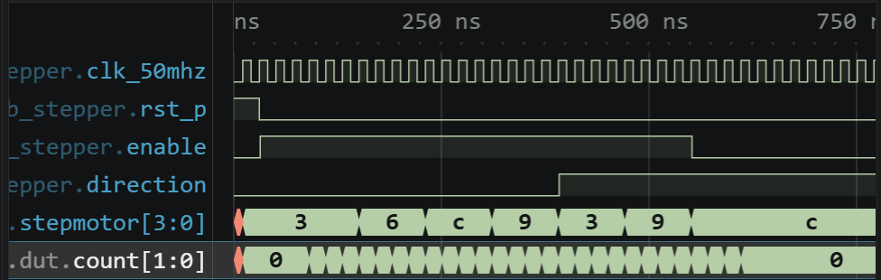

그림 14. 4 clocks/step의 양방향 출력 순서와 disable 유지 구간.

### 수정 실험: PASS를 유지한 동작 간격 변화

TB DUT의 `STEP_HZ`를 2에서 1로 낮추고 TB의 검사 순서는 유지하였다. 계산상 `STEP_CYCLES`는 `8/2=4`에서 `8/1=8 clocks`로 두 배가 되므로 회전 속도는 절반이 된다. 실제 수정 파형에서도 state 사이 간격이 8 clocks로 늘어났다.

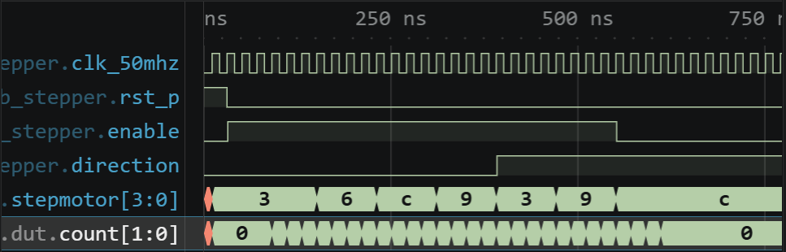

그림 15. `STEP_HZ=1`에서 정상의 두 배인 8 clocks/step으로 변한 파형.

이 수정 실행은 FAIL하지 않았다. TB는 state가 바뀌는 데 걸리는 clock 수를 검사하지 않고, `wait(dut.state==...)`로 각 state에 도달한 뒤 출력 순서가 맞는지만 비교한다. 따라서 `STEP_HZ`를 낮춰 step 간격이 4 clocks에서 8 clocks로 늘어나도 상태 순서가 같아 `LAB3_STEPPER_PASS checks=8`을 출력한다. PASS 로그에는 순서 검사가 통과한 결과가 남고, 수정 파형에는 8-clock step 간격이 나타났다.

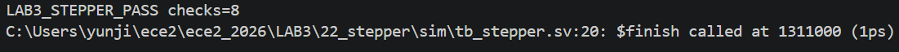

그림 16. step 간격 변화에도 출력 순서 검사가 `checks=8` PASS를 유지한 결과.

| 상태 | `STEP_HZ` | 예상·관찰 간격 | 실제 결과 |
|---|---:|---:|---|
| 정상 | 2 | 4 clocks/step | PASS `checks=8` |
| 수정 | 1 | 8 clocks/step, 속도 1/2 | PASS `checks=8` + 파형에서 간격 2배 |
| 복구 | 2 | 4 clocks/step | PASS `checks=8` |

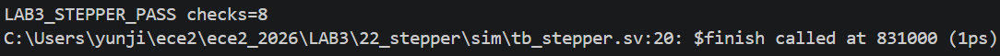

그림 17. `STEP_HZ=2`로 복구한 별도 실행의 PASS.

## F. 실험 23. MM:SS Clock

### BCD 자리올림과 7-segment 표시

`mmss_counter`는 `CLK_HZ` clocks마다 1초를 만들고 `second_ones`, `second_tens`, `minute_ones`, `minute_tens`를 각각 0~9, 0~5, 0~9, 0~5 범위에서 갱신한다. 초 일의 자리가 9에서 0으로 돌아갈 때 초 십의 자리가 증가하고, 초 십의 자리가 5에서 0으로 돌아갈 때 분 일의 자리가 증가한다. 같은 방식으로 분 일의 자리에서 분 십의 자리까지 자리올림이 전달되며, 59:59 다음에는 네 자리가 모두 0이 되어 00:00으로 돌아간다.

```verilog
if (second_ones != 9) second_ones <= second_ones + 1'b1;
else begin
    second_ones <= 0;
    if (second_tens != 5) second_tens <= second_tens + 1'b1;
    // 분 자리도 같은 방식으로 자리올림
end
```

보드 top `lab3_mmss_clock`은 네 BCD 자리를 `sevenseg_decode`로 변환하고 `SCAN_HZ=4000`으로 네 자리를 번갈아 선택한다. `SCAN_CYCLES=50,000,000/4,000=12,500 clocks`마다 다음 자리로 이동한다. TB에서는 `mmss_counter`의 `CLK_HZ=2`로 줄여 2 clocks를 1초로 사용한다.

### 파일 역할과 정상 TB 자극

`mmss_counter.v`는 1초 기준과 MM:SS 네 자리의 자리올림을 만들고, `sevenseg_decode.v`는 BCD 숫자를 8-bit segment 출력값으로 바꾼다. `lab3_mmss_clock.v`는 네 자리 중 하나를 선택해 `seg_data`와 `seg_com`으로 내보내는 설계 top이다. Simulation top `tb_mmss_counter`는 보드 top 대신 counter와 decoder를 직접 시험한다. XDC는 8개 segment data와 8개 common port를 실제 표시장치 pin에 연결한다.

| 순서/시험 조건 | TB 자극 | 사전 예상 결과 | TB가 검사하는 값 |
|---|---|---|---|
| 숫자 decode | `decode_digit=0`, 이어서 9 | 0은 `11111100`, 9는 `11110110` | 두 `decoded_segments` 출력값 |
| reset 해제 | 2개 상승 edge 뒤 `rst_p=0` | 00:00 | `mt/mo/st/so=0/0/0/0` |
| 10초 진행 | `advance(10)` = 20 clocks | 00:10 | `0/0/1/0` |
| 추가 50초 | `advance(50)` = 100 clocks | 01:00 | `0/1/0/0` |
| 추가 3539초 | `advance(3539)` | 59:59 | `5/9/5/9` |
| 추가 1초 | `advance(1)` | 00:00으로 rollover | `0/0/0/0` |

정상 실행은 decoder 2회와 시간 5회를 합쳐 7회 검사했으며, [PASS 로그](../../evidence/vscode/LAB3/23_mmss_clock/normal/LAB3_23_mmss_clock_normal_pass_log.png)에 `LAB3_MMSS_PASS checks=7`이 기록되었다.

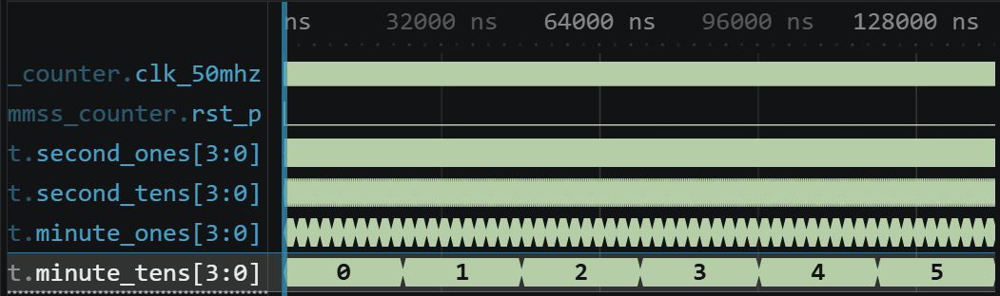

그림 18. reset부터 3600초 rollover까지 네 BCD 자리의 전체 simulation 흐름.

00:09에서 1초가 지나면 초 일의 자리 9는 0이 되고 초 십의 자리 0은 1이 되며 분 자리는 유지되어야 한다. 실제 파형에서 `second_ones 9→0`, `second_tens 0→1`이 나타나 첫 10진 자리올림이 예상과 일치하였다.

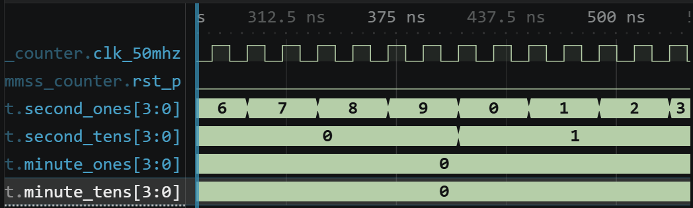

그림 19. 초 일의 자리에서 초 십의 자리로 전달되는 10진 자리올림.

00:59에서 다음 1초에는 `second_ones 9→0`, `second_tens 5→0`, `minute_ones 0→1`, `minute_tens=0 유지`가 예상된다. 실제 파형에도 00:59→01:00이 나타나 초 자리에서 분 자리까지 이어지는 자리올림이 예상과 일치하였다.

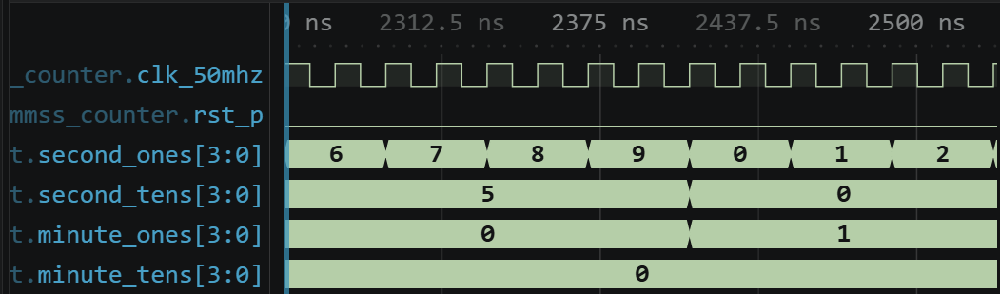

그림 20. 두 초 자리가 0으로 돌아가고 분 일의 자리가 증가하는 경계.

59:59 다음에는 네 자리가 모두 최대 범위에 있으므로 `9→0`, `5→0`, `9→0`, `5→0`이 연쇄적으로 일어나 00:00이 되어야 한다. 실제 파형의 59:59→00:00 전환은 전체 3600초 rollover를 확인한다.

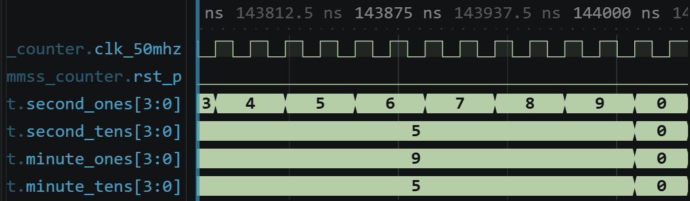

그림 21. 분·초 네 자리 전체가 순환하는 60분 경계.

### 수정 실험과 복구

TB DUT의 `CLK_HZ`만 2에서 4로 변경하고 `always #10` clock, `advance(seconds*2)`, TB 예상값은 유지하였다. 수정 회로는 4 clocks마다 1초 증가하지만 TB는 여전히 2 clocks를 1초로 간주하므로 검사 시점에서 내부 시간은 예상의 절반만 진행한다. 실제 로그는 기존 예상값과 맞지 않는 `time=00:05`에서 FATAL을 발생시켰다.

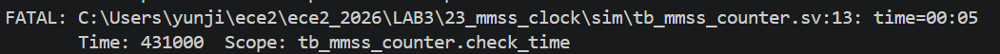

그림 22. `CLK_HZ=4`로 시간 진행이 느려져 첫 10초 검사에서 00:05가 된 FAIL.

| 상태 | DUT `CLK_HZ` | TB가 10초로 간주한 20 clocks 뒤 | 실제 결과 |
|---|---:|---:|---|
| 정상 | 2 | 00:10 | PASS `checks=7` |
| 수정 | 4 | 수정 회로는 00:05, TB 예상값 00:10 | FATAL, `time=00:05` |
| 복구 | 2 | 00:10 | PASS `checks=7` |

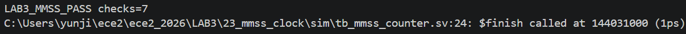

그림 23. `CLK_HZ=2`로 복구한 뒤 7개 검사를 다시 통과한 결과.

## G. 실험 24. Character LCD

### 한 byte 전송 순서와 제어 신호

`lab3_character_lcd`는 LCD 초기화 명령과 두 줄의 문자 값을 순서대로 전송하고, 각 byte에 맞게 `lcd_rs`, `lcd_rw`, `lcd_e`를 제어한다. `lcd_rs=0`이면 해당 byte는 LCD 제어 명령으로, `lcd_rs=1`이면 화면에 표시할 문자 데이터로 해석된다. 한 byte를 보낼 때는 먼저 `lcd_data`와 `lcd_rs`를 설정하고, `lcd_e`를 HIGH로 올렸다가 LOW로 내려 LCD가 값을 받아들이게 한다. 그 뒤 LCD가 명령이나 문자를 처리할 수 있도록 정해진 시간만큼 기다린 후 다음 byte로 이동한다. `lcd_rw=0`은 쓰기 동작을 뜻하며, 이번 실험에서는 `lcd_rw`를 항상 0으로 유지한다.

각 parameter는 LCD 동작 사이의 대기 시간을 정한다.

- `TICK_CYCLES`: LCD 제어 동작을 진행하는 기본 시간 간격
- `POWER_TICKS`: reset 해제 후 초기화를 시작하기 전에 기다리는 시간
- `NORMAL_WAIT_TICKS`: 일반 명령이나 문자 전송 뒤 기다리는 시간
- `CLEAR_WAIT_TICKS`: 화면 지우기 명령 뒤 기다리는 더 긴 시간

보드에서는 `TICK_CYCLES=500`, `POWER_TICKS=2000`, `NORMAL_WAIT_TICKS=4`, `CLEAR_WAIT_TICKS=200`을 사용한다. TB에서는 같은 전송 순서를 짧은 simulation 시간 안에 확인하기 위해 이 값을 각각 2, 3, 1, 2로 줄였다.

```verilog
assign lcd_rw = 1'b0;
// phase 0: data/RS 설정, 1: E HIGH, 2: E LOW, 3: wait
index <= (index == 39) ? 6 : index + 1'b1;
```

### 파일 역할과 정상 TB 자극

`lab3_character_lcd.v`는 설계 top으로서 전원 안정화 대기, 명령·문자 40 bytes, RS/RW/E 제어 순서를 만든다. `tb_character_lcd`는 예상 byte와 예상 RS 값을 배열에 저장하고 `lcd_e`가 HIGH에서 LOW로 내려갈 때마다 실제 출력과 비교한다. XDC는 세 제어 신호와 8-bit `lcd_data`를 LCD에 연결되는 package pin에 배치한다.

| 순서/시험 조건 | TB 자극·기준 | 사전 예상 결과 | TB가 검사하는 값 |
|---|---|---|---|
| 전원 안정화 대기 | reset 해제 후 `POWER_TICKS=3` | E가 LOW인 대기 뒤 전송 시작 | 첫 E 하강부터 예상 순서 적용 |
| 초기화 | index 0~6 | `38,38,38,0C,06,01,80`, `RS=0`, `RW=0` | 각 명령의 RS/RW/`lcd_data` |
| 첫 행 | index 7~22 | `FPGA LAB3` 뒤 공백, `RS=1` | 16개 문자 값 |
| 둘째 행 주소 | index 23 | `C0`, `RS=0` | 둘째 행 주소 명령 |
| 둘째 행 | index 24~39 | `LCD CONTROLLER` 뒤 공백, `RS=1` | 16개 문자 값 |

정상 실행에서는 40번의 `lcd_e` 하강 시점마다 RS/RW/`lcd_data`가 모두 예상 배열과 같았고, [PASS 로그](../../evidence/vscode/LAB3/24_character_lcd/normal/LAB3_24_character_lcd_normal_pass_log.png)에 `LAB3_LCD_PASS bytes=40`이 기록되었다.

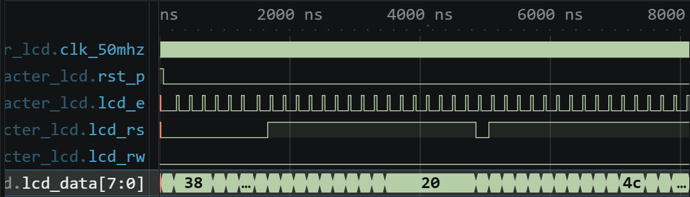

그림 24. 전원 안정화 대기 뒤 초기화 명령과 두 줄의 문자를 합해 40 bytes를 전송하는 전체 흐름.

초기화 명령을 보낼 때는 `lcd_rs=0`, `lcd_rw=0`이어야 한다. `0x38`은 LCD 동작 형식을 설정하고, `0x0C`는 display를 켜며, `0x06`은 문자를 쓴 뒤 위치가 이동하는 방식을 정한다. 이어 `0x01`로 화면을 지우고 `0x80`으로 첫 번째 행의 시작 위치를 지정한다. 실제 초기화 파형에서 `38, 38, 38, 0C, 06, 01, 80`이 이 순서로 나타났고, 각 byte마다 `lcd_e` pulse가 발생하였다.

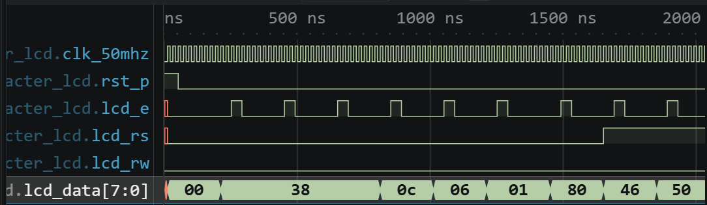

그림 25. `RS=0`, `RW=0`에서 LCD 동작 형식 설정부터 첫 행 주소 지정까지 이어지는 초기화 명령 순서.

index 7부터는 문자를 쓰기 위해 `lcd_rs=1`로 바뀐다. 첫 행에는 ASCII `46 50 47 41 20 4C 41 42 33`, 즉 `FPGA LAB3` 뒤에 공백이 전송되어야 한다. 실제 파형에도 이 ASCII 값과 공백이 순서대로 나타나 첫 행 16칸을 채우는 동작이 예상과 일치하였다.

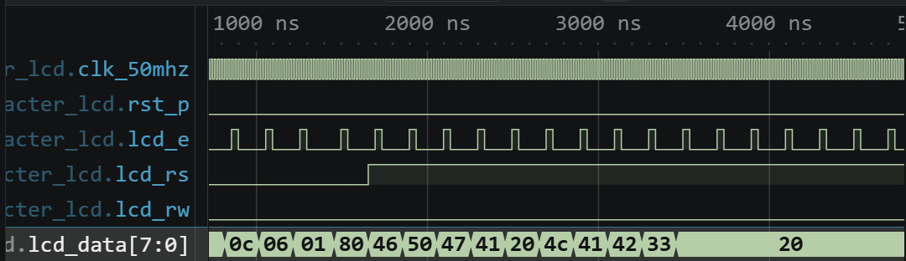

그림 26. `RS=1`에서 `FPGA LAB3`의 ASCII 값과 남은 칸의 공백을 보내는 첫 행 구간.

두 번째 행으로 이동할 때 index 23에서 `lcd_rs=0`, `lcd_data=0xC0`이 출력되어야 한다. 이후 `lcd_rs=1`에서 `LCD CONTROLLER`에 해당하는 ASCII `4C 43 44 20 43 4F 4E 54 52 4F 4C 4C 45 52`가 순서대로 전송되어야 한다. 실제 파형에서 `0xC0` 명령 뒤에 해당 ASCII 값이 차례로 나타났다.

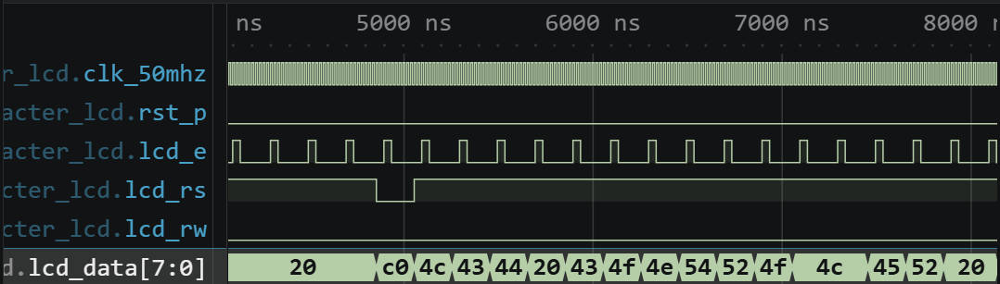

그림 27. `0xC0`으로 둘째 행 위치를 지정한 뒤 `LCD CONTROLLER`의 ASCII 값을 전송하는 구간.

### 수정 실험과 복구

RTL index 25의 `byte_data="C"`를 `"X"`로 바꾸고 TB의 예상값은 원래 문자열로 유지하였다. 실제 index 25 byte는 ASCII X인 `0x58`이므로 TB가 기대한 C `0x43`과 다르다. 로그의 `index=25 rs=1 data=58`에서 이 한 글자 차이가 검출되었다.

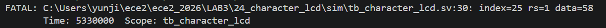

그림 28. 둘째 행의 C가 X로 바뀐 index 25의 문자 값 불일치.

| 상태 | index 25 RTL | TB 예상값 | 실제 결과 |
|---|---|---|---|
| 정상 | C (`0x43`) | C (`0x43`) | PASS `bytes=40` |
| 수정 | X (`0x58`) | C (`0x43`) | FAIL, `index=25 data=58` |
| 복구 | C (`0x43`) | C (`0x43`) | PASS `bytes=40` |

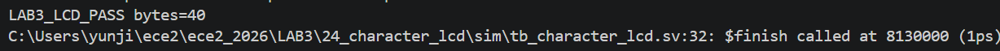

그림 29. 원래 둘째 행 문자열로 복구한 뒤 40 bytes PASS.

## H. 실험 25. UART Echo

### Bit 시간, 수신, 재전송 구조

UART는 한 개의 신호선으로 bit를 시간 순서대로 전송하므로 송신기와 수신기가 같은 bit 시간을 사용해야 한다. `DIV=(CLK_HZ+BAUD/2)/BAUD`는 UART 한 bit에 해당하는 clock 수를 정한다.

`uart_rx`는 RX 신호가 대기 상태인 1에서 start bit의 0으로 내려가면 수신을 시작한다. Bit 값이 바뀔 수 있는 경계 근처가 아니라 해당 bit가 안정적으로 유지되는 시간 구간의 중앙 부근에서 값을 읽고, 이후 `DIV` 간격으로 8개의 data bit를 LSB부터 차례로 수신한다. 마지막 stop bit가 1이면 수신 byte를 `rx_data`로 내보내고 `rx_valid`를 한 clock 동안 발생시킨다. Stop bit가 0이면 `rx_framing_error`가 발생한다.

`lab3_uart_echo`는 `rx_valid`가 발생했을 때 수신 byte를 LED에 저장하고 TX로 전달한다. `uart_tx`는 해당 byte 앞에 start bit 0, 뒤에 stop bit 1을 붙여 총 10-bit frame으로 다시 전송한다. 따라서 정상 동작에서는 수신 byte, LED 값, 다시 송신되는 byte가 모두 같아야 한다.

```verilog
if (rx_valid) begin
    last_data <= rx_data;
    if (tx_ready) begin
        tx_data <= rx_data;
        tx_valid <= 1;
    end
end
```

보드 기본값은 50 MHz와 9,600 baud이며 반올림 식으로 `DIV=5208`이다. TB는 `CLK_HZ=800`, `BAUD=100`, 즉 `DIV=8 clocks/bit`로 줄인다.

### 파일 역할과 정상 TB 자극

`uart.v`의 `uart_rx`는 start bit 검출, 8-bit LSB-first 수신, stop bit와 framing error 판정을 담당하고, `uart_tx`는 10-bit UART frame을 만든다. 설계 top `lab3_uart_echo`는 수신 byte를 LED에 저장하고 TX로 전달한다. `tb_uart_echo`는 RX 선에 frame을 직접 입력하고 TX 선을 bit 중앙 부근에서 다시 읽어 전송된 byte를 구성한다. XDC는 `uart_rxd`, `uart_txd`, `led[7:0]`을 보드 pin에 연결한다.

| 순서/시험 조건 | TB 자극 | 사전 예상 결과 | TB가 검사하는 값 |
|---|---|---|---|
| reset 해제 | 4개 상승 edge 뒤 `rst_p=0`, RX idle=1 | RX/TX idle 상태 | 첫 frame 수신 준비 |
| 문자 A | `send_byte(8'h41)`; bit당 8 clocks | TX echo와 LED가 `0x41` | `observed=41`, `led=41` |
| 문자 Z | `send_byte(8'h5A)` | TX echo와 LED가 `0x5A` | `observed=5A`, `led=5A` |
| line feed | `send_byte(8'h0A)` | TX echo와 LED가 `0x0A` | `observed=0A`, `led=0A` |
| frame 상태 | 세 byte 완료 뒤 | stop bit 오류 없음 | `rx_framing_error=0` |

정상 실행은 세 echo와 LED 값을 모두 비교했고, [PASS 로그](../../evidence/vscode/LAB3/25_uart_echo/normal/LAB3_25_uart_echo_normal_pass_log.png)에 `LAB3_UART_ECHO_PASS checks=3`이 기록되었다.

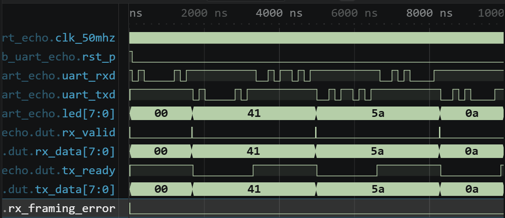

그림 30. 0x41, 0x5A, 0x0A의 수신·LED 저장·재전송 전체 흐름.

세 frame이 같은 bit 간격으로 들어오면 `rx_data`, `led`, `tx_data`가 각각 `00→41→5A→0A`로 바뀌고 각 byte의 수신이 끝날 때 `rx_valid`가 한 clock 동안 HIGH가 되어야 한다. 실제 전체 파형에서 세 신호가 이 값의 순서로 바뀌었고 `rx_framing_error=0`을 유지했으므로 세 byte가 그대로 다시 송신되었다.

대표 byte `0x41`에서는 RX의 start bit, 8 data bits, stop bit가 들어온 뒤 `rx_valid`가 발생해야 한다. 이어 `rx_data`와 LED가 `0x41`로 바뀌고 `tx_data=0x41`인 TX frame이 시작되어야 한다. 확대 파형에 이 순서가 그대로 나타나 수신 완료부터 LED 저장과 TX echo까지의 연결이 예상과 일치하였다.

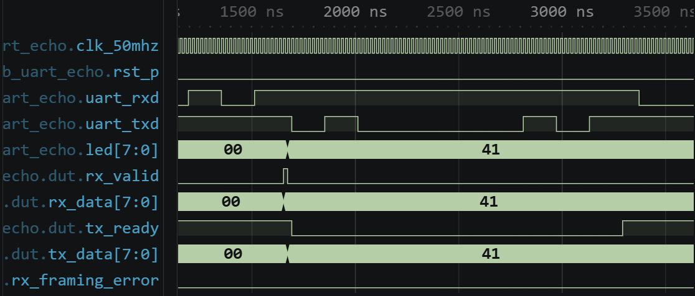

그림 31. 0x41 RX frame, `rx_valid`, LED 저장, 0x41 TX echo의 연속 동작.

### 수정 실험과 복구

TB DUT의 `BAUD`만 100에서 200으로 바꾸고 RX 입력의 `DIV=8` bit 간격과 예상 byte는 유지하였다. 수신기가 사용하는 bit 간격은 절반으로 짧아져 입력 bit가 안정된 구간의 중앙과 다른 시점에서 값을 읽게 된다. 그 결과 정상 예상값 `0x41` 대신 `0xFA`가 echo되었고, 로그는 `echo=fa expected=41`로 FAIL했다.

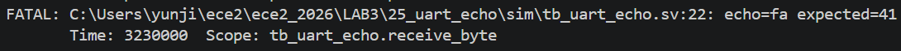

그림 32. DUT와 RX 입력의 bit 간격이 달라 0x41이 0xFA로 잘못 해석된 결과.

| 상태 | DUT와 RX 입력의 bit 간격 | 첫 byte 예상 | 실제 결과 |
|---|---|---|---|
| 정상 | DUT `DIV=8`, RX 입력 `DIV=8` | echo `0x41` | PASS `checks=3` |
| 수정 | DUT `BAUD=200`, RX 입력 `DIV=8` 유지 | 수신 시점 불일치, TB 예상값 `0x41` | FAIL, echo `0xFA` |
| 복구 | DUT와 RX 입력 모두 `DIV=8` | echo `0x41` | PASS `checks=3` |

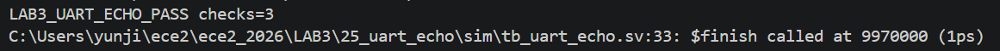

그림 33. 정상 BAUD로 복구한 뒤 세 byte를 다시 통과한 결과.

## I. 보드에서 확인할 항목과 예상 결과

Vivado에는 Icarus에서 시험한 RTL과 TB, 각 실험의 XDC를 등록하고 표의 설계 top을 지정할 계획이다. 실제 보드에서는 아래 입력을 순서대로 적용하고, 관찰한 출력이 예상 결과와 같은지 기록한다.

| 실험 | 실제 보드에서 적용할 입력·조건 | 예상 결과와 확인 항목 |
|---|---|---|
| 19 LED PWM | reset 후 밝기 조절 버튼을 한 번씩 누른다. | 버튼을 누를 때마다 LED 밝기가 한 단계 증가하고, 최대 밝기 다음 입력에서 8개 LED가 모두 꺼지는지 확인한다. |
| 20 RGB PWM | R/G/B 버튼을 각각 서로 다른 횟수로 누른다. | 선택한 색의 밝기만 변하고 다른 두 색의 밝기는 유지되는지 확인한다. |
| 21 Piezo | reset을 해제한 뒤 piezo 출력을 관찰한다. | `TONE_HZ=294`에 대응하는 주기와 음 높이가 나타나는지 확인한다. |
| 22 Stepper | enable을 활성화하고 direction을 변경한 뒤 enable을 비활성화한다. | 정방향·역방향 회전과 disable 시 마지막 위치 유지 여부를 확인한다. |
| 23 MM:SS Clock | reset을 해제한 뒤 시간 표시를 관찰한다. | 초 증가와 00:09→00:10, 00:59→01:00, 가능하면 59:59→00:00 자리올림을 확인한다. |
| 24 Character LCD | reset을 해제한 뒤 초기화와 문자 출력을 기다린다. | 첫 행 `FPGA LAB3`, 둘째 행 `LCD CONTROLLER` 문자열이 올바르게 표시되는지 확인한다. |
| 25 UART Echo | PC terminal에서 `0x41`, `0x5A`, `0x0A`에 해당하는 데이터를 전송한다. | 같은 byte가 다시 echo되고 LED에 마지막 수신 byte가 표시되는지 확인한다. |

## J. 결론

LAB3에서는 PWM을 이용한 LED 밝기 조절, piezo 주파수 생성, stepper motor의 상태 순환, MM:SS 자리올림, character LCD의 명령·문자 전송, UART 송수신과 echo 동작을 설계하였다. 각 실험에서는 입력 조건과 parameter로 예상 결과를 먼저 계산하고, PASS 로그와 핵심 파형에 나타난 실제 RTL 동작을 예상값과 비교하였다.

한 항목만 바꾼 수정 실행에서는 예상값과 다른 출력 또는 동작 간격의 변화를 실제 로그와 파형에서 구분했으며, 원래 값으로 복구한 실행은 다시 PASS했다. Stepper 수정 실행은 상태 순서가 유지되어 PASS했지만 step 간격은 4 clocks에서 8 clocks로 늘어났다. 이 결과는 PASS 로그가 출력 순서의 일치를, 파형이 속도 변화를 각각 보여 준다는 의미다.

## 참고문헌

- 전자전기컴퓨터설계실험Ⅱ LAB3 교안 및 실험 전 보고서 요구사항
- M. Morris Mano, Michael D. Ciletti, *Digital Design: With an Introduction to the Verilog HDL, VHDL, and SystemVerilog*, 6th ed., Pearson, 2017.
