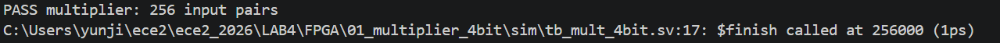
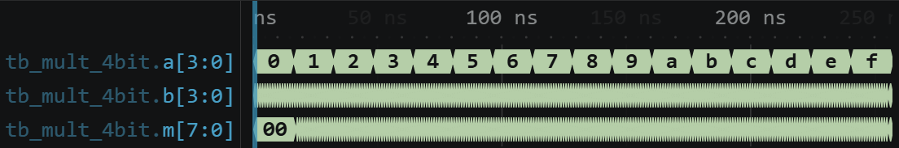
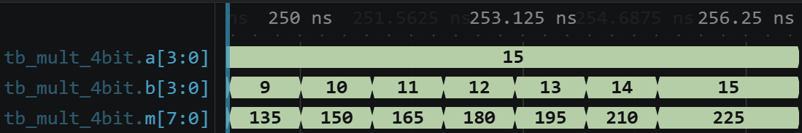
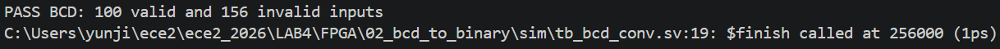
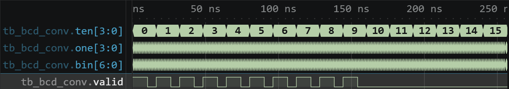
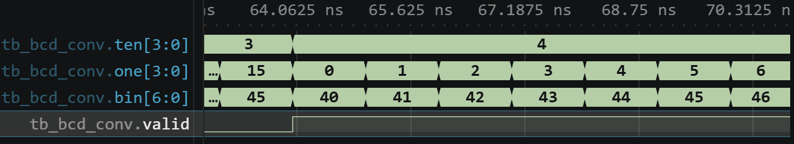
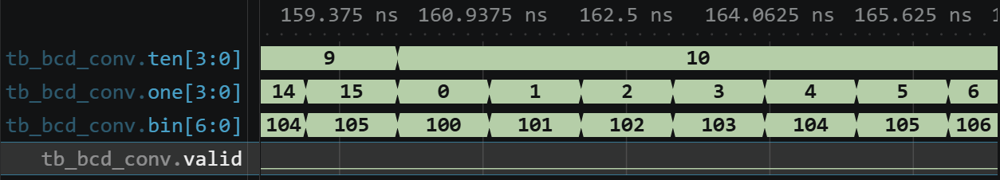

# 전자전기컴퓨터설계실험Ⅱ 실험 전 보고서

# LAB 4 – STM32 Polling과 FPGA 조합회로

| 항목 | 내용 |
|---|---|
| 학과 | 전자전기컴퓨터공학부 |
| 학번/이름 | 2025440032 / 김윤지 |
| 작성일 | 2026.10.07 |
| 대상 | STM32_0 및 FPGA 추가 실습 |
| 검증 환경 | STM32Cube VS Code · CMake/Ninja · GNU Arm toolchain · Icarus Verilog · VaporView |
| 프로젝트 | ece2_2026 / LAB4 |
| 기준 커밋 | 2b3c10b |
| GitHub 주소 | github.com/yunuos2525-cloud/ece2_2026.git |
| 제출 태그 | LAB4_PRE_FINAL |

## 1. 실험 목적 및 전체 구성

LAB4는 STM32의 polling 기반 GPIO 제어와 FPGA의 조합회로 설계를 함께 다룬다. STM32 부분에서는 CPU가 `polling_routine()`을 반복 호출하면서 GPIO 입력과 시간을 확인하고 LED 출력을 제어한다. FPGA 부분에서는 곱셈기와 BCD 변환 논리를 RTL로 구성하고 testbench simulation으로 입력 조합에 대한 출력을 검사한다.

STM32와 FPGA의 검증 방법도 서로 다르다. STM32는 핵심 C 코드의 실행 흐름과 예상 시간 동작을 분석한 뒤 compile/link 후 `ece2_474.elf` 실행 파일이 생성되는 것을 확인하고, 실제 LED와 버튼 동작은 실험 당일 보드에서 관찰할 계획이다. FPGA는 testbench의 자동 비교 결과와 대표 구간 파형을 이용해 simulation 단계의 기능을 확인하며, Vivado와 실제 FPGA board 절차는 실험 당일 수행할 계획이다.

## 2. STM32_0 — LED와 버튼

### 2.1 기본 예제

Example 1은 `HAL_GetTick()`으로 현재 시간을 읽고, 마지막 상태 변경 시각과 LED 상태를 static local variable에 보존한다. 다음 호출에서도 값이 유지되므로 별도의 blocking delay 없이 1000 ms 경과 여부를 계속 검사할 수 있다[1].

```c
static uint32_t last_ms = 0;
static GPIO_PinState led_state = GPIO_PIN_RESET;
uint32_t now_ms = HAL_GetTick();

if (now_ms - last_ms >= 1000U) {
    last_ms = now_ms;
    led_state = (led_state == GPIO_PIN_RESET)
                ? GPIO_PIN_SET : GPIO_PIN_RESET;
    HAL_GPIO_WritePin(LED_ece2_GPIO_Port, LED_ece2_Pin, led_state);
}
```

`HAL_GPIO_WritePin()`으로 PA5 출력을 SET/RESET하여 보드에 내장된 LED를 켜거나 끈다[5]. 상태 변경 간격이 1 s이므로 LED의 ON과 OFF가 각각 약 1 s 유지되고, 한 ON/OFF cycle은 약 2 s가 될 것으로 예상된다.

Example 2는 button 입력의 현재값과 직전값을 비교해 rising edge를 찾는다[1].

```c
if (current == GPIO_PIN_SET && previous == GPIO_PIN_RESET
    && now_ms - last_press_ms >= 200U) {
    last_press_ms = now_ms;
    HAL_GPIO_TogglePin(LED_ece2_GPIO_Port, LED_ece2_Pin);
}
previous = current;
```

버튼이 눌리지 않은 상태에서 눌린 상태로 바뀌고 마지막 인정 시점으로부터 200 ms 이상 지났을 때만 LED를 반전한다. 버튼을 계속 누르면 `previous`와 `current`가 모두 SET이므로 새 rising edge가 생기지 않아 한 번만 처리될 것으로 예상된다. 200 ms 조건을 두어 접점 bounce가 추가 버튼 입력으로 처리되는 것을 방지한다.

Example 1과 Example 2 모두 CMake/Ninja Build에서 compile과 link가 정상 완료되어 `ece2_474.elf`가 생성되었다.

### 2.2 Task 1 — Blink Interval Control

Task 1의 목표는 onboard LED가 계속 blink하도록 하면서 상태 변경 간격을 제어하는 것이다[1]. 초기 상태 변경 간격은 1 s이며, button press마다 2 s → 4 s → 8 s → 1 s로 순환한다. 구현에 사용한 static state는 다음과 같다.

| 변수 | 역할 |
|---|---|
| `last_ms` | 마지막 LED 상태 변경 시각 |
| `interval_ms` | 현재 상태 변경 간격, 초기값 1000 ms |
| `led_state` | 현재 LED 출력 상태 |
| `previous` | 직전 button 입력 상태 |
| `last_press_ms` | 마지막으로 인정한 button press 시각 |

핵심 실행 흐름은 button event 처리와 LED timing 처리로 나뉜다.

```c
GPIO_PinState current = HAL_GPIO_ReadPin(
    BUTTON_ece2_GPIO_Port, BUTTON_ece2_Pin);
uint32_t now_ms = HAL_GetTick();

if (current == GPIO_PIN_SET && previous == GPIO_PIN_RESET
    && now_ms - last_press_ms >= 200U) {
    last_press_ms = now_ms;
    interval_ms = (interval_ms >= 8000U)
                  ? 1000U : interval_ms * 2U;
}

if (now_ms - last_ms >= interval_ms) {
    last_ms = now_ms;
    led_state = (led_state == GPIO_PIN_RESET)
                ? GPIO_PIN_SET : GPIO_PIN_RESET;
    HAL_GPIO_WritePin(LED_ece2_GPIO_Port, LED_ece2_Pin, led_state);
}
previous = current;
```

첫 번째 `if`는 rising edge와 200 ms debounce 조건을 만족한 경우에만 interval을 갱신한다. 삼항 연산자는 8000 ms에서 1000 ms로 되돌리고, 그 외에는 현재 interval을 두 배로 만든다. 두 번째 `if`는 button 상태와 관계없이 마지막 LED toggle 이후 현재 interval이 지났는지 검사한다. 두 조건을 독립된 `if` 문으로 두었기 때문에 같은 `polling_routine()` 호출에서 button event와 LED 시간 조건을 각각 처리할 수 있고, button 입력을 기다리는 동안에도 blink가 멈추지 않는다.

`HAL_Delay()`를 사용하면 그 시간 동안 함수 실행이 대기하여 button 입력 검사도 지연된다. 반면 `HAL_GetTick()`의 unsigned 시간차를 비교하면 routine이 계속 순환하면서 두 조건을 검사하는 non-blocking 구조를 유지할 수 있다.

| 초기/누적 button press | `interval_ms` | 예상 LED 상태 변경 간격 |
|---:|---:|---:|
| 초기 | 1000 ms | 약 1 s |
| 1회 | 2000 ms | 약 2 s |
| 2회 | 4000 ms | 약 4 s |
| 3회 | 8000 ms | 약 8 s |
| 4회 | 1000 ms | 약 1 s |

현재 구현은 interval이 바뀔 때 `last_ms`를 초기화하지 않는다. 따라서 새 interval은 button을 누른 시점부터 새로 세는 것이 아니라, 기존 마지막 LED toggle 시점을 유지한 채 적용된다. 예를 들어 마지막 toggle 후 1.5 s에 interval이 1 s에서 2 s로 바뀌면 다음 toggle은 기존 toggle 시점으로부터 약 2 s가 되었을 때 발생할 것으로 예상된다.

[Task 1 Build 로그](../../stm32_evidence/build/LAB4/03_task1_interval/build.log)에서 compile과 link가 정상 완료되고 `ece2_474.elf`가 생성된 것을 확인하였다.

### 2.3 Task 2 — External LED

Task 2는 Task 1의 interval, rising-edge, debounce, non-blocking timing을 그대로 유지하고 출력 GPIO만 onboard LED PA5에서 external LED PB0으로 변경한다[1].

```c
HAL_GPIO_WritePin(
    GPIO_OUT1_ece2_GPIO_Port,
    GPIO_OUT1_ece2_Pin,
    led_state);
```

프로젝트 `main.h`에서 `GPIO_OUT1_ece2_GPIO_Port`는 `GPIOB`, `GPIO_OUT1_ece2_Pin`은 `GPIO_PIN_0`으로 정의되어 있다. 따라서 외부 회로는 PB0 출력에서 저항을 거쳐 LED의 긴 다리(anode)로 연결하고, LED의 짧은 다리(cathode)를 GND에 연결할 계획이다. 330 Ω~1 kΩ의 저항을 사용한다.

[Task 2 Build 로그](../../stm32_evidence/build/LAB4/04_task2_external_led/build.log)에서도 compile과 link가 정상 완료되고 `ece2_474.elf`가 생성된 것을 확인하였다.

### 2.4 STM32 실제 보드 검증 계획

| 대상 | 보드에서 적용할 조건 | 예상 관찰 | 기록할 evidence |
|---|---|---|---|
| Example 1 | 프로그램 download 후 button 입력 없음 | Onboard LED가 1 s마다 상태 변경 | 시간 기준이 보이는 영상 또는 연속 관찰 기록 |
| Example 2 | 짧은 press와 long press 각각 수행 | Press의 rising edge마다 LED 1회 toggle, 누르고 있는 동안 추가 toggle 없음 | Button과 LED가 함께 보이는 영상 |
| Task 1 | 버튼을 짧게 네 번 눌러 interval 순환을 확인한 뒤, 한 번 길게 눌러 long press 동작을 확인 | LED 상태 변경 간격이 1→2→4→8→1 s로 순환하며, long press에서는 처음 한 번만 interval이 변경되고 누르고 있는 동안 반복 변경되지 않음 | Interval 순환과 long press를 함께 확인할 수 있는 영상/시간 기록 |
| Task 2 | PB0–저항–외부 LED–GND 배선 후 같은 입력 적용 | 외부 LED에서 Task 1과 같은 interval 순환 | 배선과 LED가 함께 보이는 사진 및 영상 |

## 3. FPGA 추가 실습

### 3.1 4-bit Multiplier

`multiply_unsigned`는 두 4-bit unsigned 입력의 곱을 8-bit로 출력하고, top module `mult_4bit`가 이를 `a[3:0]`, `b[3:0]`, `m[7:0]`에 연결한다[4].

```verilog
assign product = a * b;

multiply_unsigned #(.WIDTH(4))
    u_multiply(a, b, m);
```

곱의 최댓값은 `15×15=225`이므로 8-bit 출력이 필요하다. Testbench는 `a=0~15`, `b=0~15`의 총 256개 조합을 1 ns씩 적용하고, 각 입력 조합에서 예상값 `a×b`를 계산하여 실제 출력 `m`과 비교한다. Icarus 실행 결과 모든 비교가 끝난 뒤 `PASS multiplier: 256 input pairs`가 출력되었다.



*그림 1. 4-bit multiplier의 256개 입력 조합 PASS 결과*

위 화면은 testbench가 256개 입력 조합의 자동 비교를 끝내고 PASS로 종료했음을 보여 준다. 전체 파형에서는 `a`가 0부터 15까지 변하고, 각 `a` 값에서 `b`가 0부터 15까지 순서대로 변하는 것을 확인할 수 있다.



*그림 2. 4-bit multiplier의 전체 입력 변화 파형*

대표 파형의 시험 조건은 `a=15`, `b=15`이다. 예상 결과는 `m=15×15=225`이고, 파형에서 관찰한 값도 `m=225`이다. 따라서 이 대표 입력에서 계산값과 RTL 출력이 일치한다.



*그림 3. a=15, b=15에서 m=225인 대표 파형*

### 3.2 BCD to Binary

`ten[3:0]`은 십의 자리 입력이고 `one[3:0]`은 일의 자리 입력이다. 각 입력은 4비트이므로 숫자로는 0부터 15까지 표현할 수 있지만, BCD 한 자리로 유효한 범위는 0부터 9까지이다. `bcd_to_binary`는 `binary = ten*10 + one`을 계산하고, 두 입력이 모두 0~9이면 `valid=1`, 하나라도 10 이상이면 `valid=0`을 출력한다[4]. Top module `bcd_conv`는 이 계산 결과를 최종 출력 `bin[6:0]`에 연결한다. 최대 유효 BCD 값 99는 7비트로 표현할 수 있으므로 `bin[6:0]`을 사용한다.

```verilog
assign binary = ten * 7'd10 + one;
assign valid = (ten <= 9) && (one <= 9);
```

Testbench는 `ten=0~15`, `one=0~15`의 총 256개 조합을 적용한다. 모든 입력에서 `valid`를 검사하고, 두 digit이 유효한 100개 조합에서는 `bin`도 `ten*10+one`과 비교한다. Icarus 실행 결과 `PASS BCD: 100 valid and 156 invalid inputs`가 출력되었다.



*그림 4. BCD 변환기의 100 valid / 156 invalid 입력 PASS 결과*

전체 파형에서는 `ten`이 0에서 15까지 진행하며, `ten`과 `one`이 0~9 범위인 동안에만 `valid`가 1이고 `ten`이 10 이상인 뒤에는 0으로 유지되는 전체 시험 범위를 확인할 수 있다.



*그림 5. BCD 변환기의 전체 입력 변화와 valid 파형*

Valid 대표 파형의 시험 조건은 `ten=4`, `one=2`이다. 예상 결과는 `bin=42`, `valid=1`이고, 파형에서 관찰한 값도 `bin=42`, `valid=1`이다. 따라서 유효한 두 BCD digit에 대해 계산값과 유효성 표시가 모두 예상과 일치한다.



*그림 6. ten=4, one=2에서 bin=42, valid=1인 파형*

Invalid 대표 파형의 시험 조건은 `ten=10`, `one=2`이다. `ten=10`은 한 자리 BCD 범위를 벗어나므로 예상한 핵심 결과는 `valid=0`이며, 파형에서도 `valid=0`을 관찰하였다. 조합 산술식 자체는 계속 계산되므로 `bin=102`가 표시되지만, `valid=0`이므로 이를 유효한 BCD 변환 결과로 해석하지 않는다. Testbench도 invalid 입력에서는 `bin`을 기능 판정에 사용하지 않고 `valid` 상태를 검사한다.



*그림 7. ten=10, one=2에서 valid=0인 파형*

### 3.3 FPGA 실제 보드 검증 계획

실험 당일에는 Vivado에 simulation에서 사용한 RTL, TB, XDC를 등록하고 Behavioral Simulation, synthesis, implementation, bitstream 생성, FPGA programming 순서로 진행한다. 이후 시뮬레이션에서 확인한 대표 입력을 포함하여 실제 보드의 switch와 LED 동작을 확인할 계획이다.

| 실험 | 보드에서 적용할 조건 | 예상 관찰 | 기록할 evidence |
|---|---|---|---|
| 4-bit multiplier | `a=15`, `b=15`를 포함하여 switch로 `a`, `b` 입력 | LED `m`이 `a×b`와 일치 | 입력 switch와 출력 LED가 함께 보이는 사진/영상 |
| BCD to binary | `ten=4`, `one=2`와 `ten=10`, `one=2`를 포함하여 switch로 `ten`, `one` 입력 | `bin` LED와 `valid` LED가 예상값과 일치 | 입력 switch와 `bin`, `valid` LED가 함께 보이는 사진/영상 |

## 참고문헌

[1] 전자전기컴퓨터설계실험Ⅱ 수업자료, `STM32_0.md`, “STM32_0 (예제 1, 예제 2, Task 1, Task 2)”.
[2] 전자전기컴퓨터설계실험Ⅱ 수업자료, `index.md`, “실습 진행 순서와 개발 환경”.
[3] 전자전기컴퓨터설계실험Ⅱ 수업자료, `C_basics.md`, “변수, 조건문, 함수와 기본 C 문법”.
[4] 전자전기컴퓨터설계실험Ⅱ 수업자료, `FPGA_additional.md`, “4비트 곱셈기와 BCD→이진수 변환”.
[5] STMicroelectronics, `stm32g4xx-hal-driver`, GitHub repository, commit `a6001282dfacfff57e9710250f15e4333b578865`, 확인일 2026.10.07, https://github.com/STMicroelectronics/stm32g4xx-hal-driver.
